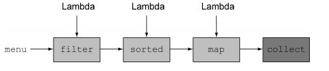

## Java 8特性

### 1. Lambda表达式

#### 1.1 行为参数化

行为参数化的三个操作：

- 策略模式：需要创建多个策略类
- 匿名类：过于笨重
- lambda 表达式

``` java
// 使用策略模式
// 苹果重量策略
public class AppleWeightPredicate implements ApplePredicate {
    public boolean test(Apple apple) {
        return apple.getWeigth() > 150;
    }
}

// 苹果颜色策略
public class AppleColorPredicate implements ApplePredicate {
    public boolean test(Apple apple) {
        return "green".equals(apple.getColor());
    }
}

// 苹果过滤器
public static List<Apple> filterApples(List<Apple> inventory,
                                       ApplePredicate p) {
    List<Apple> result = new ArrayList<>();
    for (Apple apple: inventory) {
        if (p.test(apple)) {
            result.add(apple);
        }
    }
    return result;
}
```

``` java
// 匿名类实现
List<Apple> redApples = filterApples(inventory, new ApplePredicate() {
   public boolean test(Apple apple) {
       return "red".equals(apple.getColor());
   } 
});
```

``` java
// lambda 实现
List<Apple> result = filterApples(inventory, (Apple apple) -> 
                                  "red".equals(apple.getColor()));
```

对上述操作使用泛型，即可得到泛用的过滤函数

``` java
public static <T> List<T> filter(List<T> list, Predicate<T> p) {
    List<T> result = new ArrayList<>();
    for (T e: list) {
        if (p.test(e)) {
            result.add(e);
        }
    }
    return result;
}

public interface Predicate<T> {
    boolean test(T e);
}
```

#### 1.2 函数式接口

lambda 表达式主要用于函数式接口，该接口只定义一个抽象方法

JDK 1.8 引入 <a color="blue">`@FunctionalInterface`</a> 注解用来标识函数式接口，在编译期进行检查

#### 1.3 限制

lambda 表达式允许使用 **自由变量**，即在作用域外的变量，闭包特性。对于引用和静态变量没有限制，而**对于局部变量必须为 final 或者事实上是 final**

``` java
// 可以通过编译
int portNumber = 1337;
Runnable r = () -> System.out.println(portNumber);

// 无法通过编译
int portNumber = 1337;
Runnable r = () -> System.out.println(portNumber);
portNumber = 31337;
```

原因：因为引用是存储在堆，而局部变量保存在线程栈上。lambda 是在一个线程 t1 中使用，如果 lambda 访问局部变量没有限制，那么该局部变量被分配该变量的线程 t2 回收后，t1 可能会访问该变量，导致错误。

#### 1.4 方法引用

方法引用允许使用已有的方法创建 lambda，显式指明方法名称，提升可读性。

``` java
// 使用labda
inventory.sort((Apple a1, Apple a2) -> a1.getWeight().compareTo(a2.getWeight()));

// 使用方法引用和java.util.Comparator.comparing
inventory.sort(comparing(Apple::getWeight));
```

``` java
// 指向Apple()构造函数
Supplier<Apple> c1 = Apple::new;
// 创建对象
Apple a1 = c1.get();
```


### 2. 流

流可以构造操作流水线，实现函数式编程，不需要操作线程和锁就能并行处理数据。



```java
// 使用集合外部迭代
public static List<JSONObject> toJSON(List<? extends Jsonable> data) {
    List<JSONObject> result = new ArrayList<>(data.size());
    for (Jsonable object: data) {
        result.add(object.toJSON());
    }
    return result;
}

// 使用流内部迭代
public static List<JSONObject> toJSON(List<? extends Jsonable> data) {
    return data.stream()
            .map(Jsonable::toJSON)
            .collect(Collectors.toList());
}
```

java 流操作类型

- 中间操作：filter、map 和 limit 等形成流水线；
- 终端操作：collect、foreach、count 等触发流水线执行并关闭。

下面展示几个应用

``` java
// 打印fibnacci数列
public class FibonacciTest {

    public static void main(String[] args) {
        // 创建无限流，必须使用limit进行限制
        Stream.iterate(new int[] {0,1},
                t -> new int[] {t[1], t[0]+t[1]})
                .limit(20)
                .forEach(t -> System.out.println(t[1]));
    }
}
```

``` java
// 字符串拼接
public class StreamJoinTest {

    public static void main(String[] args) {
        String[] test = {"one", "two", "three"};
        String together = Arrays.stream(test).collect(Collectors.joining(" "));
        System.out.println(together);

    }
}
```

``` java
// 筛选不重复奇数
public class OddNumTest {
    
    public static void main(String[] args) {
        List<Integer> numbers = Arrays.asList(1, 2, 1, 3, 3, 2, 4);
        numbers.stream()
                .filter(i -> i % 2 == 1)
                .distinct()
                .forEach(System.out::println);
    }
    
}
```

``` java
// 使用并行流加速，默认使用ForkJoinPool分配线程
public static long parallelSum(long n) {
	return Stream.iterate(1L, i -> i + 1)
 		.limit(n)
        // 开启并行
 		.parallel() 
 		.reduce(0L, Long::sum);
} 
```


### 3. 高效java8编程

#### 3.1 重构

利用 lambda 表达式和 Stream，可以进行如下修改：

- 将单一抽象方法的匿名类改为 lambda 表达式；

- 将集合的遍历、筛选、抽取等操作改为 Stream；

- 使用 lambda 表达式实现策略模式，减少策略类数量；

- 使用 lambda 和方法引用实现简单工厂模式

  ```java
  // 简单工厂模式
  public class ProductFactory {
  	public static Product createProduct(String name){
  		switch(name){
  			case "loan": return new Loan();
   			case "stock": return new Stock();
   			case "bond": return new Bond();
   			default: throw new RuntimeException("No such product " + name);
   		}
   	}
  }
  
  // 使用
  Product p = ProductFactory.createProduct("stock");
  ```

  ``` java
  // lambda和方法引用实现简单工厂
  public class ProductFactory {
      final static Map<String, Supplier<Product>> map = new HashMap<>();
  	static {
   		map.put("loan", Loan::new);
   		map.put("stock", Stock::new);
   		map.put("bond", Bond::new);
  	}
      
  	public static Product createProduct(String name){
          Supplier<Product> p = map.get(name);
   		if (p != null) {
             return p.get(); 
          } 
   		throw new IllegalArgumentException("No such product " + name); 
   	}
  }
  ```

#### 3.2 默认方法

实现了某个接口的类需要重写接口函数，但可能很多类的接口实现都是相同的；或者向某个接口添加方法后，实现该接口的类都需要重新编写。

故 jdk 1.8引入了 default 提供接口默认方法的实现。

``` java
default void isEmpty() {
	return size() == 0;
} 
```

在 jdk 1.8 之后，抽象类和接口的主要区别为：

- 一个类只能继承一个抽象类，但可以实现多个接口；
- 抽象类可以通过实例变量/字段还保存通用状态或者信息，但是接口中的变量必须进行初始化，且编译后会被转为 final 。

#### 3.3 Optional

Optional 用于解决对于 NPE 麻烦的防御式检查。注意，**Optional 对象无法序列化**。

变量存在时，Optional 只是对类简单包装，不存在时则返回 Optional.empty()


创建 Optional 对象

``` java
// 创建一个空的Optional
Optional<Car> optCar = Optional.empty();
// 根据非空值创建Optional
Optional<Car> optCar = Optional.of(car);
// 可接受null的Optional
Optional<Car> optCar = Optional.ofNullable(car);
```

使用 Optional 对象

``` java
// isPresent()：如果值存在返回true，否则返回false
optCar.isPresent();
//get()：如果Optional有值则将其返回，否则抛出NoSuchElementException
optCar.get();                 
//orElse()：如果有值则将其返回，否则返回指定的其它值
optional.orElse("fallback");   
```

#### 3.4 组合式异步编程接口 CompletableFuture

待续。。。

#### 3.5 新的日期API

Java 8 引入了新的日期 API，分别是

- LocalDate：提供了简单的日期功能。

  ``` java
  LocalDate date = LocalDate.of(2020, 11, 11);        
  System.out.println(date.toString()); // 2020-11-11        
  System.out.println(LocalDate.now()); // 2020-11-14
  ```

- LocalTime：提供了一天内时间功能。

- LocalDateTime：合并了日期与时间。

  ``` java
  LocalDateTime dt = LocalDateTime.of(2020, Month.NOVEMBER, 11, 9, 0, 0);
  System.out.println(dt.toString()); // 2020-11-11T09:00
  ```

- Instant：机器的时间秒数。

- Duration

- Period