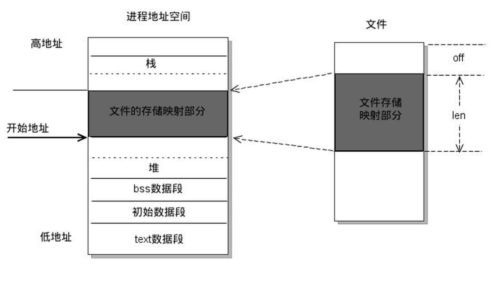

## Java NIO

### 1. NIO 相关

#### 1.1 零拷贝

当通过 socket 传输文件时，需要拷贝 4 次文件（也经过 4 次上下文切换）：

- 调用 read 时，将文件拷贝到内核空间 read buffer；
- 将文件从内核空间拷贝到用户空间；
- 调用 write 时，将用户空间的文件拷贝到内核下 socket buffer 中
- 将 buffer 中的数据拷贝到网卡中发送

上述过程到内核空间的操作是非必要的，零拷贝是为了节省这些开销出现的。

java NIO 的 FileChannal.transferTo 方法就是这样实现，底层依赖于 sendfile

``` java
public void transferTo(long position, long count, WritableByteChannel target);
```

``` c
#include <sys/socket.h>
ssize_t sendfile(int out_fd, int in_fd, off_t *offset, size_t count);
```


linux sendfile 的流程：

- 通过 DMA 将文件拷贝到 kernel buffer 中
- 向 socket buffer 中追加当前要发生的数据在 kernelbuffer 中的位置和偏差量
- 根据位置和偏差量将 kernel buffer 的数据拷贝到网卡中

上述过程只经过 2 次拷贝，过程如下图


#### 1.2 select、poll、epoll

见 <a href="../../计算机网络/Socket.md">select、poll、epoll</a>

jdk 1.5 在 nio 中使用 epoll 替代了 select/poll

#### 1.3 内存映射

内存映射文件的作用是使磁盘文件与内存中的缓冲区建立映射关系，通过操作缓冲区即可操作文件。

内存映射在文件操作过程中无需分配缓存，取消了文件加载到内存、文件的回写、和释放内存等步骤，加快了处理大数据量文件的速度。

Linux 使用 mmap 实现内存映射

``` c
#include <sys/mman.h>
/**
 * start: 映射区开始地址
 * length: 映射区长度
 * prot: 内存保护标志
 * flags: 指定映射对象的类型
 * fd: 文件描述符
 * offset: 被映射对象内容的起点
 */
void *mmap(void *start, size_t length, int prot, int flags, int fd, off_t offset);
```




### 2. NIO 概述

NIO 解决的问题是大量长连接但其中活跃连接少引起的内存消耗问题，NIO 允许一个线程控制多个连接。其非阻塞指的是在网络 IO 环节线程是非阻塞的，本质上使用就是 linux 的 IO 多路复用不阻塞线程，底层使用 epoll 实现。

NIO 的三大核心：

- Buffer：缓冲区，存储数据
- Channel：类似流，但可读可写，需要与 Buffer 配合使用
- Selector：允许单线程控制多个 Channel

大量连接但少量活跃连接适合使用 NIO，大量活跃连接使用传统 IO


 ### 3. Buffer

#### 3.1 介绍

Buffer 即存储数据的缓冲区，提供读写操作，底层使用数组存储，并维护了 4 个数组信息相关的核心属性：

- capacity：缓冲区的最大容量，不可改变
- limit：缓冲区的数据个数，flip() 调用前等于 capacipty，调用后等于 position
- position：下一个要读写的元素下标，由 get() 和 put() 自动更新
- mark：记录当前 position 的位置，可以通过 reset() 恢复到 mark 的位置

模式切换：

- 切换到读：flip()

  ``` java
      public final Buffer flip() {
          limit = position;
          position = 0;
          mark = -1;
          return this;
      }
  ```

- 切换到写：clear()

  ``` java
      public final Buffer clear() {
          position = 0;
          limit = capacity;
          mark = -1;
          return this;
      }
  ```

#### 3.2 DirectBuffer

DirectBuffer 是在 JVM 堆外（直接内存）分配的内存，用于解决大容量 ByteBuffer 在 GC 时的低效率问题

``` java
// 申请DirectBuffer，底层使用操作系统的malloc
ByteBuffer buf = ByteBuffer.allocateDirect(1024);
```

特点：

- IO 读写速度快，DirectBuffer 底层采用零拷贝
- 不被 GC 管理，不影响 GC 速度，缺点是可能造成内存泄漏

#### 3.3 MappedByteBuffer 

MappedByteBuffer 是 FileChannel 提供的内存映射操作，使用 map 方法获取，在 Linux 平台底层使用 mmap 实现。

```  java
/**
 * mode:映射文件方式
 * position:起始位置
 * size:映射区大小
 */
MappedByteBuffer map(int mode,long position,long size); 
```

映射方式：

- READ_ONLY
- READ_WRITE
- PRIVATE：对缓冲区的更改不会传播到文件，只是 buffer 改变，相当于 copy on write

``` java
    public static void main(String args[]){
        RandomAccessFile f = null;
        try {
            f = new RandomAccessFile("hello.txt", "rw");
            RandomAccessFile world = new RandomAccessFile("world.txt", "rw");
            FileChannel fc = f.getChannel();
            MappedByteBuffer buf = fc.map(FileChannel.MapMode.READ_WRITE, 0, 20);

            FileChannel worldChannel = world.getChannel();
            MappedByteBuffer worldBuf = worldChannel.map(FileChannel.MapMode.READ_WRITE, 0, 20);
            worldBuf.put(buf);

            fc.close();
            f.close();
            world.close();
            worldChannel.close();
        } catch (Exception e) {
            e.printStackTrace();
        }
    }
```


### 4. Channel

Channel 封装了对数据源的操作，而不必关心底层，Channel 需要与 Buffer 配合使用。

主要分为：

- 文件通道：FileChannel
- socket通道：ServerSocketChannel（服务器）、SocketChannel（TCP 客户端）、DatagramChannel（UDP 客户端）


### 5. Selector

Selector 的实现思路与 select/poll/epoll 类似（在 Linux 平台底层就是这些操作），通过将多个 Channel 和事件绑定到 Selector 上，当有一个或多个 Channel 触发事件时，select() 即返回正数，通过该返回值判断是否有 IO 就绪。

事件类型：

- `SelectionKey.OP_READ`：读就绪
- `SelectionKey.OP_WRITE`：写就绪
- `SelectionKey.OP_CONNECT`：客户端连接成功，用于 socket 通道
- `SelectionKey.OP_ACCEPT`： 服务器接收新连接，用于 socket 通道

``` java
public class Server {

    public static void main(String[] args) throws IOException {
        ServerSocketChannel server = ServerSocketChannel.open();
        //切换成非阻塞模式
        server.configureBlocking(false);
        server.bind(new InetSocketAddress(6666));

        Selector selector = Selector.open();

        // 将通道注册到选择器上，通过|运算指定事件
        server.register(selector, SelectionKey.OP_ACCEPT);

        /*
         * select() > 0则有IO就绪，需要遍历查看具体哪个IO就绪
         * 注: 调用时会阻塞
         */
        while (selector.select() > 0) {
            // 获取当前选择器所有注册的事件
            Iterator<SelectionKey> iterator= selector.selectedKeys().iterator();

            while (iterator.hasNext()) {

                SelectionKey selectionKey = iterator.next();

                // 接收事件就绪，此处为有TCP连接
                if (selectionKey.isAcceptable()) {
                    ...

                } else if (selectionKey.isReadable()) { // 读事件就绪
                    ...
                }
                // 取消选择键(已经处理过的事件，就应该取消掉了)
                iterator.remove();
            }
        }

    }
}
```


