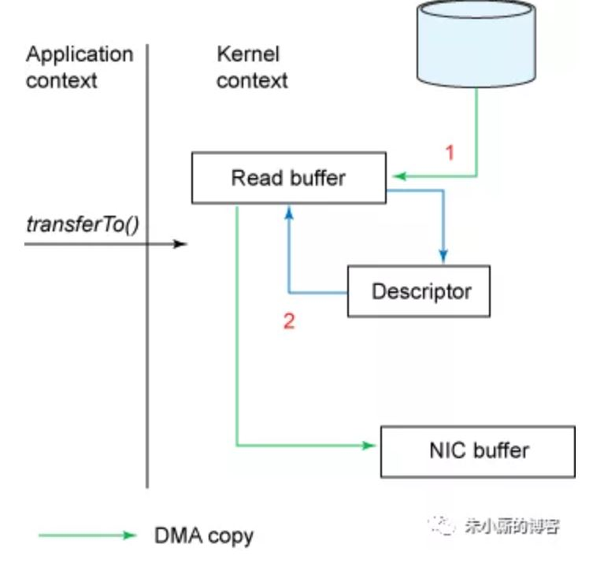

## Java NIO

### 1. NIO 相关

#### 1.1 零拷贝

当通过 socket 传输文件时，需要拷贝 4 次文件（也经过 4 次上下文切换）：

- 调用 read 时，将文件拷贝到内核空间 read buffer；
- 将文件从内核空间拷贝到用户空间；
- 调用 write 时，将用户空间的文件拷贝到内核下 socket buffer 中
- 将 buffer 中的数据拷贝到网卡中发送

上述过程到内核空间的操作是非必要的，零拷贝是为了节省这些开销出现的。

java NIO 的 FileChannal.transferTo 方法就是这样实现，底层依赖于 sendfile

``` java
public void transferTo(long position, long count, WritableByteChannel target);
```

``` c
#include <sys/socket.h>
ssize_t sendfile(int out_fd, int in_fd, off_t *offset, size_t count);
```


linux sendfile 的流程：

- 通过 DMA 将文件拷贝到 kernel buffer 中
- 向 socket buffer 中追加当前要发生的数据在 kernelbuffer 中的位置和偏差量
- 根据位置和偏差量将 kernel buffer 的数据拷贝到网卡中

上述过程只经过 2 次拷贝，过程如下图



#### 1.2 select、poll、epoll

见 <a href="../../计算机网络/Socket.md">select、poll、epoll</a>

jdk 1.5 在 nio 中使用 epoll 替代了 select/poll


### 2. NIO 概述

NIO 解决的问题是大量长连接但其中活跃连接少引起的内存消耗问题，NIO 允许一个线程控制多个连接。其非阻塞指的是在网络 IO 环节线程是非阻塞的，本质上就是 linux 的 select 模式，通过 IO 多路复用来使线程不阻塞，底层使用 epoll 实现。

NIO 的三大核心：

- Buffer：存储数据
- Channel：类似流，但可读可写，需要与 Buffer 配合使用
- Selector：允许单线程控制多个 Channel

大量连接但少量活跃连接适合使用 NIO，大量活跃连接使用传统 IO


 