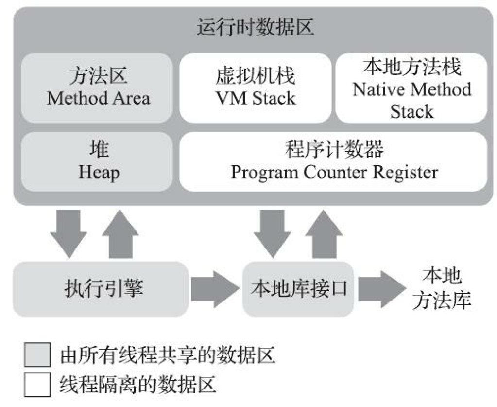

## jvm内存区域和对象存储

### 1. 内存区域

- 运行时内存区
  - 程序计数器：线程私有，类似汇编的 pc 指针
  - java 虚拟机栈：线程私有，存储局部变量、方法调用等，溢出则抛出 `StackOverflowError`
  - 本地方法栈：记录 Native 的方法调用，溢出时将抛出 `StackOverflowError`
  - 堆：对象分配内存的区域，溢出抛出 `OutOfMemoryError`
  - 方法区：存储 class 对象，jdk 1.8 之前还存储常量池，jdk 1.8 以及之后常量池位于元空间（直接内存），溢出抛出 `OutOfMemoryError`

- 直接内存：内含元空间，也用于 NIO 堆外内存，溢出抛出 `OutOfMemoryError`

### 2. 对象存储

#### 2.1 对象的内存布局

对象在堆中的分布可分为：

- 对象头
  - Mark Word：存储哈希码、GC 分代年龄、锁相关信息等
  - 类型指针
- 实例数据
- 对齐填充：对象起始地址为 8 字节的整数倍

#### 2.2 对象访问

对象的主要访问方式：

- 句柄访问：堆中划分出句柄池，引用存储对象的句柄，句柄包含对象实例数据指针和类型数据指针；优点是对象移动时只需要改变句柄的实例数据指针
- 直接指针访问：引用直接存储对象地址，在堆中的对象实例中存储了实例数据和指向类型的指针；优点是少一次指针定位

