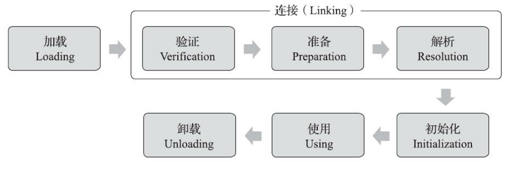
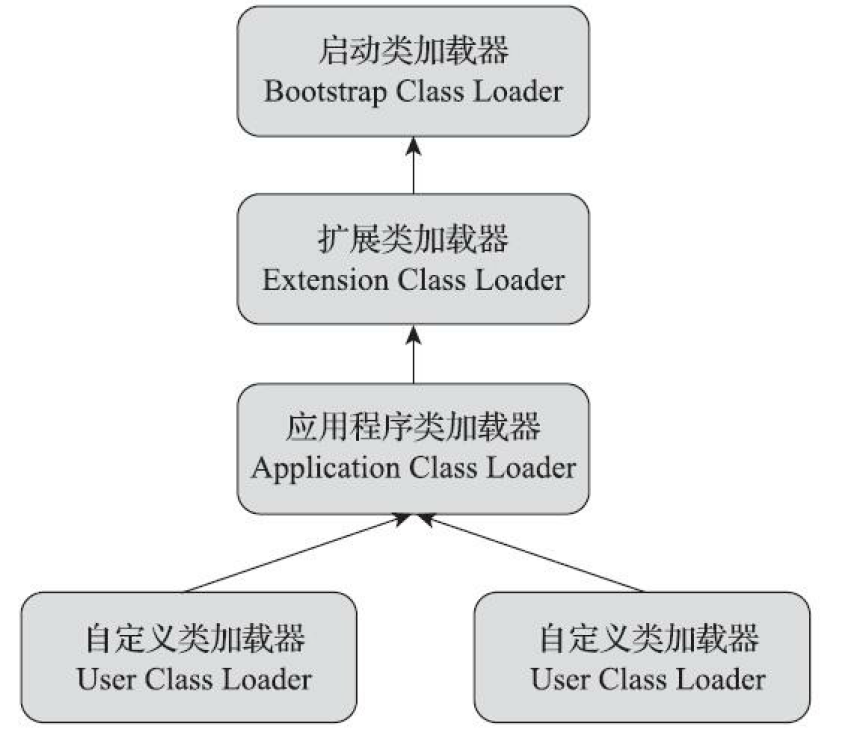

## 类加载

### 1. 类加载过程

类的生命周期如下：



#### 1.1 加载

jvm 加载的主要工作：

- 通过类的全限定名获取 .class 文件
- 将文件的静态存储结构转化到方法区
- 在内存中生成 Class 对象，作为方法区这个类的访问入口

#### 1.2 验证

验证阶段的主要工作：

- 文件格式验证：检验魔数、版本号等是否符合 class 文件规范
- 元数据验证：验证类是否符合 java 规范，例如是否实现了接口要求的所有方法等
- 字节码验证
- 符号引用验证

#### 1.3 准备

为类中的静态变量分配内存并设置变量 **零值** 。

``` java
// 在准备阶段过后value的值为0而不是123
public static int value = 123;
```

#### 1.4 解析

解析是将 class 文件中跟内存布局无关的符号引用转化为与内存相关的直接引用，主要分为：

- 类和接口的解析
- 字段解析
- 方法解析
- 接口方法解析

#### 1.5 初始化

初始化阶段为静态变量赋予真实值


### 2. 双亲委派模型

#### 2.1 类加载器类型

类加载器类型：

- 启动 Bootstrap 类加载器：负责加载 `rt.jar` 等 jdk 库
- 拓展 Extension 类加载器：负责加载 `JAVA_HOME\lib\ext` 目录下的类
- 应用程序/系统 Application 类加载器：负责加载用户实现的类

#### 2.2 双亲委派模型实现

双亲委派：类加载器收到类加载的请求时，先交给父加载器完成，当父加载器无法完成，子加载器才尝试加载

优点：系统的核心类不会被用户代替，保证 java 程序的稳定运作



#### 2.3 破坏双亲委派

破坏双亲委派的原因：父类加载器需要委托子类加载器加载文件，但受双亲委派的限制无法加载，例如

`Driver` 接口定义在 jdk 中，但实现由服务商提供，`DriverManager`（由 jdk 提供）要加载实现类，然后进行管理，但是 `DriverManager` 由启动类加载器加载，实现类由系统类加载器加载，这时需要启动类加载器来委托子类来加载实现类，从而破坏了双亲委派

破坏手段：

- 自定义类加载器，重写 `loadClass` 方法，不进行双亲委派机制
- 使用线程上下文加载器


