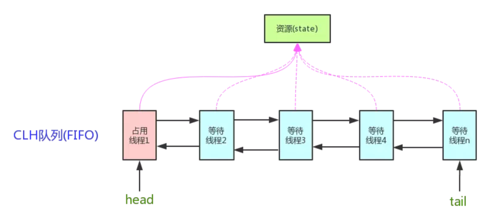
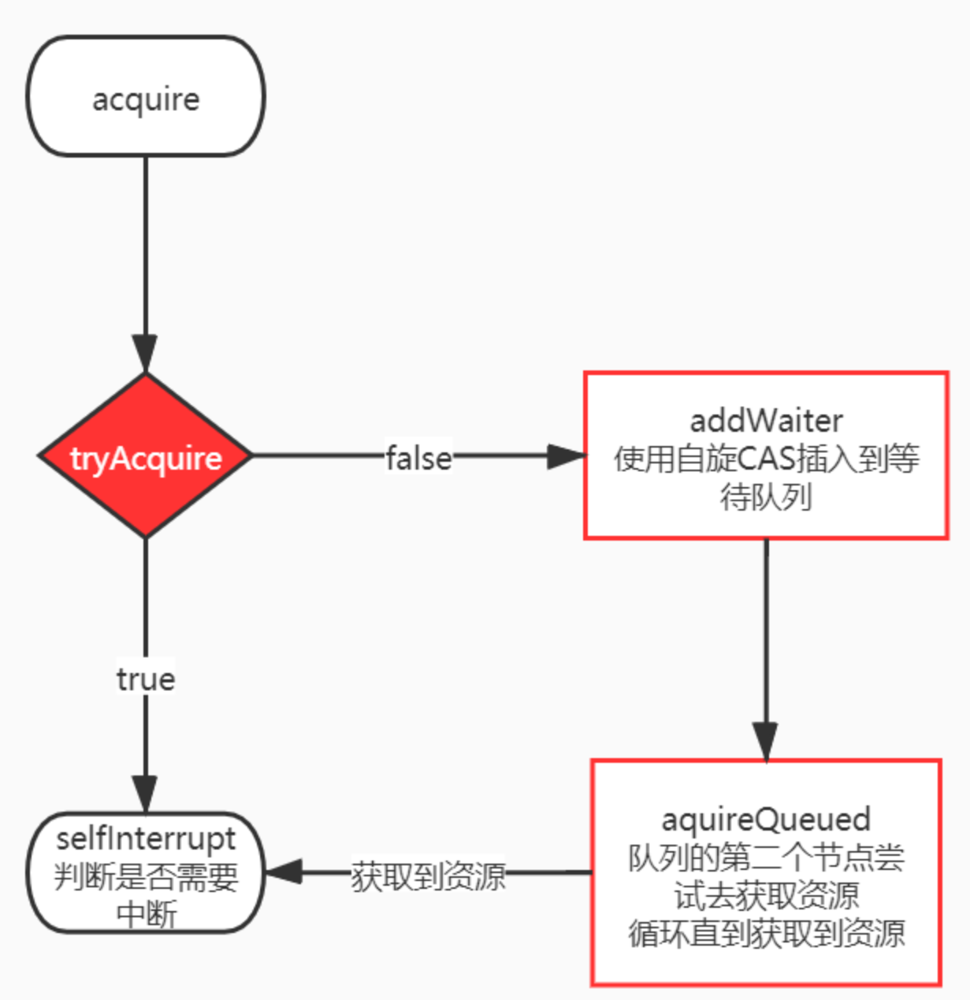

## AQS

### 1.介绍

**AQS **是 `AbstractQueuedSynchronizer` 的简称，即抽象队列同步器。实现了一些主要逻辑，主要方法由子类实现 (**模板方法设计模式**)，是 juc 的基础。



### 2. Node 节点

资源有两种同步方式：

- 独占模式（Exclusive）：资源是独占的，一次只能一个线程获取。如 ReentrantLock；
- 共享模式（Share）：同时可以被多个线程获取，具体的资源个数可以通过参数指定。如Semaphore/CountDownLatch。

两种方式的定义都在 Node 静态内部类中

``` java
static final class Node {
    // 标记一个结点（对应的线程）在共享模式下等待
    static final Node SHARED = new Node();
    // 标记一个结点（对应的线程）在独占模式下等待
    static final Node EXCLUSIVE = null; 

    // waitStatus的值，表示该结点（对应的线程）已被取消
    static final int CANCELLED = 1; 
    // waitStatus的值，表示后继结点（对应的线程）需要被唤醒
    static final int SIGNAL = -1;
    // waitStatus的值，表示该结点（对应的线程）在等待某一条件
    static final int CONDITION = -2;
    /** 
     * waitStatus的值，表示有资源可用，新head结点需要继续唤醒后继结点（共享模式下，多线程并      * 发释放资源，而head唤醒其后继结点后，需要把多出来的资源留给后面的结点；设置新的head结点      * 时，会继续唤醒其后继结点）
     */
    static final int PROPAGATE = -3;

    // 等待状态，取值范围，-3，-2，-1，0，1
    volatile int waitStatus;
    volatile Node prev; // 前驱结点
    volatile Node next; // 后继结点
    volatile Thread thread; // 结点对应的线程
    Node nextWaiter; // 等待队列里下一个等待条件的结点

    // 判断共享模式的方法
    final boolean isShared() {
        return nextWaiter == SHARED;
    }

    Node(Thread thread, Node mode) {     // Used by addWaiter
        this.nextWaiter = mode;
        this.thread = thread;
    }

    // 其它方法忽略
}

    // AQS里面的addWaiter私有方法
    private Node addWaiter(Node mode) {
        // 将当前线程加入队列
        Node node = new Node(Thread.currentThread(), mode);
        // Try the fast path of enq; backup to full enq on failure
        Node pred = tail;
        // 尝试快速插入
        if (pred != null) {
            node.prev = pred;
            if (compareAndSetTail(pred, node)) {
                pred.next = node;
                return node;
            }
        }
        // 如果快速插入失败，则循环使用CAS入队
        enq(node);
        return node;
    }
```

### 3.源码解析

AQS的设计是基于**模板方法模式**的，子类要实现的方法主要有：

- isHeldExclusively()：该线程是否正在独占资源，只有用到condition才需要去实现它；
- tryAcquire(int)：独占方式。尝试获取资源，成功则返回true；
- tryRelease(int)：独占方式。尝试释放资源，成功则返回true；
- tryAcquireShared(int)：共享方式。尝试获取资源。负数表示失败；0表示成功，但没有剩余可用资源；正数表示成功，且有剩余资源；
- tryReleaseShared(int)：共享方式。尝试释放资源，如果释放后允许唤醒后续等待结点返回true

#### 3.1 获取资源

``` java
    // arg为获取资源个数，独占模式横为1
    public final void acquire(int arg) {
        if (!tryAcquire(arg) && // 尝试获取资源，子类实现
            /**
             * 调用addWaiter将当前线程以独占方式添加到队列
             * acquireQueued在队列中尝试获取资源
             */
            acquireQueued(addWaiter(Node.EXCLUSIVE), arg))
            selfInterrupt();
    }
```

``` java
final boolean acquireQueued(final Node node, int arg) {
    boolean failed = true;
    try {
        boolean interrupted = false;
        // 自旋
        for (;;) {
            final Node p = node.predecessor();
            // 如果node的前驱结点p是head，表示node是第二个结点，就可以尝试去获取资源了
            if (p == head && tryAcquire(arg)) {
                /** 
                 * 拿到资源后，将head指向该结点。
                 * head所指的结点，就是当前获取到资源的那个结点或者null。
                 */
                setHead(node); 
                p.next = null; // help GC
                failed = false;
                return interrupted;
            }
            // 如果自己可以休息了，就进入waiting状态，直到被unpark()
            if (shouldParkAfterFailedAcquire(p, node) &&
                parkAndCheckInterrupt()) // 内部调用LockSupport.park()阻塞本线程
                interrupted = true;
        }
    } finally {
        if (failed)
            cancelAcquire(node);
    }
}
```



#### 3.2 释放资源

``` java
    public final boolean release(int arg) {
        if (tryRelease(arg)) {
            Node h = head;
            if (h != null && h.waitStatus != 0)
                unparkSuccessor(h); // 唤醒后继节点
            return true;
        }
        return false;
    }

```

``` java
private void unparkSuccessor(Node node) {
    // 如果状态是负数，尝试把它设置为0
    int ws = node.waitStatus;
    if (ws < 0)
        compareAndSetWaitStatus(node, ws, 0);
    // 直接后继
    Node s = node.next;
    // 如果这个后继结点为空或者状态大于0,大于0即结点已被取消
    if (s == null || s.waitStatus > 0) {
        s = null;
        // 遍历等待队列获取下一个要唤醒的节点
        for (Node t = tail; t != null && t != node; t = t.prev)
            if (t.waitStatus <= 0)
                s = t;
    }
    // 如果后继结点不为空或者仍有有用的节点，则唤醒
    if (s != null)
        LockSupport.unpark(s.thread);
}
```

