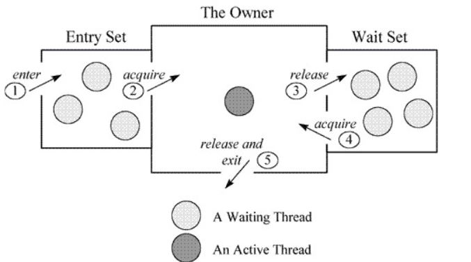
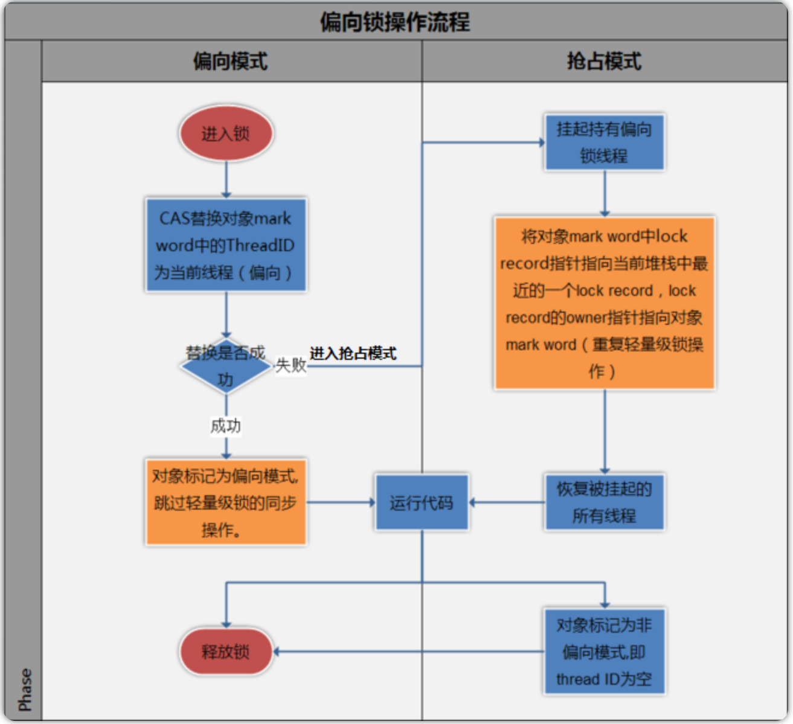
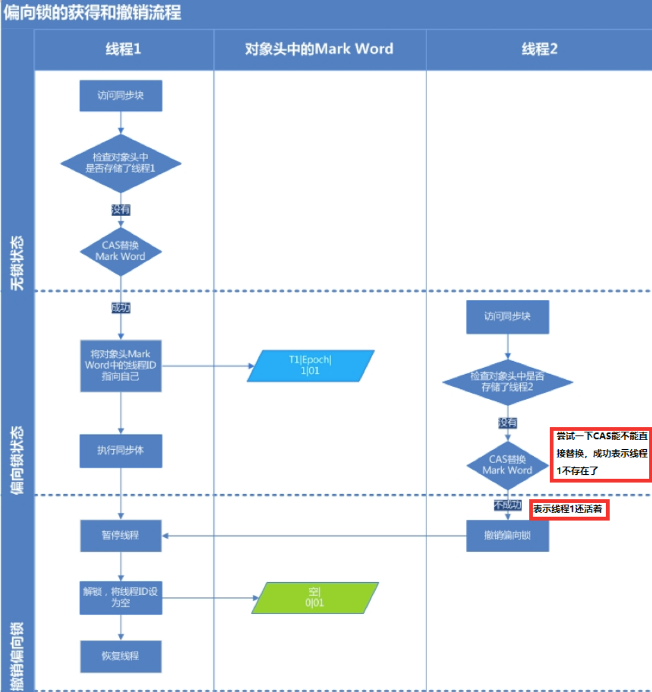
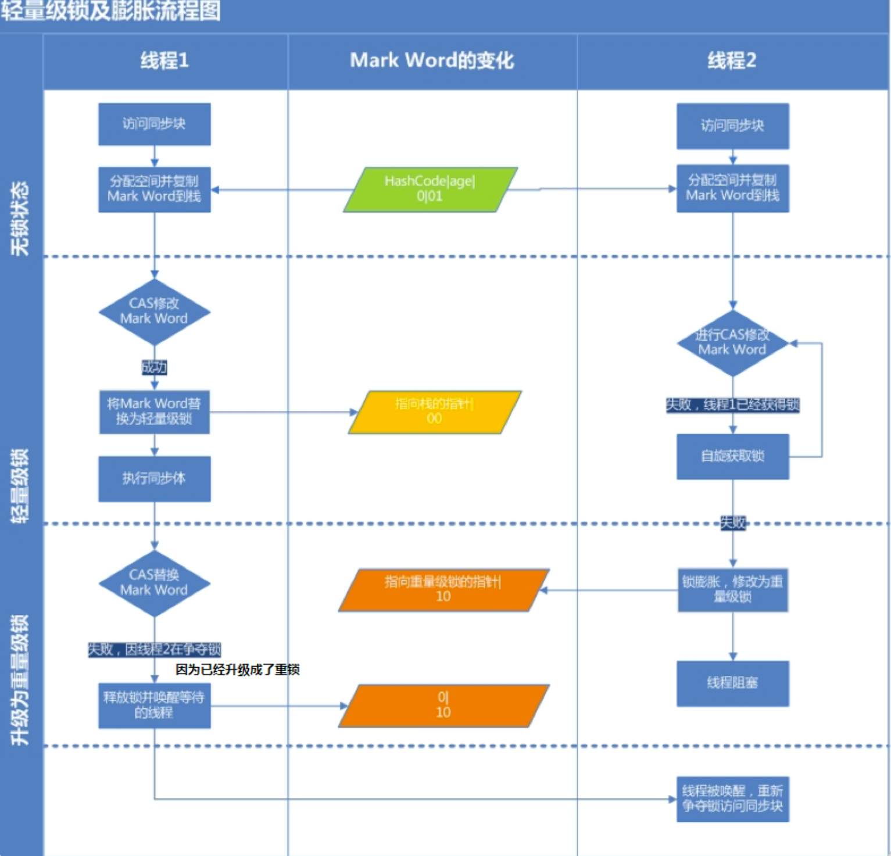

[toc]

## synchronized

### 1. 介绍

synchronized 是 java 中的可重入悲观锁，在 jdk 1.6引入了偏向锁、轻量锁进行锁升级降低了性能消耗

**可重入锁**：又称递归锁，线程在递归调用时，外层方法获取锁后，进入内层会自动获得锁



synchronized 的三种加锁方式

- 普通方法，相当于给**实例对象**加锁，进入同步代码之前要获得当前实例的锁
- 静态方法，相当于给**类对象**加锁
- 代码块，需要指定加锁对象，对**给定对象**加锁

### 2. 原理

#### 2.1 JVM 层次

java 多线程的 **锁都是基于对象的**。java 的每个对象都携带 monitor，monitor 存放在 **对象头** 的 Mark Word  中，下图是 Mark Word 中与锁相关的部分：


``` c++
 ObjectMonitor() {
    _header       = NULL;
    _count        = 0; // 该线程获取锁的次数
    _waiters      = 0,
    _recursions   = 0; // 锁重入次数
    _object       = NULL;
    _owner        = NULL; // 持有ObjectMonitor对象的线程
    _WaitSet      = NULL; // wait状态线程列表
    _WaitSetLock  = 0 ;
    _Responsible  = NULL ;
    _succ         = NULL ;
    _cxq          = NULL ;
    FreeNext      = NULL ;
    _EntryList    = NULL ; // 等待锁释放的线程队列
    _SpinFreq     = 0 ;
    _SpinClock    = 0 ;
    OwnerIsThread = 0 ;
  }
```

在进入同步代码块前，会使用 monitorenter 指令尝试获取锁，获取失则线程挂起，进入 WaitSet


结束同步代码块后，执行 monitorexit  释放锁，如果调用 wait 则进入 WaitSet


#### 2.2 CPU 级别

JVM 底层使用 Atomic::cmpxchg_ptr 尝试把 monitor 的 _owner 字段设置为当前线程，依赖了 CPU 底层的 <a href="../jdk源码/util/CAS.md">CAS 原语</a>，使用 lock 指令实现。


### 3. 锁升级

#### 3.1 偏向锁

偏向锁的作用是当线程访问同步代码时，只需要判断 Mark Word 中偏向锁线程 ID 是否为自身，是直接进入同步代码块，不需要进行 同步操作。

偏向锁记录流程：

- 线程抢到同步锁
- 对象 Mark Word 设置偏向标志为为 1
- 对象 Mark Word 记录线程 ID
- 进入偏向状态

当有线程竞争偏向锁，并且发现线程 ID 不是自身的话，将尝试获取锁

- 获取成功，更改对象 Mark Word 的线程 ID，保持偏向状态
- 获取失败，升级为轻量级锁



下图为偏向锁的举例说明：


#### 3.2 轻量级锁

轻量级锁通过自旋实现，在 jdk 1.7 后默认开启。

自旋次数可以通过 JVM 设置，默认为 10 次，当自旋失败后，将会升级为重量级锁。后使用 **适应性自旋**，线程如果自旋成功了，则下次自旋的次数会更多。



#### 3.3 重量级锁

重量级锁开始使线程挂起阻塞，减少 CPU 消耗，需要进入内核态。


#### 3.4 锁升级流程

每一个线程在准备获取共享资源时： 第一步，检查 MarkWord 里面是不是放的自己的ThreadId ,如果是，表示当前线程是处于 “偏向锁” 。

第二步，如果 MarkWord 不是自己的 ThreadId，锁升级，这时候，用 CAS 来执行切换，新的线程根据 MarkWord 里面现有的ThreadId，通知之前线程暂停，之前线程将 Markword 的内容置为空。

第三步，两个线程都把锁对象的 HashCode 复制到自己新建的用于存储锁的记录空间，接着开始通过 CAS 操作， 把锁对象的 MarKword的内容修改为自己新建的记录空间的地址的方式竞争 MarkWord。

第四步，第三步中成功执行 CAS 的获得资源，失败的则进入自旋 。

第五步，自旋的线程在自旋过程中，成功获得资源(即之前获的资源的线程执行完成并释放了共享资源)，则整个状态依然处于轻量级锁的状态，如果自旋失败 。

第六步，进入重量级锁的状态，这个时候，自旋的线程进行阻塞，等待之前线程执行完成并唤醒自己。


### 4.锁降级

锁降级发生在Stop The World 期间，当 JVM 进入安全点的时候，会检查是否有闲置的锁，然后进行降级。