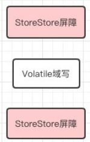
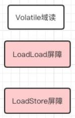

[toc]

## volatile

### 1. 介绍

- volatile 修饰的变量不会被线程缓存，而是始终从主存中进行读取

- volatile 保证了不同线程对共享变量操作的可见性，一个线程修改了此属性后，其他线程可以立即得到修改后的值

- volatile 修饰的属性不会被 **指令重排序** (jdk 1.5后才保证)

### 2. MESI

intel CPU 采用 <a name="jump" href="../../../计算机组成原理/存储器.md">MESI</a> 协议来保证缓存的一致性，每个处理器通过嗅探在总线上传播的数据检查缓存的有效性，并及时进行更新

由于不断从主存嗅探，大量使用 volatile 将会导致总线风暴，使总线带宽达到峰值

### 3. 禁止指令重排序

#### 3.1 指令重排

指令重排：为了提高性能，编译器和处理器会对既定的代码执行顺序进行重新排序

重排序类型

- 编译器优化，在不改变单线程语义的情况下，安排语句的执行顺序
- 指令并行，不存在数据依赖的情况下，CPU  可以改变机器指令的执行顺序
- 内存系统的重排序，由于使用了缓存和读写缓冲区，加载和存储操作可能是乱序执行的；例如写缓存时 cacheline 被占用，可能先将后面的读缓存命令优先执行

as-if-serial 语义：所有重排序都要遵守的语义，单线程执行结果不能被改变，即存在数据依赖关系的操作不会被重排序

<a href="多线程基础.md">happens-before</a>： jdk 1.5后引入，用于描述操作之间的内存可见性，volatile 域要求对该域的写操作， happens-before 于任意线程对这个域的读操作

#### 3.2 内存屏障

内存屏障的作用：

- 阻止屏障两侧的指令重排序
- 强制把写缓冲区和高速缓存中的脏数据等写回主内存，或者让缓存中相应的数据失效。此处的缓存指 CPU cache

##### 3.2.1 JVM 层次

JVM 规范要求所有虚拟机完成下述内存屏障

- LoadLoad：下一个 Load 必须在前一个 Load 完成后执行，下面屏障描述类似
- StroreStore
- LoadStore
- StoreLoad

volatile 写是在前面和后面分别插入内存屏障

volatile读是在后面插入两个内存屏障

##### 3.2.2 CPU 层次

X86 支持的内存屏障

- sfence：写屏障，在该指令后的写操作必须指令之前的写操作完成之后执行
- lfence：读屏障
- mfence：全屏障

lock 指令：是一个全屏障，通过锁住总线和 Cache Line 实现原子性和保证指令执行顺序；JVM 大部分是用该方式实现内存屏障的
