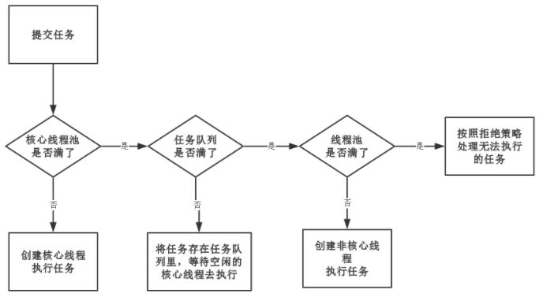

## 线程池

### 1. 简介

#### 1.1 使用线程池的原因

- **控制并发的数量**

- 复用已创建的线程，无需创建/销毁线程消耗系统资源
- 可以对线程做统一管理

#### 1.2 ThreadPoolExecutor

`ThreadPoolExecutor` 是 jdk 线程池的创建类，`newCachedThreadPool、newFixedThreadPool` 等线程池通过不同参数调用该类的构造函数，该类的构造函数如下：

``` java
        /**
         * 该类7个参数的构造函数，还有其他三个构造函数，分别为5,6,6个参数
         * corePoolSize: 核心线程数，核心线程闲置也不会被销毁
         * maximumPoolSize: 线程总数最大数，等于核心线程数+非核心线程数
         * keepAliveTime: 非核心线程闲置超时时长，超过将被销毁
         * unit: keepAliveTime的单位，天、小时、分、秒、毫秒。。。
         * workQueue: 阻塞队列，维护等待执行的Runnable任务对象
         * threadFactory: 线程工厂，默认使用内部默认工厂
         * handler: 拒绝处理策略，默认为AbortPolicy
         */
        public ThreadPoolExecutor(int corePoolSize,
                                  int maximumPoolSize,
                                  long keepAliveTime,
                                  TimeUnit unit,
                                  BlockingQueue<Runnable> workQueue,
                                  ThreadFactory threadFactory,
                                  RejectedExecutionHandler handler) {
            if (corePoolSize < 0 ||
                    maximumPoolSize <= 0 ||
                    maximumPoolSize < corePoolSize ||
                    keepAliveTime < 0)
                throw new IllegalArgumentException();
            if (workQueue == null || threadFactory == null || handler == null)
                throw new NullPointerException();
            this.acc = System.getSecurityManager() == null ?
                    null :
                    AccessController.getContext();
            this.corePoolSize = corePoolSize;
            this.maximumPoolSize = maximumPoolSize;
            this.workQueue = workQueue;
            this.keepAliveTime = unit.toNanos(keepAliveTime);
            this.threadFactory = threadFactory;
            this.handler = handler;
        }
```

`ThreadPoolExecutor`  用一个 `AtomicInteger` 高 3 位标识线程池状态，低 29 位表示工作线程数量，线程池状态如下：

``` java
// COUNT_BITS = 29
private static final int RUNNING    = -1 << COUNT_BITS;
// 调用shutdown()后处于SHUTDOWN状态，不能接受新的任务，清除空闲worker，等待阻塞队列任务完成
private static final int SHUTDOWN   =  0 << COUNT_BITS;
/** 
 * 调用shutdownNow()后处于STOP状态，不能接受新的任务，中断所有线程，阻塞队列中没有执行的任务
 * 全部丢弃，此时, poolsize = 0,阻塞队列size = 0
 */
private static final int STOP       =  1 << COUNT_BITS;
// 线程池为空后，STOP转变为TIDYING状态，同时执行terminated()
private static final int TIDYING    =  2 << COUNT_BITS;
// TIDYING状态执行完terminated()之后转变为TERMINATED
private static final int TERMINATED =  3 << COUNT_BITS;
```

常用阻塞队列：

- `LinkedBlockingQueue`：链表阻塞队列，默认大小是`Integer.MAX_VALUE`。
- `ArrayBlockingQueue`：数组阻塞队列，需要指定队列的大小。
- `SynchronousQueue`：同步队列，内部容量为0，每个put操作必须等待一个take操作，反之亦然。
- `DelayQueue`：延迟队列，元素只有到达指定的延迟才能够获取。

拒绝处理策略：

- **AbortPolicy**：丢弃任务并抛出 RejectedExecutionException，默认拒绝处理策略
- **DiscardPolicy**：丢弃新来的任务，但是不抛出异常
- **DiscardOldestPolicy**：丢弃队列头部（最旧的）的任务，然后重新尝试执行（如果再次失败，重复此过程）

- **CallerRunsPolicy**：由调用线程处理该任务

### 2. 线程池执行流程

#### 2.1 execute

``` java
    public void execute(Runnable command) {
        if (command == null)
            throw new NullPointerException();
        int c = ctl.get();
        // 当前线程数小于corePoolSize,调用addWorker创建核心线程加载任务
        if (workerCountOf(c) < corePoolSize) {
            if (addWorker(command, true))
                return;
            c = ctl.get();
        }
        // 反复确认添加任务
        if (isRunning(c) && workQueue.offer(command)) {
            int recheck = ctl.get();
            if (! isRunning(recheck) && remove(command))
                reject(command);
            else if (workerCountOf(recheck) == 0)
                addWorker(null, false);
        }
        else if (!addWorker(command, false))
            reject(command);
    }
```



#### 2.2 addWorker

待续

``` java
    private boolean addWorker(Runnable firstTask, boolean core) {
        retry:
        // 检查是否超过阈值
        for (;;) {
            int c = ctl.get();
            int rs = runStateOf(c);

            // Check if queue empty only if necessary.
            if (rs >= SHUTDOWN &&
                ! (rs == SHUTDOWN &&
                   firstTask == null &&
                   ! workQueue.isEmpty()))
                return false;

            for (;;) {
                int wc = workerCountOf(c);
                // 是否达到上限
                if (wc >= CAPACITY ||
                    wc >= (core ? corePoolSize : maximumPoolSize))
                    return false;
                if (compareAndIncrementWorkerCount(c))
                    break retry;
                c = ctl.get();  // Re-read ctl
                if (runStateOf(c) != rs)
                    continue retry;
                // else CAS failed due to workerCount change; retry inner loop
            }
        }

        boolean workerStarted = false;
        boolean workerAdded = false;
        Worker w = null;
        try {
            // 创建一个worker
            w = new Worker(firstTask);
            // 实例化一个Thread
            final Thread t = w.thread;
            if (t != null) {
                // 线程池全局锁
                final ReentrantLock mainLock = this.mainLock;
                mainLock.lock();
                try {
                    // Recheck while holding lock.
                    // Back out on ThreadFactory failure or if
                    // shut down before lock acquired.
                    int rs = runStateOf(ctl.get());

                    if (rs < SHUTDOWN ||
                        (rs == SHUTDOWN && firstTask == null)) {
                        if (t.isAlive()) // precheck that t is startable
                            throw new IllegalThreadStateException();
                        workers.add(w);
                        int s = workers.size();
                        if (s > largestPoolSize)
                            largestPoolSize = s;
                        workerAdded = true;
                    }
                } finally {
                    mainLock.unlock();
                }
                // 添加成功则启动线程
                if (workerAdded) {
                    t.start();
                    workerStarted = true;
                }
            }
        } finally {
            if (! workerStarted)
                addWorkerFailed(w);
        }
        return workerStarted;
    }
```

### 3. 常见线程池

#### 3.1 newCachedThreadPool

``` java
public static ExecutorService newCachedThreadPool() {
    return new ThreadPoolExecutor(0, Integer.MAX_VALUE,
                                  60L, TimeUnit.SECONDS,
                                  new SynchronousQueue<Runnable>());
}
```

运行流程：

- 提交任务

- `corePoolSize` 为0，故不创建核心线程，线程池最大为 `Integer.MAX_VALUE`

- 尝试将任务添加到 `SynchronousQueue`

- 如果入列成功，等待被空闲线程拉取执行。如果没有空闲线程，则创建一个非核心线程，然后从队列拉取任务执行

- 如果队列已有任务在等待，入列操作将会阻塞

适用场合：因为不包含核心线程，且 60s 就回收线程，故适合 **大量短时间** 的任务

#### 3.2 newFixedThreadPool

``` java
public static ExecutorService newFixedThreadPool(int nThreads) {
        return new ThreadPoolExecutor(nThreads, nThreads,
                                      0L, TimeUnit.MILLISECONDS,
                                      new LinkedBlockingQueue<Runnable>());
}
```

只能创建核心线程，`LinkedBlockingQueue` 的默认大小是 `Integer.MAX_VALUE`，核心线程空闲进行处理，不空闲则入列等待，直到核心线程空闲。

特点：

- 只会创建核心线程
- 线程不会被回收，一直阻塞
- 几乎不会触发拒绝策略

#### 3.3 newSingleThreadExecutor

``` java 
public static ExecutorService newSingleThreadExecutor() {
    return new FinalizableDelegatedExecutorService
        (new ThreadPoolExecutor(1, 1,
                                0L, TimeUnit.MILLISECONDS,
                                new LinkedBlockingQueue<Runnable>()));
}
```

有且仅有一个核心线程工作，不会创建非核心线程，所有任务按 **先来先服务** 的顺序执行。

#### 3.4 newScheduledThreadPool

创建一个定长线程池，支持定时和周期性任务。

``` java
public static ScheduledExecutorService newScheduledThreadPool(int corePoolSize) {
    return new ScheduledThreadPoolExecutor(corePoolSize);
}

    //ScheduledThreadPoolExecutor():
    public ScheduledThreadPoolExecutor(int corePoolSize) {
        super(corePoolSize, Integer.MAX_VALUE, 0, NANOSECONDS,
              new DelayedWorkQueue());
    }
```

