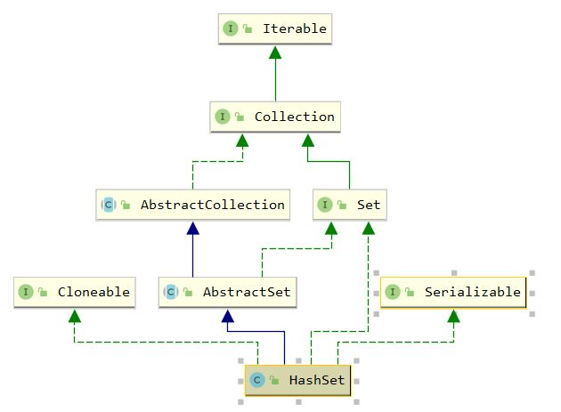

## HashSet

### 1. 介绍

#### 1.1 委托模式

HashSet 通过委托模式将数据交予 HashMap 处理， key 为要添加到 HashSet 的元素，value 为一个固定的 Object 对象

#### 1.2 继承体系



### 2. 属性

``` java
    // 委托给HashMap处理
	private transient HashMap<E,Object> map;
	// 采用固定统一的value存储
    private static final Object PRESENT = new Object();
```

### 3. 构造函数

``` java
    public HashSet() {
        map = new HashMap<>();
    }

    public HashSet(Collection<? extends E> c) {
        map = new HashMap<>(Math.max((int) (c.size()/.75f) + 1, 16));
        addAll(c);
    }

	// 指定的都是HashMap的容量与负载因子
    public HashSet(int initialCapacity, float loadFactor) {
        map = new HashMap<>(initialCapacity, loadFactor);
    }

    public HashSet(int initialCapacity) {
        map = new HashMap<>(initialCapacity);
    }
```

### 4. 常用操作

``` java
    public boolean contains(Object o) {
        return map.containsKey(o);
    }

    public boolean add(E e) {
        return map.put(e, PRESENT)==null;
    }

    public boolean remove(Object o) {
        return map.remove(o)==PRESENT;
    }
```

