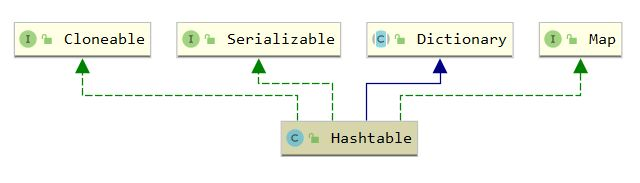

[toc]

## Hashtable

### 1. 原理

#### 1.1 介绍

hashtable 是线程安全的哈希表，但其使用 synchronized 修饰方法，开销较大

通常使用 ConcurrentHashMap 代替

#### 1.2 继承体系



### 2. 属性

``` java
	// 哈希表数组
	private transient Entry<?,?>[] table;
	// Entry 个数
    private transient int count;
	// rehash的阈值，等于数组长度*loadFactor
    private int threshold;
	// 负载因子
    private float loadFactor;
	// 当前结构修改次数，用于fast-fail
    private transient int modCount = 0;
```

### 3. 构造函数

``` java
    public Hashtable(int initialCapacity, float loadFactor) {
        if (initialCapacity < 0)
            throw new IllegalArgumentException("Illegal Capacity: "+
                                               initialCapacity);
        if (loadFactor <= 0 || Float.isNaN(loadFactor))
            throw new IllegalArgumentException("Illegal Load: "+loadFactor);

        // 至少保证一个元素
        if (initialCapacity==0)
            initialCapacity = 1;
        this.loadFactor = loadFactor;
        table = new Entry<?,?>[initialCapacity]; // 直接初始化而不是懒初始化
        threshold = (int)Math.min(initialCapacity * loadFactor, MAX_ARRAY_SIZE + 1);
    }

    public Hashtable(int initialCapacity) {
        this(initialCapacity, 0.75f);
    }

	// 默认数组长度为11, 负载因子为0.75
    public Hashtable() {
        this(11, 0.75f);
    }
```

### 4. put方法

``` java
    public synchronized V put(K key, V value) {
        // value不能为null
        if (value == null) {
            throw new NullPointerException();
        }

        Entry<?,?> tab[] = table;
        int hash = key.hashCode();
        // 与0x7FFFFFFF进行&操作是为了保证得到正数，求下标直接使用求余
        int index = (hash & 0x7FFFFFFF) % tab.length;
        Entry<K,V> entry = (Entry<K,V>)tab[index];
        for(; entry != null ; entry = entry.next) {
            // 已存在 key 直接更新
            if ((entry.hash == hash) && entry.key.equals(key)) {
                V old = entry.value;
                entry.value = value;
                return old;
            }
        }

        addEntry(hash, key, value, index);
        return null;
    }
```

``` java
    private void addEntry(int hash, K key, V value, int index) {
        modCount++;

        Entry<?,?> tab[] = table;
        // 下一次插入前才会进行扩容
        if (count >= threshold) {
            rehash();
            tab = table;
            hash = key.hashCode();
            index = (hash & 0x7FFFFFFF) % tab.length;
        }

        Entry<K,V> e = (Entry<K,V>) tab[index];
        // 头插实现，局部性原理, table[index]是最近插入的数据
        tab[index] = new Entry<>(hash, key, value, e);
        count++;
    }
```

#### 5. rehash 方法

``` java
    protected void rehash() {
        int oldCapacity = table.length;
        Entry<?,?>[] oldMap = table;

        // 2倍+1 扩容
        int newCapacity = (oldCapacity << 1) + 1;
        // 防止溢出
        if (newCapacity - MAX_ARRAY_SIZE > 0) {
            if (oldCapacity == MAX_ARRAY_SIZE)
                // Keep running with MAX_ARRAY_SIZE buckets
                return;
            newCapacity = MAX_ARRAY_SIZE;
        }
        Entry<?,?>[] newMap = new Entry<?,?>[newCapacity];

        modCount++;
        threshold = (int)Math.min(newCapacity * loadFactor, MAX_ARRAY_SIZE + 1);
        table = newMap;

        for (int i = oldCapacity ; i-- > 0 ;) {
            for (Entry<K,V> old = (Entry<K,V>)oldMap[i] ; old != null ; ) {
                Entry<K,V> e = old;
                old = old.next;

                int index = (e.hash & 0x7FFFFFFF) % newCapacity;
                // 仍是头插，但原来的顺序改变了
                // newMap[index]: 1->2->3 变为 3->2->1
                e.next = (Entry<K,V>)newMap[index];
                newMap[index] = e;
            }
        }
    }
```

### 6. get方法

``` java
    public synchronized V get(Object key) {
        Entry<?,?> tab[] = table;
        int hash = key.hashCode();
        int index = (hash & 0x7FFFFFFF) % tab.length;
        for (Entry<?,?> e = tab[index] ; e != null ; e = e.next) {
            if ((e.hash == hash) && e.key.equals(key)) {
                return (V)e.value;
            }
        }
        return null;
    }
```

``` java
    public synchronized V replace(K key, V value) {
        Objects.requireNonNull(value);
        Entry<?,?> tab[] = table;
        int hash = key.hashCode();
        int index = (hash & 0x7FFFFFFF) % tab.length;
        Entry<K,V> e = (Entry<K,V>)tab[index];
        for (; e != null; e = e.next) {
            if ((e.hash == hash) && e.key.equals(key)) {
                V oldValue = e.value;
                e.value = value;
                return oldValue;
            }
        }
        return null;
    }
```

