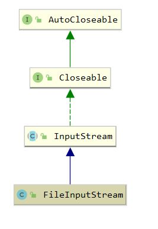

## FileInputStream


### 1. 概述

`java.io.FileInputStream` 是读取文件二进制字节数据的文件输出流，

需要提供 <a>File</a> 或者 <a>FileDescriptor</a>， 写入文本数据则使用 <a>FileReader</a> 

FileInputStream 的继承体系



### 2. 属性

``` java
    // 文件描述符，取决于当前OS 
    private final FileDescriptor fd;

    // 当前输出流关联的通道，调用getChannel()后进行懒初始化
    private FileChannel channel;

    // 文件路径，如果使用FileDescriptor的构造函数则为null
    private final String path;

    // 关闭时的锁
    private final Object closeLock = new Object();
    // 该流是否关闭
    private volatile boolean closed = false;
```

### 3. 构造函数

``` java
    
    public FileInputStream(String name) throws FileNotFoundException {
        this(name != null ? new File(name) : null);
    }

    public FileInputStream(File file) throws FileNotFoundException {
        String name = (file != null ? file.getPath() : null);
        SecurityManager security = System.getSecurityManager();
        if (security != null) {
            security.checkRead(name);
        }
        if (name == null) {
            throw new NullPointerException();
        }
        if (file.isInvalid()) {
            throw new FileNotFoundException("Invalid file path");
        }
        fd = new FileDescriptor();
        fd.attach(this);
        path = name;
        // 打开文件
        open(name);
    }

    public FileInputStream(FileDescriptor fdObj) {
        SecurityManager security = System.getSecurityManager();
        if (fdObj == null) {
            throw new NullPointerException();
        }
        if (security != null) {
            security.checkRead(fdObj);
        }
        fd = fdObj;
        path = null;

        /*
         * FileDescriptor is being shared by streams.
         * Register this stream with FileDescriptor tracker.
         */
        fd.attach(this);
    }
```

### 4. read

``` java
    /**
     * read0和readBytes底层都调用了IO_Read方法，该方法根据OS设置追加属性，并写入数据
     * 例如linux下使用ssize_t read(int fd, void * buf, size_t count)
     * readBytes使用了8192字节的数组作为缓存
     */
    public int read() throws IOException {
        return read0();
    }

    private native int read0() throws IOException;


    private native int readBytes(byte b[], int off, int len) throws IOException;


    public int read(byte b[]) throws IOException {
        return readBytes(b, 0, b.length);
    }

    public int read(byte b[], int off, int len) throws IOException {
        return readBytes(b, off, len);
    }
```

``` c++
// read0的cpp实现
JNIEXPORT jint JNICALL Java_java_io_FileInputStream_read0(JNIEnv *env, jobject this) {
    return readSingle(env, this, fis_fd);
}

jint readSingle(JNIEnv *env, jobject this, jfieldID fid) {
    jint nread;
    char ret;
    FD fd = GET_FD(this, fid);
    if (fd == -1) {
        JNU_ThrowIOException(env, "Stream Closed");
        return -1;
    }
    nread = IO_Read(fd, &ret, 1);
    // JVM的EOF设置为0，并将-1作为jdk中read方法的返回值
    if (nread == 0) { /* EOF */
        return -1;
    } else if (nread == -1) { /* error */
        JNU_ThrowIOExceptionWithLastError(env, "Read error");
    }
    return ret & 0xFF; // 返回低8位
}
```

``` c++
JNIEXPORT jint JNICALL Java_java_io_FileInputStream_readBytes(JNIEnv *env, jobject this,
        jbyteArray bytes, jint off, jint len) {
    return readBytes(env, this, bytes, off, len, fis_fd);
}

jint readBytes(JNIEnv *env, jobject this, jbyteArray bytes,
          jint off, jint len, jfieldID fid)
{
    jint nread;
    char stackBuf[BUF_SIZE]; // 采用8192字节的数组作为缓冲
    char *buf = NULL;
    FD fd;

    if (IS_NULL(bytes)) {
        JNU_ThrowNullPointerException(env, NULL);
        return -1;
    }

    if (outOfBounds(env, off, len, bytes)) {
        JNU_ThrowByName(env, "java/lang/IndexOutOfBoundsException", NULL);
        return -1;
    }

    if (len == 0) {
        return 0;
    } else if (len > BUF_SIZE) {
        buf = malloc(len);
        if (buf == NULL) {
            JNU_ThrowOutOfMemoryError(env, NULL);
            return 0;
        }
    } else {
        buf = stackBuf;
    }

    fd = GET_FD(this, fid);
    if (fd == -1) {
        JNU_ThrowIOException(env, "Stream Closed");
        nread = -1;
    } else {
        nread = IO_Read(fd, buf, len);
        if (nread > 0) {
            // 将jni层的数据传至java层
            (*env)->SetByteArrayRegion(env, bytes, off, nread, (jbyte *)buf);
        } else if (nread == -1) {
            JNU_ThrowIOExceptionWithLastError(env, "Read error");
        } else { /* EOF */
            nread = -1;
        }
    }

    if (buf != stackBuf) {
        free(buf);
    }
    return nread;
}
```

### 5. 其他常用方法

``` java
    // 跳过n个字节
    public long skip(long n) throws IOException {
        return skip0(n);
    }

    // skip0调用IO_Lseek，在linux则系统调用off_t lseek(int fd, off_t offset, int whence)
    private native long skip0(long n) throws IOException;
```

``` java
    // 返回剩余可不阻塞地读取（或跳过）的估计字节数
    public int available() throws IOException {
        return available0();
    }

    private native int available0() throws IOException;
```

```java
    // FileInputStream与FileOutputStrem的close方法实现相同
    public void close() throws IOException {
        synchronized (closeLock) {
            if (closed) {
                return;
            }
            closed = true;
        }

        if (channel != null) {
            channel.close();
        }

        fd.closeAll(new Closeable() {
            public void close() throws IOException {
               close0();
           }
        });
    }
```

