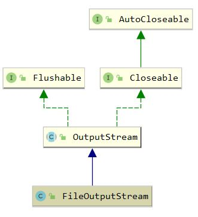

## FileOutputStream

### 1. 概述

`java.io.FileOutputStream` 是用于向文件写入二进制字节数据的文件输出流，

需要提供 <a>File</a> 或者 <a>FileDescriptor</a>， 写入文本数据则使用 <a>FileWriter</a> 

FileOutputStream 的继承体系



### 2. 属性

``` java
    // 文件描述符，取决于当前OS 
    private final FileDescriptor fd;

    // 是否追加写入
    private final boolean append;

    // 当前输出流关联的通道，调用getChannel()后进行懒初始化
    private FileChannel channel;

    // 文件路径，如果使用FileDescriptor的构造函数则为null
    private final String path;

    // 关闭时的锁
    private final Object closeLock = new Object();
    private volatile boolean closed = false;
```

### 3. 构造函数

``` java
    // 默认不追加写入
    public FileOutputStream(String name) throws FileNotFoundException {
        this(name != null ? new File(name) : null, false);
    }

    public FileOutputStream(String name, boolean append)
        throws FileNotFoundException
    {
        this(name != null ? new File(name) : null, append);
    }


    public FileOutputStream(File file) throws FileNotFoundException {
        this(file, false);
    }

    public FileOutputStream(File file, boolean append)
        throws FileNotFoundException
    {
        String name = (file != null ? file.getPath() : null);
        SecurityManager security = System.getSecurityManager();
        if (security != null) {
            security.checkWrite(name);
        }
        if (name == null) {
            throw new NullPointerException();
        }
        if (file.isInvalid()) {
            throw new FileNotFoundException("Invalid file path");
        }
        
        this.fd = new FileDescriptor();
        // 将当前文件流记录到关联的文件描述符
        fd.attach(this);
        this.append = append;
        this.path = name;
        // 打开文件，并设置追加属性
        open(name, append);
    }

    public FileOutputStream(FileDescriptor fdObj) {
        SecurityManager security = System.getSecurityManager();
        if (fdObj == null) {
            throw new NullPointerException();
        }
        if (security != null) {
            security.checkWrite(fdObj);
        }
        this.fd = fdObj;
        this.append = false;
        this.path = null;

        fd.attach(this);
    }
```

### 4. 常用方法

``` java
    /**
     * write和writeBytes底层都调用了IO_Write方法，该方法根据OS设置追加属性，并写入数据
     * 例如linux下使用ssize_t write(int fd, const void * buf, size_t count)
     * writeBytes使用了8192字节的数组作为缓存
     */
    private native void write(int b, boolean append) throws IOException;

    private native void writeBytes(byte b[], int off, int len, boolean append)
        throws IOException;

    public void write(int b) throws IOException {
        write(b, append);
    }

    public void write(byte b[]) throws IOException {
        writeBytes(b, 0, b.length, append);
    }

    public void write(byte b[], int off, int len) throws IOException {
        writeBytes(b, off, len, append);
    }
```

``` java
// writeBytes的本地cpp实现
void writeBytes(JNIEnv *env, jobject this, jbyteArray bytes,
           jint off, jint len, jboolean append, jfieldID fid)
{
    jint n;
    char stackBuf[BUF_SIZE];
    char *buf = NULL;
    FD fd;

    if (IS_NULL(bytes)) {
        JNU_ThrowNullPointerException(env, NULL);
        return;
    }

    if (outOfBounds(env, off, len, bytes)) {
        JNU_ThrowByName(env, "java/lang/IndexOutOfBoundsException", NULL);
        return;
    }

    if (len == 0) {
        return;
    } else if (len > BUF_SIZE) {
        buf = malloc(len);
        if (buf == NULL) {
            JNU_ThrowOutOfMemoryError(env, NULL);
            return;
        }
    } else {
        buf = stackBuf;
    }

    (*env)->GetByteArrayRegion(env, bytes, off, len, (jbyte *)buf);

    if (!(*env)->ExceptionOccurred(env)) {
        off = 0;
        while (len > 0) {
            fd = GET_FD(this, fid);
            if (fd == -1) {
                JNU_ThrowIOException(env, "Stream Closed");
                break;
            }
            if (append == JNI_TRUE) {
                n = IO_Append(fd, buf+off, len);
            } else {
                n = IO_Write(fd, buf+off, len);
            }
            if (n == -1) {
                JNU_ThrowIOExceptionWithLastError(env, "Write error");
                break;
            }
            off += n;
            len -= n;
        }
    }
    if (buf != stackBuf) {
        free(buf);
    }
}
```

```java
    public void close() throws IOException {
        synchronized (closeLock) {
            if (closed) {
                return;
            }
            closed = true;
        }

        if (channel != null) {
            channel.close();
        }

        fd.closeAll(new Closeable() {
            public void close() throws IOException {
               close0();
           }
        });
    }
```

