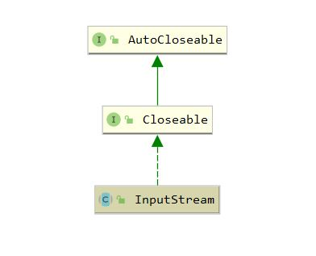

## InputStream

`java.io.InputStream` 是 java io 中**字节**输入流的顶级抽象父类，继承体系如下



``` java
package java.io;

public abstract class InputStream implements Closeable {

    // skip时所能使用的最大缓存长度
    private static final int MAX_SKIP_BUFFER_SIZE = 2048;

    /**
     * 从输入流读取一个字节，成功返回该字节(转为int)，失败返回 -1
     * 该方法为阻塞io
     */
    public abstract int read() throws IOException;

    /** 
     * 从输入流读取b.length个字节
     * 返回值为实际读取的字节数，若为-1则已读取完毕
     */
    public int read(byte b[]) throws IOException {
        return read(b, 0, b.length);
    }

    /** 
     * 从输入流读取指定数量字节，并存放于byte数组起始偏移off的位置
     * 返回值为实际读取的字节数，若为-1则已读取完毕
     */
    public int read(byte b[], int off, int len) throws IOException {
        if (b == null) {
            throw new NullPointerException();
        } else if (off < 0 || len < 0 || len > b.length - off) {
            throw new IndexOutOfBoundsException();
        } else if (len == 0) {
            return 0;
        }

        int c = read();
        if (c == -1) {
            return -1;
        }
        b[off] = (byte)c;

        int i = 1;
        try {
            for (; i < len ; i++) {
                c = read();
                if (c == -1) {
                    break;
                }
                b[off + i] = (byte)c;
            }
        } catch (IOException ee) {
        }
        return i;
    }


    // 跳过n个字节，返回实际跳过的字节数
    public long skip(long n) throws IOException {

        long remaining = n;
        int nr;

        if (n <= 0) {
            return 0;
        }

        int size = (int)Math.min(MAX_SKIP_BUFFER_SIZE, remaining);
        byte[] skipBuffer = new byte[size];
        while (remaining > 0) {
            nr = read(skipBuffer, 0, (int)Math.min(size, remaining));
            if (nr < 0) {
                break;
            }
            remaining -= nr;
        }

        return n - remaining;
    }

    // 返回剩余可不阻塞地读取（或跳过）的估计字节数
    public int available() throws IOException {
        return 0;
    }


    public void close() throws IOException {}

    /**
     * mark()与reset()配合使用实现标记以及回溯的功能
     */
    public synchronized void mark(int readlimit) {}


    public synchronized void reset() throws IOException {
        throw new IOException("mark/reset not supported");
    }

    // 是否支持标记操作
    public boolean markSupported() {
        return false;
    }

}

```

