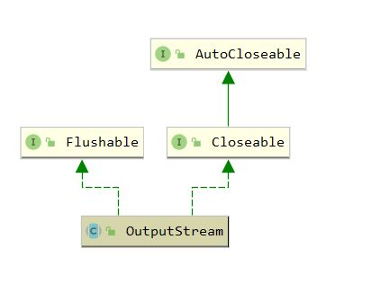

## OutputStream

`java.io.OutputStream` 是 java io 中**字节**输出流的顶级抽象父类，继承体系如下



``` java
package java.io;


public abstract class OutputStream implements Closeable, Flushable {
    
    /**
     * 往输出流写入一个字节，写入低8位
     * 输出流关闭后调用该方法将抛出IOException
     */
    public abstract void write(int b) throws IOException;

    /**
     * 往输出流写入字节数组全部元素
     */
    public void write(byte b[]) throws IOException {
        write(b, 0, b.length);
    }

    /**
     * 往输出流写入字节数组中的指定元素
     */
    public void write(byte b[], int off, int len) throws IOException {
        if (b == null) {
            throw new NullPointerException();
        } else if ((off < 0) || (off > b.length) || (len < 0) ||
                   ((off + len) > b.length) || ((off + len) < 0)) {
            throw new IndexOutOfBoundsException();
        } else if (len == 0) {
            return;
        }
        for (int i = 0 ; i < len ; i++) {
            write(b[off + i]);
        }
    }

    /**
     * 如果此输出流的实现使用了缓冲，
     * 调用此方法将这些字节立即写入预期的目标
     */
    public void flush() throws IOException {
    }

    /**
     * Closes this output stream and releases any system resources
     * associated with this stream. The general contract of <code>close</code>
     * is that it closes the output stream. A closed stream cannot perform
     * output operations and cannot be reopened.
     * <p>
     * The <code>close</code> method of <code>OutputStream</code> does nothing.
     *
     * @exception  IOException  if an I/O error occurs.
     */
    public void close() throws IOException {
    }

}

```

