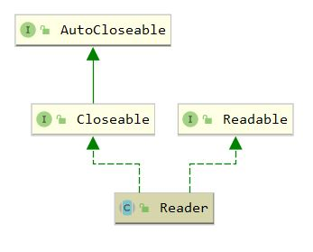

## Reader

`java.io.Reader` 是 java io 中**字符**输入流的顶级抽象父类，继承体系如下



```java
package java.io;

public abstract class Reader implements Readable, Closeable {

    // 用于同步
    protected Object lock;

    protected Reader() {
        this.lock = this;
    }

    protected Reader(Object lock) {
        if (lock == null) {
            throw new NullPointerException();
        }
        this.lock = lock;
    }

    public int read(java.nio.CharBuffer target) throws IOException {
        int len = target.remaining();
        char[] cbuf = new char[len];
        int n = read(cbuf, 0, len);
        if (n > 0)
            target.put(cbuf, 0, n);
        return n;
    }

    public int read() throws IOException {
        char cb[] = new char[1];
        if (read(cb, 0, 1) == -1)
            return -1;
        else
            return cb[0];
    }

    public int read(char cbuf[]) throws IOException {
        return read(cbuf, 0, cbuf.length);
    }

    /** 
     * 核心读取方法，属于阻塞IO
     * 返回值为读取的字符个数，-1为到达流尽头
     */
    abstract public int read(char cbuf[], int off, int len) throws IOException;

    /** Maximum skip-buffer size */
    private static final int maxSkipBufferSize = 8192;

    // 存储跳过的字符，使用懒初始化
    private char skipBuffer[] = null;

    // 跳过n个字符，读取过程通过加锁阻塞，并使用skipBuffer进行存储
    public long skip(long n) throws IOException {
        if (n < 0L)
            throw new IllegalArgumentException("skip value is negative");
        int nn = (int) Math.min(n, maxSkipBufferSize);
        synchronized (lock) {
            if ((skipBuffer == null) || (skipBuffer.length < nn))
                skipBuffer = new char[nn];
            long r = n;
            while (r > 0) {
                int nc = read(skipBuffer, 0, (int)Math.min(r, nn));
                if (nc == -1)
                    break;
                r -= nc;
            }
            return n - r;
        }
    }

    /**
     * Tells whether this stream is ready to be read.
     *
     * @return True if the next read() is guaranteed not to block for input,
     * false otherwise.  Note that returning false does not guarantee that the
     * next read will block.
     *
     * @exception  IOException  If an I/O error occurs
     */
    public boolean ready() throws IOException {
        return false;
    }

    public boolean markSupported() {
        return false;
    }

    /**
     * mark()与reset()配合使用实现标记以及回溯的功能
     */
    public void mark(int readAheadLimit) throws IOException {
        throw new IOException("mark() not supported");
    }

    public void reset() throws IOException {
        throw new IOException("reset() not supported");
    }

    /**
     * Closes the stream and releases any system resources associated with
     * it.  Once the stream has been closed, further read(), ready(),
     * mark(), reset(), or skip() invocations will throw an IOException.
     * Closing a previously closed stream has no effect.
     *
     * @exception  IOException  If an I/O error occurs
     */
     abstract public void close() throws IOException;

}
```

