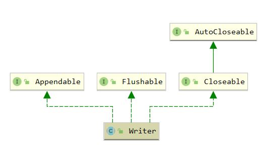

## Writer

`java.io.Writer` 是 java io 中**字符**输出流的顶级抽象父类，继承体系如下



``` java
package java.io;

public abstract class Writer implements Appendable, Closeable, Flushable {

    /**
     * Temporary buffer used to hold writes of strings and single characters
     */
    private char[] writeBuffer;
    
    // writeBuffer的长度，默认为1024
    private static final int WRITE_BUFFER_SIZE = 1024;

    protected Object lock;

    protected Writer() {
        this.lock = this;
    }

    protected Writer(Object lock) {
        if (lock == null) {
            throw new NullPointerException();
        }
        this.lock = lock;
    }

    public void write(int c) throws IOException {
        synchronized (lock) {
            if (writeBuffer == null){
                writeBuffer = new char[WRITE_BUFFER_SIZE];
            }
            writeBuffer[0] = (char) c;
            write(writeBuffer, 0, 1);
        }
    }

    public void write(char cbuf[]) throws IOException {
        write(cbuf, 0, cbuf.length);
    }

    // 核心写入函数
    abstract public void write(char cbuf[], int off, int len) throws IOException;


    public void write(String str) throws IOException {
        write(str, 0, str.length());
    }

    // 写入字符串
    public void write(String str, int off, int len) throws IOException {
        synchronized (lock) {
            char cbuf[];
            // 当字符串长度大于1024，则创建相应大小的字符数组
            if (len <= WRITE_BUFFER_SIZE) {
                if (writeBuffer == null) {
                    writeBuffer = new char[WRITE_BUFFER_SIZE];
                }
                cbuf = writeBuffer;
            } else {    // Don't permanently allocate very large buffers.
                cbuf = new char[len];
            }
            str.getChars(off, (off + len), cbuf, 0); // 将字符串转为字符数组
            write(cbuf, 0, len);
        }
    }

    public Writer append(CharSequence csq) throws IOException {
        if (csq == null)
            write("null");
        else
            write(csq.toString());
        return this;
    }

    public Writer append(CharSequence csq, int start, int end) throws IOException {
        CharSequence cs = (csq == null ? "null" : csq);
        write(cs.subSequence(start, end).toString());
        return this;
    }

    public Writer append(char c) throws IOException {
        write(c);
        return this;
    }

    /**
     * 如果此输出流的实现使用了缓冲，
     * 调用此方法将这些字节立即写入预期的目标
     */
    abstract public void flush() throws IOException;

    /**
     * Closes the stream, flushing it first. Once the stream has been closed,
     * further write() or flush() invocations will cause an IOException to be
     * thrown. Closing a previously closed stream has no effect.
     *
     * @throws  IOException
     *          If an I/O error occurs
     */
    abstract public void close() throws IOException;

}

```

