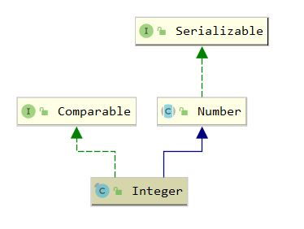

## Integer

### 1. 介绍

#### 1.1 介绍

基本类型 int 的包装类

#### 1.2 继承体系



### 2. 属性

``` java
    // 最小值， -2^31
	@Native public static final int   MIN_VALUE = 0x80000000;
	// 最大值, 2^31 - 1
    @Native public static final int   MAX_VALUE = 0x7fffffff;
	// int.Class
    public static final Class<Integer>  TYPE = (Class<Integer>) 	Class.getPrimitiveClass("int");
	// 包装的int值
    private final int value;
	// 当前类型所占bit数，int固定占32位
    @Native public static final int SIZE = 32;
	// 当前类型所占字节数，int为4个字节
    public static final int BYTES = SIZE / Byte.SIZE;
```

### 3. 构造函数

``` java
    public Integer(int value) {
        this.value = value;
    }
	
	// 将字符串转化为10进制整数
    public Integer(String s) throws NumberFormatException {
        this.value = parseInt(s, 10);
    }
```

``` java
    /*
    * 核心思路: 通过第一个字符判断正负，计算过程中先将结果保存为负数，计算结束后再进行正负转换
    */
	public static int parseInt(String s, int radix)
                throws NumberFormatException
    {
        /*
         * WARNING: This method may be invoked early during VM initialization
         * before IntegerCache is initialized. Care must be taken to not use
         * the valueOf method.
         */
        if (s == null) {
            throw new NumberFormatException("null");
        }
		
        if (radix < Character.MIN_RADIX) { // Min_RADIX = 2
            throw new NumberFormatException("radix " + radix +
                                            " less than Character.MIN_RADIX");
        }

        if (radix > Character.MAX_RADIX) { // MAX_RADIX = 36
            throw new NumberFormatException("radix " + radix +
                                            " greater than Character.MAX_RADIX");
        }

        int result = 0;
        boolean negative = false;
        int i = 0, len = s.length();
        int limit = -Integer.MAX_VALUE;
        int multmin;
        int digit;

        if (len > 0) {
            char firstChar = s.charAt(0);
            if (firstChar < '0') { // Possible leading "+" or "-"
                if (firstChar == '-') {
                    negative = true;
                    limit = Integer.MIN_VALUE;
                } else if (firstChar != '+')
                    throw NumberFormatException.forInputString(s);

                if (len == 1) // Cannot have lone "+" or "-"
                    throw NumberFormatException.forInputString(s);
                i++;
            }
            multmin = limit / radix;
            while (i < len) {
                // Accumulating negatively avoids surprises near MAX_VALUE
                digit = Character.digit(s.charAt(i++),radix);
                if (digit < 0) {
                    throw NumberFormatException.forInputString(s);
                }
                // 发生了overflow
                if (result < multmin) {
                    throw NumberFormatException.forInputString(s);
                }
                result *= radix;
                if (result < limit + digit) {
                    throw NumberFormatException.forInputString(s);
                }
                result -= digit; // 保证result为负数，最后再进行正负转换
            }
        } else {
            throw NumberFormatException.forInputString(s);
        }
        return negative ? result : -result;
    }
```

### 4. valueOf

``` java
    // Integer i = 10; 调用的是valueOf方法
	public static Integer valueOf(int i) {
        // 在 [low, high]范围的整数，会从缓存中获取
        if (i >= IntegerCache.low && i <= IntegerCache.high)
            return IntegerCache.cache[i + (-IntegerCache.low)];
        // 在范围之外会创建新的包装类，使用==比较结果为false，比较Integer必须采用equal函数
        return new Integer(i);
    }
```

``` java
    private static class IntegerCache {
        static final int low = -128;
        static final int high;
        static final Integer cache[];

        static {
            int h = 127;
            /*
            * high value may be configured by property
            * 可以通过 -XX:AutoBoxCacheMax=200 或者 
            * -Djava.lang.Integer.IntegerCache.high=200设置
            * 该数值会被写入sun.misc.VM class系统私有配置文件
            */
            String integerCacheHighPropValue =
                sun.misc.VM.getSavedProperty("java.lang.Integer.IntegerCache.high");
            if (integerCacheHighPropValue != null) {
                try {
                    int i = parseInt(integerCacheHighPropValue);
                    i = Math.max(i, 127); // 最小上限 127
                    h = Math.min(i, Integer.MAX_VALUE - (-low) -1);
                } catch( NumberFormatException nfe) {
                    // If the property cannot be parsed into an int, ignore it.
                }
            }
            high = h;

            cache = new Integer[(high - low) + 1];
            int j = low;
            for(int k = 0; k < cache.length; k++)
                cache[k] = new Integer(j++); // 此处不能使用ValueOf，否则stack-overflow

            // range [-128, 127] must be interned (JLS7 5.1.7)
            assert IntegerCache.high >= 127;
        }

        private IntegerCache() {}
    }
```

### 5. 巧妙的位运算

``` java
    // 返回最高位的1的序号
	public static int highestOneBit(int i) {
        // HD, Figure 3-1
        i |= (i >>  1);
        i |= (i >>  2);
        i |= (i >>  4);
        i |= (i >>  8);
        i |= (i >> 16);
        return i - (i >>> 1);
    }

	// 返回最低位的1的序号
	public static int lowestOneBit(int i) {
        // HD, Section 2-1
        return i & -i;
    }

    public static int reverse(int i) {
        // HD, Figure 7-1
        i = (i & 0x55555555) << 1 | (i >>> 1) & 0x55555555;
        i = (i & 0x33333333) << 2 | (i >>> 2) & 0x33333333;
        i = (i & 0x0f0f0f0f) << 4 | (i >>> 4) & 0x0f0f0f0f;
        i = (i << 24) | ((i & 0xff00) << 8) |
            ((i >>> 8) & 0xff00) | (i >>> 24);
        return i;
    }
```

