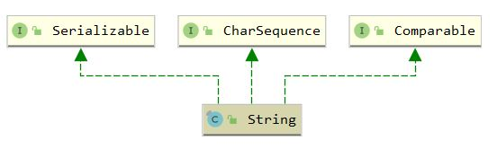

## String

### 1. 介绍

#### 1.1 介绍

Java 中的字符串类，String 是不可变的，直接使用双引号声明的 String 将存放在字符串常量池中，位于堆中

#### 1.2 继承体系



### 2. 属性

``` java
    /*
    * 底层使用不可变char数组存储，在jdk1.9之后改用byte数组存储，并且有ISO-8859-1和UTF16两种编码
    */
    private final char value[];
    // 默认为 0
    private int hash;
```

### 3. 构造函数

``` java
    public String() {
        this.value = "".value;
    }

    public String(String original) {
        this.value = original.value;
        this.hash = original.hash;
    }

    public String(char value[], int offset, int count) {
        if (offset < 0) {
            throw new StringIndexOutOfBoundsException(offset);
        }
        if (count <= 0) {
            if (count < 0) {
                throw new StringIndexOutOfBoundsException(count);
            }
            if (offset <= value.length) {
                this.value = "".value;
                return;
            }
        }
        // Note: offset or count might be near -1>>>1.
        if (offset > value.length - count) {
            throw new StringIndexOutOfBoundsException(offset + count);
        }
        this.value = Arrays.copyOfRange(value, offset, offset+count);
    }
	
    /* 以下省略一系列根据各种类型数组初始化的构造函数 */
			...
```

### 4. equals 和 hashCode

``` java
    public boolean equals(Object anObject) {
        if (this == anObject) {
            return true;
        }
        if (anObject instanceof String) {
            String anotherString = (String)anObject;
            int n = value.length;
            if (n == anotherString.value.length) {
                char v1[] = value;
                char v2[] = anotherString.value;
                int i = 0;
                while (n-- != 0) {
                    if (v1[i] != v2[i])
                        return false;
                    i++;
                }
                return true;
            }
        }
        return false;
    }
```

``` java
    public int hashCode() {
        int h = hash;
        if (h == 0 && value.length > 0) {
            char val[] = value;

            // 乘质数计算
            for (int i = 0; i < value.length; i++) {
                h = 31 * h + val[i];
            }
            // 记录，下次直接返回hash
            hash = h;
        }
        return h;
    }
```

