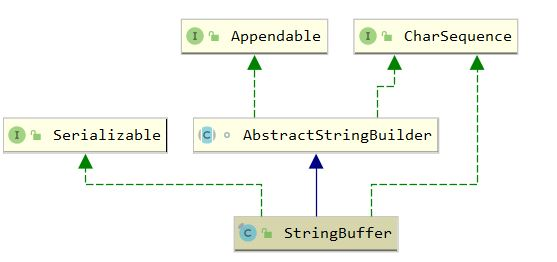

## StringBuffer

### 1. 介绍

#### 1.1 介绍

线程安全的可变字符串类，通过 synchronized 保证线程安全，初始容量为 16， 采用 2倍 + 2 扩容

#### 1.2 继承体系



### 2. 属性

``` java
    // 缓存最后一次toString()的内容，但StringBuffer改变后，将其置为null
	private transient char[] toStringCache;
```

### 3. 构造函数

``` java
    // 默认容量为 16
	public StringBuffer() {
        super(16);
    }

    public StringBuffer(int capacity) {
        super(capacity);
    }

    public StringBuffer(String str) {
        super(str.length() + 16);
        append(str);
    }

    public StringBuffer(CharSequence seq) {
        this(seq.length() + 16);
        append(seq);
    }
```

``` java
    // 构造时直接初始化
	AbstractStringBuilder(int capacity) {
        value = new char[capacity];
    }
```

### 4. append 方法

``` java
    public synchronized StringBuffer append(String str) {
        // 将缓存置为null
        toStringCache = null;
        super.append(str); // 调用AbstractStringBuilder.append
        return this;
    }
```

``` java
    // AbstractStringBuilder.append
	public AbstractStringBuilder append(String str) {
        if (str == null)
            return appendNull();
        int len = str.length();
        ensureCapacityInternal(count + len); // 确保能够存放
        str.getChars(0, len, value, count);
        count += len;
        return this;
    }

	private void ensureCapacityInternal(int minimumCapacity) {
        // overflow-conscious code
        if (minimumCapacity - value.length > 0) {
            // Arrays.copy 会新建指定大小的数组并进行复制，完成扩容
            value = Arrays.copyOf(value,
                    newCapacity(minimumCapacity));
        }
    }
```

``` java
    private int newCapacity(int minCapacity) {
        // 2倍+2 扩容
        int newCapacity = (value.length << 1) + 2;
        if (newCapacity - minCapacity < 0) {
            newCapacity = minCapacity;
        }
        return (newCapacity <= 0 || MAX_ARRAY_SIZE - newCapacity < 0)
            ? hugeCapacity(minCapacity)
            : newCapacity;
    }
```

### 5. toString

``` java
    public synchronized String toString() {
        // 更新缓存
        if (toStringCache == null) {
            toStringCache = Arrays.copyOfRange(value, 0, count);
        }
        return new String(toStringCache, true);
    }
```

