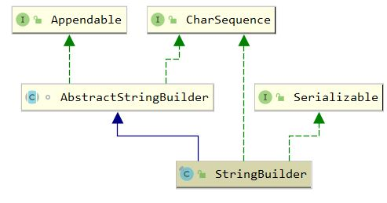

## StringBuilder

### 1. 介绍

#### 1.1 介绍

可变字符串类，API 与实现基本与 <a href="StringBuffer.md">StringBuffer</a> 相同，线程不安全

#### 1.2 继承体系




### 2. 构造函数

``` java
    public StringBuilder() {
        super(16);
    }

    public StringBuilder(int capacity) {
        super(capacity);
    }

    public StringBuilder(String str) {
        super(str.length() + 16);
        append(str);
    }
```

``` java
    // 构造时直接初始化
	AbstractStringBuilder(int capacity) {
        value = new char[capacity];
    }
```

### 3. append 方法

``` java
    public StringBuilder append(String str) {
        super.append(str); // AbstractStringBuilder.append
        return this;
    }
```

``` java
    // AbstractStringBuilder.append
	public AbstractStringBuilder append(String str) {
        if (str == null)
            return appendNull();
        int len = str.length();
        ensureCapacityInternal(count + len); // 确保能够存放
        str.getChars(0, len, value, count);
        count += len;
        return this;
    }

	private void ensureCapacityInternal(int minimumCapacity) {
        // overflow-conscious code
        if (minimumCapacity - value.length > 0) {
            // Arrays.copy 会新建指定大小的数组并进行复制，完成扩容
            value = Arrays.copyOf(value,
                    newCapacity(minimumCapacity));
        }
    }
```

``` java
    private int newCapacity(int minCapacity) {
        // 2倍+2 扩容
        int newCapacity = (value.length << 1) + 2;
        if (newCapacity - minCapacity < 0) {
            newCapacity = minCapacity;
        }
        return (newCapacity <= 0 || MAX_ARRAY_SIZE - newCapacity < 0)
            ? hugeCapacity(minCapacity)
            : newCapacity;
    }
```

