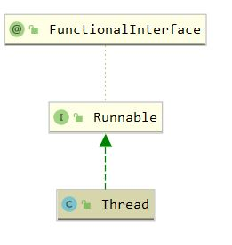

## Thread

### 1. 介绍

#### 1.1 介绍

Java 中的线程类，通过静态代理模式代理 Runnable 对象，为其分配线程，并调用其 run 方法

``` java
@FunctionalInterface
public interface Runnable {
    public abstract void run();
}
```

#### 1.2 继承体系



### 2. 属性

``` java
	// 线程名称
    private volatile String name;
	// 优先级
    private int priority;
	// 是否是守护线程
    private boolean daemon = false;
	// JVM 状态
    private boolean stillborn = false;
	// 实际被执行的对象
    private Runnable target;

	// 优先级从1到10，默认为5
    public final static int MIN_PRIORITY = 1;
    public final static int NORM_PRIORITY = 5;
    public final static int MAX_PRIORITY = 10;

	// 所属线程组
    private ThreadGroup group;

   	// 该线程的上下文类加载器
    private ClassLoader contextClassLoader;
```

``` java
    /**
     * ThreadLocal 的 ThreadLocalMap 是线程的一个属性，所以在多线程环境下 threadLocals 是线程安全的
     */
    ThreadLocal.ThreadLocalMap threadLocals = null;

    /**
     * 当创建子线程时，子线程可以得到父线程的 inheritableThreadLocals
     */
    ThreadLocal.ThreadLocalMap inheritableThreadLocals = null;

    /**
     * 此线程请求的堆栈大小
     */
    private long stackSize;

```

``` java
	private long tid; // 线程id
    /* For generating thread ID */
    private static long threadSeqNumber; // 自增创建tid
    private volatile int threadStatus = 0; // 线程状态
```

### 3. 构造函数

``` java
    public Thread() {
        init(null, null, "Thread-" + nextThreadNum(), 0);
    }

    public Thread(Runnable target) {
        init(null, target, "Thread-" + nextThreadNum(), 0);
    }

    public Thread(ThreadGroup group, Runnable target) {
        init(group, target, "Thread-" + nextThreadNum(), 0);
    }
	// 省略其他构造函数
```

``` java
    private void init(ThreadGroup g, Runnable target, String name,
                      long stackSize) {
        init(g, target, name, stackSize, null, true);
    }
```

``` java
    private void init(ThreadGroup g, Runnable target, String name,
                      long stackSize, AccessControlContext acc,
                      boolean inheritThreadLocals) {
        if (name == null) {
            throw new NullPointerException("name cannot be null");
        }

        this.name = name;

        // 父线程设置为当前线程，当前线程创建了本线程
        Thread parent = currentThread();
        // 安全管理器不为空，则从安全管理器获得线程组，否则继承父线程的线程组
        SecurityManager security = System.getSecurityManager();
        if (g == null) {
            /* Determine if it's an applet or not */

            /* If there is a security manager, ask the security manager
               what to do. */
            if (security != null) {
                g = security.getThreadGroup();
            }

            /* If the security doesn't have a strong opinion of the matter
               use the parent thread group. */
            if (g == null) {
                g = parent.getThreadGroup();
            }
        }

        /* checkAccess regardless of whether or not threadgroup is
           explicitly passed in. */
        g.checkAccess();

        /*
         * Do we have the required permissions?
         */
        if (security != null) {
            if (isCCLOverridden(getClass())) {
                security.checkPermission(SUBCLASS_IMPLEMENTATION_PERMISSION);
            }
        }

        g.addUnstarted();

        this.group = g;
        this.daemon = parent.isDaemon(); // 继承父线程的守护属性
        this.priority = parent.getPriority(); // 继承父线程的优先级
        if (security == null || isCCLOverridden(parent.getClass()))
            this.contextClassLoader = parent.getContextClassLoader();
        else
            this.contextClassLoader = parent.contextClassLoader;
        this.inheritedAccessControlContext =
                acc != null ? acc : AccessController.getContext();
        this.target = target;
        setPriority(priority);
        // 复制父线程的 inheritableThreadLocals
        if (inheritThreadLocals && parent.inheritableThreadLocals != null)
            this.inheritableThreadLocals =
                ThreadLocal.createInheritedMap(parent.inheritableThreadLocals);
        /* Stash the specified stack size in case the VM cares */
        this.stackSize = stackSize;

        /* Set thread ID */
        tid = nextThreadID(); // 自增线程id
    }
```

###  4. 线程状态	

```java
public enum State {
    NEW, // 未启动

    RUNNABLE, // 在JVM已经执行，但在OS中可能在等待资源，比如CPU

    BLOCKED, // 阻塞，等待获得锁

    WAITING, // 等待状态，可能等notify()等方法唤醒

    TIMED_WAITING, // 调用sleep()或者wait()超时后进行睡眠

    TERMINATED; // 停止，已经完成执行
}
```

### 5. start 方法

``` java
    // 必须调用start才能创建新线程，只调用run仍在当前线程执行
	public synchronized void start() {
        
        // 状态必须为 "NEW"
        if (threadStatus != 0)
            throw new IllegalThreadStateException();

        /* Notify the group that this thread is about to be started
         * so that it can be added to the group's list of threads
         * and the group's unstarted count can be decremented. */
        group.add(this);

        boolean started = false;
        try {
            start0();
            started = true;
        } finally {
            try {
                // 失败则从线程组中删除
                if (!started) {
                    group.threadStartFailed(this);
                }
            } catch (Throwable ignore) {
                /* do nothing. If start0 threw a Throwable then
                  it will be passed up the call stack */
            }
        }
    }

    private native void start0(); // 开启新线程，并执行run方法
```

``` java
    // 当前线程执行run()
	public void run() {
        if (target != null) {
            target.run();
        }
    }
```


### 6. 常用方法

``` java
    // 获得当前线程
	public static native Thread currentThread();
	// 当前线程交出CPU资源，进入RUNNABLE状态，等待系统调度
	public static native void yield();
	// 线程睡眠，交出CPU，睡眠时间结束之后等待系统调度获得CPU
    public static native void sleep(long millis) throws InterruptedException;


	// 中断线程，给线程设置标记，而不是立即停止
    public void interrupt() {
        // 如果由别的线程对当前线程发起中断
        if (this != Thread.currentThread())
            checkAccess();

        synchronized (blockerLock) {
            Interruptible b = blocker;
            // 如果存在线程中断回调标记
            if (b != null) {
                // 设置中断标记
                interrupt0();
                b.interrupt(this);
                return;
            }
        }
        interrupt0();
    }
```

``` java
    // 默认等待其他线程结束
	public final void join() throws InterruptedException {
        join(0);
    }
	
	/*
    * 使该方法的调用者所在的线程进入 WAITING 或 TIMED_WAITING 状态，
    * 直到当前线程死亡，或者等待超时之后，再去执行调用者线程
    * 相当于当前线程插队
    */
	public final synchronized void join(long millis) throws InterruptedException {
        long base = System.currentTimeMillis();
        long now = 0;

        if (millis < 0) {
            throw new IllegalArgumentException("timeout value is negative");
        }

        if (millis == 0) {
            // 其他线程好了之后，当前线程的状态是 TERMINATED,isAlive 返回 false
            // NEW false
            // RUNNABLE true
            while (isAlive()) {
                // 调用Object.wait()等待其他线程,一直等待
                wait(0);
            }
        } else {
            while (isAlive()) {
                long delay = millis - now;
                if (delay <= 0) {
                    break;
                }
                // 等待一定的时间，如果在 delay 时间内，等待的线程仍没有结束，放弃等待
                wait(delay);
                now = System.currentTimeMillis() - base;
            }
        }
    }
```

