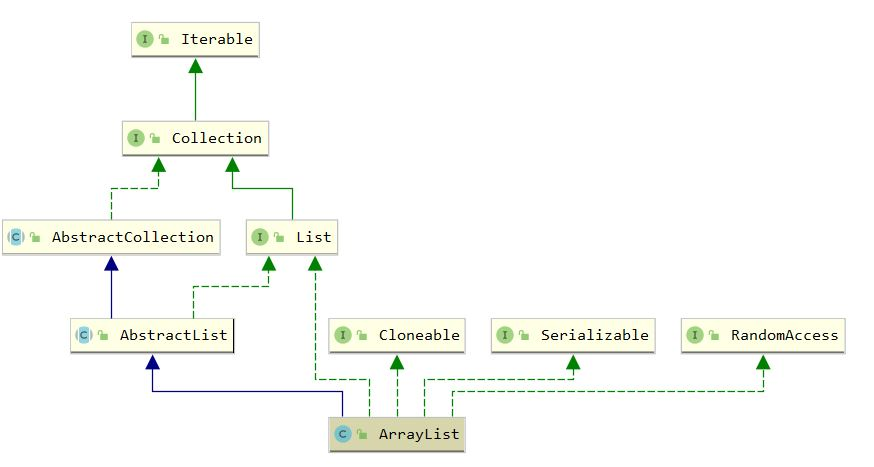

[toc]

## ArrayList

### 1. 原理

#### 1.1 继承体系




#### 1.2 注意点

- 非线程安全，线程安全考虑使用 CopyOnWriteArrayList

- 采用 1.5 倍扩容，默认进行了懒初始化，一开始为空数组，第一个元素插入后数组长度变为 10


### 2. 属性

``` java
    // 默认容量，第一次插入后扩容
	private static final int DEFAULT_CAPACITY = 10; 
    // 指定initialCapacity为0时，使用该数组构造
    private static final Object[] EMPTY_ELEMENTDATA = {}; 
	// 默认构造使用空数组
    private static final Object[] DEFAULTCAPACITY_EMPTY_ELEMENTDATA = {}; 
	// 采用数组存储数据，并且使用transient修饰，只序列化数组非空部分
    transient Object[] elementData; 
	// 元素个数
    private int size;
```

### 3. 构造方法

``` java
    // 指定初始化容量
	public ArrayList(int initialCapacity) {
        if (initialCapacity > 0) {
            this.elementData = new Object[initialCapacity];
        } else if (initialCapacity == 0) {
            this.elementData = EMPTY_ELEMENTDATA;
        } else {
            throw new IllegalArgumentException("Illegal Capacity: "+
                                               initialCapacity);
        }
    }

	// 默认构造为空数组
    public ArrayList() {
        this.elementData = DEFAULTCAPACITY_EMPTY_ELEMENTDATA;
    }

    public ArrayList(Collection<? extends E> c) {
        elementData = c.toArray();
        if ((size = elementData.length) != 0) {
            // c.toArray might (incorrectly) not return Object[] (see 6260652)
            if (elementData.getClass() != Object[].class)
                elementData = Arrays.copyOf(elementData, size, Object[].class);
        } else {
            // replace with empty array.
            this.elementData = EMPTY_ELEMENTDATA;
        }
    }
```

### 4. add方法

``` java
    // 尾部添加
	public boolean add(E e) {
        // 调用ensureCapacityInternal至少保证当前数据能够存储
        ensureCapacityInternal(size + 1);  // Increments modCount!!
        elementData[size++] = e;
        return true;
    }

	// 指定位置添加
    public void add(int index, E element) {
        rangeCheckForAdd(index);

        ensureCapacityInternal(size + 1);  // Increments modCount!!
        System.arraycopy(elementData, index, elementData, index + 1,
                         size - index);
        elementData[index] = element;
        size++;
    }
```

``` java
    private void ensureCapacityInternal(int minCapacity) {
        ensureExplicitCapacity(calculateCapacity(elementData, minCapacity));
    }

    private static int calculateCapacity(Object[] elementData, int minCapacity) {
        // 第一次插入，minCapacity为1，故数组长度增长为10
        if (elementData == DEFAULTCAPACITY_EMPTY_ELEMENTDATA) {
            return Math.max(DEFAULT_CAPACITY, minCapacity);
        }
        return minCapacity;
    }

    private void ensureExplicitCapacity(int minCapacity) {
        modCount++;

        if (minCapacity - elementData.length > 0)
            grow(minCapacity);
    }
```

``` java
    // 核心扩容代码
	private void grow(int minCapacity) {
        int oldCapacity = elementData.length;
        // 采用1.5倍扩容
        int newCapacity = oldCapacity + (oldCapacity >> 1); 
        // 选择更大值，除了自动扩容，还可通过ensureCapacity(int minCapacity)手动扩容
        if (newCapacity - minCapacity < 0)
            newCapacity = minCapacity;
        // 防止超过最大长度
        if (newCapacity - MAX_ARRAY_SIZE > 0)
            newCapacity = hugeCapacity(minCapacity);
        elementData = Arrays.copyOf(elementData, newCapacity);
    }
```

### 5. remove方法

``` java
    public E remove(int index) {
        rangeCheck(index);

        modCount++;
        E oldValue = elementData(index);

        int numMoved = size - index - 1;
        if (numMoved > 0)
            System.arraycopy(elementData, index+1, elementData, index,
                             numMoved);
        // 数组尾部设为null让GC回收
        elementData[--size] = null; // clear to let GC do its work

        return oldValue;
    }
```

