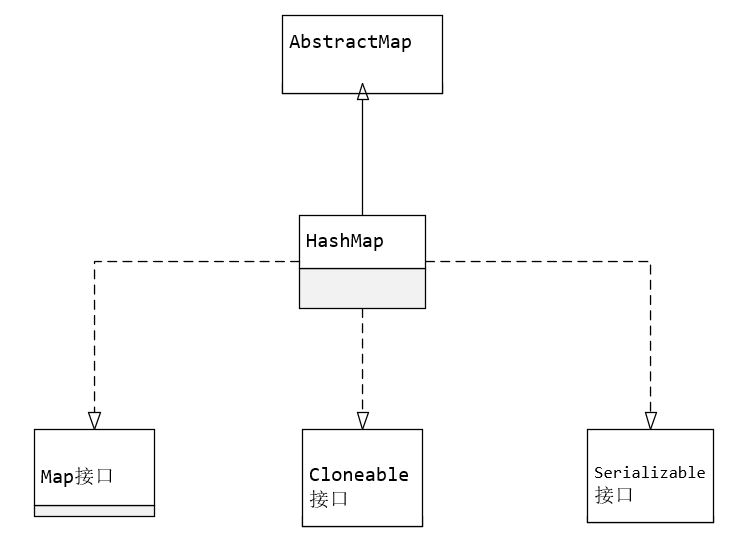

[toc]

## HashMap

### 1. 原理

#### 1.1 继承体系



#### 1.2 Node 内部类

``` java
    static class Node<K,V> implements Map.Entry<K,V> {
        final int hash;
        final K key;
        V value;
        // 拉链解决哈希碰撞
        Node<K,V> next;

        // 省略构造函数、getter、setter
        
        public final int hashCode() {
            return Objects.hashCode(key) ^ Objects.hashCode(value);
        }

        public final boolean equals(Object o) {
            if (o == this)
                return true;
            if (o instanceof Map.Entry) {
                Map.Entry<?,?> e = (Map.Entry<?,?>)o;
                if (Objects.equals(key, e.getKey()) &&
                    Objects.equals(value, e.getValue()))
                    return true;
            }
            return false;
        }
    }
```

#### 1.3 注意点

- 默认数组大小 16，最大长度 2^31，默认负载因子 0.75，树降级为链表的阈值为 6 (rehash 时触发)

  **树化阈值**有两个，链表长度为 8， 数组长度为 64

- ``` java
      transient Node<K,V>[] table; // Node 数组
      transient int size; // 当前Node个数
      transient int modCount; // 当前结构修改次数
  	int threshold; // 扩容阈值，元素格式超过阈值进行扩容
  	final float loadFactor; // 负载因子，用于计算 threshold
  ```


### 2. 构造方法

``` java
    public HashMap(int initialCapacity, float loadFactor) {
        if (initialCapacity < 0)
            throw new IllegalArgumentException("Illegal initial capacity: " +
                                               initialCapacity);
        if (initialCapacity > MAXIMUM_CAPACITY)
            initialCapacity = MAXIMUM_CAPACITY;
        if (loadFactor <= 0 || Float.isNaN(loadFactor))
            throw new IllegalArgumentException("Illegal load factor: " +
                                               loadFactor);
        // 构造方法设置初始化容量和负载因子
        this.loadFactor = loadFactor;
        // tableSizeFor获得大于等于当前值的最小的2^n
        this.threshold = tableSizeFor(initialCapacity);
    }


    public HashMap(int initialCapacity) {
        this(initialCapacity, DEFAULT_LOAD_FACTOR);
    }

    public HashMap() {
        this.loadFactor = DEFAULT_LOAD_FACTOR;
    }

    public HashMap(Map<? extends K, ? extends V> m) {
        this.loadFactor = DEFAULT_LOAD_FACTOR;
        putMapEntries(m, false);
    }
```

``` java
    // tableSizeFor获得大于等于当前值的最小的2^n
	static final int tableSizeFor(int cap) {
        int n = cap - 1;
        n |= n >>> 1;
        n |= n >>> 2;
        n |= n >>> 4;
        n |= n >>> 8;
        n |= n >>> 16;
        return (n < 0) ? 1 : (n >= MAXIMUM_CAPACITY) ? MAXIMUM_CAPACITY : n + 1;
    }
```


### 3. put 方法

#### 3.1 put

``` java
// 核心是调用putVal方法
public V put(K key, V value) {
    	// hash方法对hashCode高16位与低16位 进行^运算
        return putVal(hash(key), key, value, false, true);
}
```

``` java
    /*
    * onlyIfAbsent:如果为true，插入后key已存在，则不进行变动
    */
	final V putVal(int hash, K key, V value, boolean onlyIfAbsent,
                   boolean evict) {
        // tab:用于引用Node数组
        // n: 数组长度
        // i:待存放的数组下标
        // p: 待存放位置已存在的元素
        Node<K,V>[] tab; Node<K,V> p; int n, i;
        // 当第一次put的时候才进行初始化，懒初始化
        if ((tab = table) == null || (n = tab.length) == 0)
            n = (tab = resize()).length;
        // 存放位置不存在元素，直接创建
        if ((p = tab[i = (n - 1) & hash]) == null)
            tab[i] = newNode(hash, key, value, null);
        else {
            // 临时变量 e
            Node<K,V> e; K k;
            // 当前key已经存在，后续可能需要替换
            if (p.hash == hash &&
                ((k = p.key) == key || (key != null && key.equals(k))))
                e = p;
            // 当前已经树化
            else if (p instanceof TreeNode)
                e = ((TreeNode<K,V>)p).putTreeVal(this, tab, hash, key, value);
            else {
                for (int binCount = 0; ; ++binCount) {
                    // jdk1.8采用尾插，之前采用头插
                    if ((e = p.next) == null) {
                        p.next = newNode(hash, key, value, null);
                        // 当插入后的节点数量超过8时，进行树化
                        if (binCount >= TREEIFY_THRESHOLD - 1) // -1 for 1st
                            treeifyBin(tab, hash);
                        break;
                    }
                    // 如果 key 已存在，则直接更新value
                    if (e.hash == hash &&
                        ((k = e.key) == key || (key != null && key.equals(k))))
                        break;
                    p = e;
                }
            }
            // key已存在，则替换value
            if (e != null) { // existing mapping for key
                V oldValue = e.value;
                if (!onlyIfAbsent || oldValue == null)
                    e.value = value;
                afterNodeAccess(e);
                return oldValue;
            }
        }
        // 插入新元素才自增modCount,更新值不处理
        ++modCount;
        // 插入新元素增加size，超过阈值进行rehash
        if (++size > threshold)
            resize();
        afterNodeInsertion(evict);
        return null;
    }
```

#### 3.2 树化

```java
    final void treeifyBin(Node<K,V>[] tab, int hash) {
        int n, index; Node<K,V> e;
        // 如果数组未到树化阈值，则进行扩容
        if (tab == null || (n = tab.length) < MIN_TREEIFY_CAPACITY)
            resize();
        else if ((e = tab[index = (n - 1) & hash]) != null) {
            // hd: 红黑树头节点
            // tl: 红黑树尾节点
            TreeNode<K,V> hd = null, tl = null;
            do {
                TreeNode<K,V> p = replacementTreeNode(e, null);
                if (tl == null)
                    hd = p;
                // 采用尾插实现，红黑树节点除了子节点还使用链表连接
                else {
                    p.prev = tl;
                    tl.next = p;
                }
                tl = p;
            } while ((e = e.next) != null);
            // 真正的树化，TreeNode的treeify方法
            if ((tab[index] = hd) != null)
                hd.treeify(tab);
        }
    }
```

``` java
	// TreeNode的treeify方法
	final void treeify(Node<K,V>[] tab) {
            TreeNode<K,V> root = null;
            for (TreeNode<K,V> x = this, next; x != null; x = next) {
                next = (TreeNode<K,V>)x.next;
                x.left = x.right = null;
                // 第一个节点作为根节点
                if (root == null) {
                    x.parent = null;
                    x.red = false;
                    root = x;
                }
                // 插入节点
                else {
                    K k = x.key;
                    int h = x.hash;
                    Class<?> kc = null;
                    for (TreeNode<K,V> p = root;;) {
                        // 判断左节点还是右节点
                        int dir, ph;
                        K pk = p.key;
                        if ((ph = p.hash) > h)
                            dir = -1;
                        else if (ph < h)
                            dir = 1;
                        else if ((kc == null &&
                                  (kc = comparableClassFor(k)) == null) ||
                                 (dir = compareComparables(kc, k, pk)) == 0)
                            dir = tieBreakOrder(k, pk);

                        // 查找插入位置并插入
                        TreeNode<K,V> xp = p;
                        if ((p = (dir <= 0) ? p.left : p.right) == null) {
                            x.parent = xp;
                            if (dir <= 0)
                                xp.left = x;
                            else
                                xp.right = x;
                            // 平衡插入，会导致旋转和染色
                            root = balanceInsertion(root, x);
                            break;
                        }
                    }
                }
            }
        	// 确保第一个节点是root
            moveRootToFront(tab, root);
        }
```


### 4. resize 方法

``` java
    final Node<K,V>[] resize() {
        Node<K,V>[] oldTab = table;
        int oldCap = (oldTab == null) ? 0 : oldTab.length; // 旧表数组长度
        int oldThr = threshold;
        int newCap, newThr = 0;
        // 已经经过初始化
        if (oldCap > 0) {
            if (oldCap >= MAXIMUM_CAPACITY) {
                threshold = Integer.MAX_VALUE;
                return oldTab;
            }
            // 两倍扩容
            else if ((newCap = oldCap << 1) < MAXIMUM_CAPACITY &&
                     oldCap >= DEFAULT_INITIAL_CAPACITY)
                newThr = oldThr << 1; // double threshold
        }
        // 未初始化，但设置过数组长度，即不是调用默认构造函数
        else if (oldThr > 0) // initial capacity was placed in threshold
            newCap = oldThr;
        // 调用默认构造函数 new HashMap()，全部采用默认值
        else {               // zero initial threshold signifies using defaults
            newCap = DEFAULT_INITIAL_CAPACITY; // 16
            newThr = (int)(DEFAULT_LOAD_FACTOR * DEFAULT_INITIAL_CAPACITY); // 12
        }
        // 针对上面 else if 的分支
        if (newThr == 0) {
            float ft = (float)newCap * loadFactor;
            newThr = (newCap < MAXIMUM_CAPACITY && ft < (float)MAXIMUM_CAPACITY ?
                      (int)ft : Integer.MAX_VALUE);
        }
        threshold = newThr;
        Node<K,V>[] newTab = (Node<K,V>[])new Node[newCap];
        table = newTab;
        // rehash
        if (oldTab != null) {
            for (int j = 0; j < oldCap; ++j) {
                // e:链表头节点
                Node<K,V> e;
                if ((e = oldTab[j]) != null) {
                    oldTab[j] = null;
                    // 唯一节点
                    if (e.next == null)
                        newTab[e.hash & (newCap - 1)] = e;
                    // 树节点
                    else if (e instanceof TreeNode)
                        // 该方法中进行TreeNode的rehash，如果结束后节点小于等于6
                        // 通过untreeify将红黑树转为链表
                        // 红黑树除了使用left,right,parent连接，还有链表连接
                        ((TreeNode<K,V>)e).split(this, newTab, j, oldCap);
                    else { // preserve order
                        // lo 与 hi 处理Node的hash差距为一个oldCap的情况
                        /*
                        比如oldCap为16，两个hash分别为1和17，都存放在为1的位置
                        现在扩容为32，1和17的hash&oldCap的结果分别为0和1
                        */
                        Node<K,V> loHead = null, loTail = null;
                        Node<K,V> hiHead = null, hiTail = null;
                        Node<K,V> next;
                        do {
                            next = e.next;
                            if ((e.hash & oldCap) == 0) {
                                if (loTail == null)
                                    loHead = e;
                                else
                                    loTail.next = e;
                                loTail = e;
                            }
                            else {
                                if (hiTail == null)
                                    hiHead = e;
                                else
                                    hiTail.next = e;
                                hiTail = e;
                            }
                        } while ((e = next) != null);
                        if (loTail != null) {
                            loTail.next = null;
                            newTab[j] = loHead;
                        }
                        if (hiTail != null) {
                            hiTail.next = null;
                            newTab[j + oldCap] = hiHead;
                        }
                    }
                }
            }
        }
        return newTab;
    }
```

### 5. get方法和remove方法

#### 5.1 get方法

``` java
    public V get(Object key) {
        Node<K,V> e;
        return (e = getNode(hash(key), key)) == null ? null : e.value;
    }
```

``` java
	final Node<K,V> getNode(int hash, Object key) {
        // tab: Node数组
        // first: 链表头， e:临时Node
        Node<K,V>[] tab; Node<K,V> first, e; int n; K k;
        if ((tab = table) != null && (n = tab.length) > 0 &&
            (first = tab[(n - 1) & hash]) != null) {
            // 第一个元素即为所查找的元素
            if (first.hash == hash && // always check first node
                ((k = first.key) == key || (key != null && key.equals(k))))
                return first;
            if ((e = first.next) != null) {
                // 红黑树查找
                if (first instanceof TreeNode)
                    return ((TreeNode<K,V>)first).getTreeNode(hash, key);
                // 遍历查询
                do {
                    if (e.hash == hash &&
                        ((k = e.key) == key || (key != null && key.equals(k))))
                        return e;
                } while ((e = e.next) != null);
            }
        }
        return null;
    }
```

#### 5.2 remove方法

```java
    public V remove(Object key) {
        Node<K,V> e;
        return (e = removeNode(hash(key), key, null, false, true)) == null ?
            null : e.value;
    }
```

``` java
    /*
    * matchValue:如果为true，则value也必须相等
	* movable: 如果为false,则不进行删除
    */
	final Node<K,V> removeNode(int hash, Object key, Object value,
                               boolean matchValue, boolean movable) {
        Node<K,V>[] tab; Node<K,V> p; int n, index;
        if ((tab = table) != null && (n = tab.length) > 0 &&
            (p = tab[index = (n - 1) & hash]) != null) {
            // node为待删除的节点
            Node<K,V> node = null, e; K k; V v;
            if (p.hash == hash &&
                ((k = p.key) == key || (key != null && key.equals(k))))
                node = p;
            else if ((e = p.next) != null) {
                if (p instanceof TreeNode)
                    node = ((TreeNode<K,V>)p).getTreeNode(hash, key);
                else {
                    // p为待删除元素的前一个
                    do {
                        if (e.hash == hash &&
                            ((k = e.key) == key ||
                             (key != null && key.equals(k)))) {
                            node = e;
                            break;
                        }
                        p = e;
                    } while ((e = e.next) != null);
                }
            }
            if (node != null && (!matchValue || (v = node.value) == value ||
                                 (value != null && value.equals(v)))) {
                if (node instanceof TreeNode)
                    ((TreeNode<K,V>)node).removeTreeNode(this, tab, movable);
                // 待删除元素为链表头
                else if (node == p)
                    tab[index] = node.next;
                else
                    p.next = node.next;
                ++modCount;
                --size;
                afterNodeRemoval(node);
                return node;
            }
        }
        return null;
    }
```

### 6. replace方法

``` java
    public V replace(K key, V value) {
        Node<K,V> e;
        if ((e = getNode(hash(key), key)) != null) {
            V oldValue = e.value;
            e.value = value;
            afterNodeAccess(e);
            return oldValue;
        }
        return null;
    }
```

### 7. 与 hashtable 的对比

- Hashtable 通过 synchronized 修饰方法来实现线程安全，HashMap 非线程安全
- HashMap 允许 key 和 value 为 null，hashtable 要求均不为 null
- 初始化：HashMap 使用了懒初始化，当 put 第一个元素才分配内存，默认容量为 16，并严格控制数组长度为 2 的幂；Hashtable 调用构造函数时分配内存，默认容量为 11
- put：Hashtable 直接调用 key 的 hashCode() 作为 hash 值，并与 0x7FFFFFFF 进行与运算保证正数，直接求余获取数组下标；HashMap 中的 hash 将 key 的 hashCode() 高 16 位与低 16 位进行异或运算，减少哈希冲突，因为数组长度严格为 2 的幂，直接使用位运算提高了运算速度
- 扩容：Hashtable 采用 2 倍 + 1 扩容，rehash 时直接重新求余，并颠倒了链表顺序；HashMap 采用 2倍扩容，rehash 时采用高低链表，原来顺序未改变，可能发生红黑树退化为链表