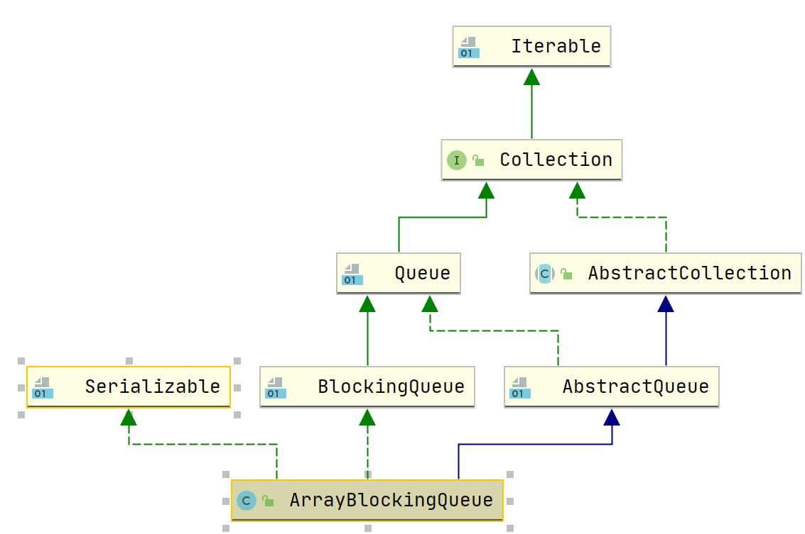

## ArrayBlockingQueue

### 1. 概述

#### 1.1 介绍

`ArrayBlockingQueue` 为数组实现的有界阻塞队列，无法自动扩容，通过锁控制出入队的原子性，通过两个条件量 notFull 和 notEmpty 阻塞线程。

主要操作：

- offer：如果队列满则返回 null；
- put：如果队列满则阻塞当前线程，直到 notFull 条件量被其他线程唤醒；
- poll：如果队列空则返回 null；
- take：如果队列空则阻塞当前线程，直到 notEmpty 条件量被其他线程唤醒。

#### 1.2 继承体系



### 2. 属性

``` java
    /** The queued items */
    final Object[] items;

    /** items index for next take, poll, peek or remove */
    int takeIndex; // 下一个出队列的元素下标

    /** items index for next put, offer, or add */
    int putIndex; // 下一个入队列的元素下标

    /** Number of elements in the queue */
    int count;

    /*
     * Concurrency control uses the classic two-condition algorithm
     * found in any textbook.
     * 通过两个条件量控制出入队列
     */

    /** Main lock guarding all access */
    final ReentrantLock lock;

    /** Condition for waiting takes */
    private final Condition notEmpty; // 用于阻塞take操作

    /** Condition for waiting puts */
    private final Condition notFull; // 用于阻塞put操作

    /**
     * Shared state for currently active iterators, or null if there
     * are known not to be any.  Allows queue operations to update
     * iterator state.
     */
    transient Itrs itrs = null;
```

### 3. 构造函数

``` java
    public ArrayBlockingQueue(int capacity) {
        this(capacity, false);
    }

    /**
     * @capacity:数组容量
     * @fair:是否使用公平锁
     */
    public ArrayBlockingQueue(int capacity, boolean fair) {
        if (capacity <= 0)
            throw new IllegalArgumentException();
        this.items = new Object[capacity];
        lock = new ReentrantLock(fair);
        notEmpty = lock.newCondition();
        notFull =  lock.newCondition();
    }

    public ArrayBlockingQueue(int capacity, boolean fair,
                              Collection<? extends E> c) {
        this(capacity, fair);

        final ReentrantLock lock = this.lock;
        lock.lock(); // Lock only for visibility, not mutual exclusion
        try {
            int i = 0;
            try {
                for (E e : c) {
                    checkNotNull(e);
                    items[i++] = e;
                }
            } catch (ArrayIndexOutOfBoundsException ex) {
                throw new IllegalArgumentException();
            }
            count = i;
            putIndex = (i == capacity) ? 0 : i;
        } finally {
            lock.unlock();
        }
    }
```

### 4. 主要操作

#### 4.1 出入队

``` java
    private void enqueue(E x) {
        // assert lock.getHoldCount() == 1;
        // assert items[putIndex] == null;
        final Object[] items = this.items;
        items[putIndex] = x;
        if (++putIndex == items.length)
            putIndex = 0; // 采用循环数组实现队列
        count++;
        notEmpty.signal(); // 唤醒阻塞take操作的线程
    }

    private E dequeue() {
        // assert lock.getHoldCount() == 1;
        // assert items[takeIndex] != null;
        final Object[] items = this.items;
        @SuppressWarnings("unchecked")
        E x = (E) items[takeIndex];
        items[takeIndex] = null;
        if (++takeIndex == items.length)
            takeIndex = 0;
        count--;
        if (itrs != null)
            itrs.elementDequeued();
        notFull.signal();
        return x;
    }
```

####  4.2 offer操作

``` java
    public boolean offer(E e) {
        checkNotNull(e);
        final ReentrantLock lock = this.lock;
        lock.lock();
        try {
            if (count == items.length) // 容量满返回false
                return false;
            else {
                enqueue(e);
                return true;
            }
        } finally {
            lock.unlock();
        }
    }
```

#### 4.3 put 操作

``` java
    public void put(E e) throws InterruptedException {
        checkNotNull(e);
        final ReentrantLock lock = this.lock;
        lock.lockInterruptibly();
        try {
            while (count == items.length) // 容量满将阻塞put操作(等待notFull条件量)
                notFull.await();
            enqueue(e);
        } finally {
            lock.unlock();
        }
    }
```

#### 4.4 poll 操作

``` java
    public E poll() {
        final ReentrantLock lock = this.lock;
        lock.lock();
        try {
            return (count == 0) ? null : dequeue();
        } finally {
            lock.unlock();
        }
    }
```

#### 4.5 take 操作

``` java
    public E take() throws InterruptedException {
        final ReentrantLock lock = this.lock;
        lock.lockInterruptibly();
        try {
            while (count == 0) // 容量满将阻塞put操作(等待notEmpty条件量)
                notEmpty.await();
            return dequeue();
        } finally {
            lock.unlock();
        }
    }
```


