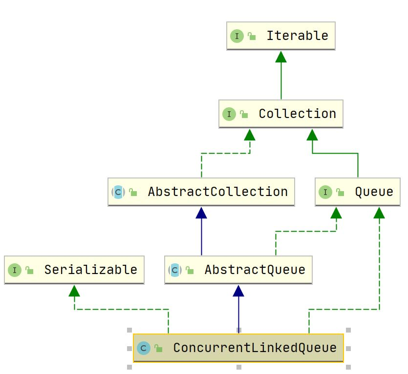

## ConcurrentLinkedQueue

### 1. 概述

#### 1.1 介绍

`ConcurrentLinkedQueue` 为单向链表实现的无界非阻塞队列，使用 CAS 保证出入队的原子性。

主要操作：

- offer：总能保证将元素插入队列；
- poll：队列为空则返回 null 。

注：`size()` 方法由于未使用锁，只能保持弱一致性

#### 1.2 继承体系



### 2. 属性

``` java
    // 头节点，为哨兵节点
    private transient volatile Node<E> head;

    // 尾节点，为哨兵节点
    private transient volatile Node<E> tail;

    // Unsafe操作类，实现CAS
    private static final sun.misc.Unsafe UNSAFE;
    private static final long headOffset;
    private static final long tailOffset;
```

``` java
private static class Node<E> {
        // 使用volatile保证可见性
        volatile E item;
        volatile Node<E> next;

        /**
         * Constructs a new node.  Uses relaxed write because item can
         * only be seen after publication via casNext.
         */
        Node(E item) {
            UNSAFE.putObject(this, itemOffset, item);
        }

        boolean casItem(E cmp, E val) {
            return UNSAFE.compareAndSwapObject(this, itemOffset, cmp, val);
        }

        void lazySetNext(Node<E> val) {
            UNSAFE.putOrderedObject(this, nextOffset, val);
        }

        boolean casNext(Node<E> cmp, Node<E> val) {
            return UNSAFE.compareAndSwapObject(this, nextOffset, cmp, val);
        }

        // Unsafe mechanics
        ... 
    }
```


### 3. 构造函数

``` java
    public ConcurrentLinkedQueue() {
        head = tail = new Node<E>(null);
    }

    public ConcurrentLinkedQueue(Collection<? extends E> c) {
        Node<E> h = null, t = null;
        for (E e : c) {
            checkNotNull(e);
            Node<E> newNode = new Node<E>(e);
            if (h == null)
                h = t = newNode;
            else {
                t.lazySetNext(newNode);
                t = newNode;
            }
        }
        if (h == null)
            h = t = new Node<E>(null);
        head = h;
        tail = t;
    }
```

### 4. 主要操作

#### 4.1 offer操作

``` java
    public boolean offer(E e) {
        checkNotNull(e);
        final Node<E> newNode = new Node<E>(e);
        // 从尾节点开始插入
        for (Node<E> t = tail, p = t;;) {
            Node<E> q = p.next;
            // q == null证明p是为节点
            if (q == null) {
                if (p.casNext(null, newNode)) {
                    // Successful CAS is the linearization point
                    // for e to become an element of this queue,
                    // and for newNode to become "live".
                    // 还未设置尾节点
                    if (p != t) // hop two nodes at a time
                        casTail(t, newNode);  // Failure is OK.
                    return true;
                }
                // Lost CAS race to another thread; re-read next
            }
            // 由于poll操作把head变为自引用，故重新找新的head
            else if (p == q)
                // We have fallen off list.  If tail is unchanged, it
                // will also be off-list, in which case we need to
                // jump to head, from which all live nodes are always
                // reachable.  Else the new tail is a better bet.
                p = (t != (t = tail)) ? t : head;
            // 寻找尾节点
            else
                // Check for tail updates after two hops.
                p = (p != t && t != (t = tail)) ? t : q;
        }
    }
```

####  4.2 poll操作

``` java
   public E poll() {
        restartFromHead:
        for (;;) {
            for (Node<E> h = head, p = h, q;;) {
                E item = p.item;

                if (item != null && p.casItem(item, null)) {
                    // Successful CAS is the linearization point
                    // for item to be removed from this queue.
                    // CAS成功后删除当前节点
                    if (p != h) // hop two nodes at a time
                        updateHead(h, ((q = p.next) != null) ? q : p);
                    return item;
                }
                // 当前空队列，则返回null
                else if ((q = p.next) == null) {
                    updateHead(h, p);
                    return null;
                }
                // 当前节点已经自引用，寻找真正的head节点
                else if (p == q)
                    continue restartFromHead;
                else
                    p = q;
            }
        }
    }
```

#### 4.3 size()

``` java
    // 遍历过程中可能删除或增加节点，故该方法结果不准确
    public int size() {
        int count = 0;
        for (Node<E> p = first(); p != null; p = succ(p))
            if (p.item != null)
                // Collection.size() spec says to max out
                if (++count == Integer.MAX_VALUE)
                    break;
        return count;
    }
```

#### 


