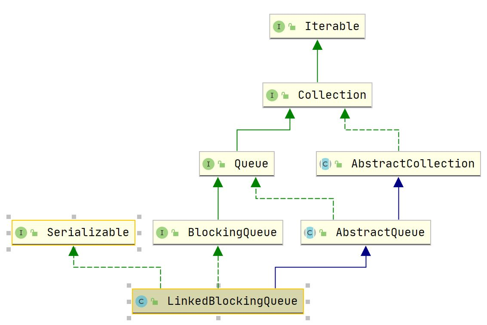

## LinkedBlockingQueue

### 1. 概述

#### 1.1 介绍

`LinkedBlockingQueue` 为单向链表实现的无界(默认是 Integer.MAX_VALUE，也可设置为有界)阻塞队列，使用锁保证出入队的原子性：

- takeLock 锁，执行 take、poll 等操作需要此锁，保证只有一个线程操作头节点；
- putLock 锁，执行 put、offer 等操作需要此锁，保证只有一个线程操作尾节点。

注：remove 操作需要同时获得上述两个锁。

`LinkedBlockingQueue` 使用条件量区分阻塞与非阻塞，主要操作：

- offer 操作，如果队列已满丢弃当前元素返回 false ;
- put 操作，如果队列已满则阻塞当前线程直到队列有空闲，可以被中断；
- poll 操作，如果队列为空则返回 null；
- take 操作，如果队列为空则阻塞当前线程直到队列有元素，可以被中断。

#### 1.2 继承体系



### 2. 属性

``` java
    /** The capacity bound, or Integer.MAX_VALUE if none */
    private final int capacity;

    /** Current number of elements */
    private final AtomicInteger count = new AtomicInteger();

    /**
     * Head of linked list.
     * Invariant: head.item == null
     */
    // head、tail均为哨兵节点
    transient Node<E> head;

    /**
     * Tail of linked list.
     * Invariant: last.next == null
     */
    private transient Node<E> last;

    /** Lock held by take, poll, etc */
    private final ReentrantLock takeLock = new ReentrantLock(); // 出队锁

    /** Wait queue for waiting takes */
    private final Condition notEmpty = takeLock.newCondition(); //阻塞take操作

    /** Lock held by put, offer, etc */
    private final ReentrantLock putLock = new ReentrantLock(); // 入队锁

    /** Wait queue for waiting puts */
    private final Condition notFull = putLock.newCondition(); //阻塞put操作
```

### 3. 构造函数

``` java
    public LinkedBlockingQueue() {
        this(Integer.MAX_VALUE); // 默认容量为Integer.MAX_VALUE
    }

    /**
     * Creates a {@code LinkedBlockingQueue} with the given (fixed) capacity.
     *
     * @param capacity the capacity of this queue
     * @throws IllegalArgumentException if {@code capacity} is not greater
     *         than zero
     */
    public LinkedBlockingQueue(int capacity) {
        if (capacity <= 0) throw new IllegalArgumentException();
        this.capacity = capacity;
        last = head = new Node<E>(null);
    }

    /**
     * Creates a {@code LinkedBlockingQueue} with a capacity of
     * {@link Integer#MAX_VALUE}, initially containing the elements of the
     * given collection,
     * added in traversal order of the collection's iterator.
     *
     * @param c the collection of elements to initially contain
     * @throws NullPointerException if the specified collection or any
     *         of its elements are null
     */
    public LinkedBlockingQueue(Collection<? extends E> c) {
        this(Integer.MAX_VALUE);
        final ReentrantLock putLock = this.putLock;
        putLock.lock(); // Never contended, but necessary for visibility
        try {
            int n = 0;
            for (E e : c) {
                if (e == null)
                    throw new NullPointerException();
                if (n == capacity)
                    throw new IllegalStateException("Queue full");
                enqueue(new Node<E>(e));
                ++n;
            }
            count.set(n);
        } finally {
            putLock.unlock();
        }
    }
```

### 4. 主要操作

#### 4.1 出入队

``` java
    private void enqueue(Node<E> node) {
        // assert putLock.isHeldByCurrentThread();
        // assert last.next == null;
        /**
         * 右边的先运行，故等价于
         * last.next = node;
         * last = last.next;
         */
        last = last.next = node; 
    }

    /**
     * Removes a node from head of queue.
     *
     * @return the node
     */
    private E dequeue() {
        // assert takeLock.isHeldByCurrentThread();
        // assert head.item == null;
        Node<E> h = head;
        Node<E> first = h.next;
        h.next = h; // help GC, 形成环
        // 下面重新设置head节点
        head = first;
        E x = first.item;
        first.item = null;
        return x;
    }
```

####  4.2 offer操作

``` java
    public boolean offer(E e) {
        if (e == null) throw new NullPointerException();
        final AtomicInteger count = this.count;
        if (count.get() == capacity) // 容量满则返回false
            return false;
        int c = -1;
        Node<E> node = new Node<E>(e);
        final ReentrantLock putLock = this.putLock;
        putLock.lock();
        try {
            // 此处再次判断未满容量，防止其他线程插入了新元素
            if (count.get() < capacity) {
                enqueue(node);
                c = count.getAndIncrement();
                if (c + 1 < capacity) // 如果容量未满，则唤醒阻塞put操作的一个线程
                    notFull.signal();
            }
        } finally {
            putLock.unlock();
        }
        if (c == 0) // 只有之前队列为空且刚插入元素才会满足此条件
            signalNotEmpty(); // 唤醒阻塞take操作的一个线程
        return c >= 0;
    }
```

#### 4.3 put 操作

``` java
    public void put(E e) throws InterruptedException {
        if (e == null) throw new NullPointerException();
        // Note: convention in all put/take/etc is to preset local var
        // holding count negative to indicate failure unless set.
        int c = -1;
        Node<E> node = new Node<E>(e);
        final ReentrantLock putLock = this.putLock;
        final AtomicInteger count = this.count;
        putLock.lockInterruptibly(); // put操作可以被中断
        try {
            /*
             * Note that count is used in wait guard even though it is
             * not protected by lock. This works because count can
             * only decrease at this point (all other puts are shut
             * out by lock), and we (or some other waiting put) are
             * signalled if it ever changes from capacity. Similarly
             * for all other uses of count in other wait guards.
             */
            // 采用while而不是if是为了防止虚假唤醒，比如被signalAll唤醒
            while (count.get() == capacity) {
                notFull.await(); // 容量满则阻塞put操作
            }
            enqueue(node);
            c = count.getAndIncrement();
            if (c + 1 < capacity)
                notFull.signal();
        } finally {
            putLock.unlock();
        }
        if (c == 0)
            signalNotEmpty();
    }
```

#### 4.4 poll 操作

``` java
    public E poll() {
        final AtomicInteger count = this.count;
        if (count.get() == 0) // 空队列则返回false
            return null;
        E x = null;
        int c = -1;
        final ReentrantLock takeLock = this.takeLock;
        takeLock.lock();
        try {
            // 重新判断防止其他线程已经出队元素
            if (count.get() > 0) {
                x = dequeue();
                c = count.getAndDecrement();
                if (c > 1)
                    notEmpty.signal();
            }
        } finally {
            takeLock.unlock();
        }
        if (c == capacity) // 只有之前满队列且刚元素出队才会满足此条件
            signalNotFull(); // 唤醒put操作阻塞的一个线程 
        return x;
    }
```

#### 4.5 take 操作

``` java
    public E take() throws InterruptedException {
        E x;
        int c = -1;
        final AtomicInteger count = this.count;
        final ReentrantLock takeLock = this.takeLock;
        takeLock.lockInterruptibly(); // take操作引起的阻塞可以被中断
        try {
            while (count.get() == 0) {
                notEmpty.await();
            }
            x = dequeue();
            c = count.getAndDecrement();
            if (c > 1)
                notEmpty.signal();
        } finally {
            takeLock.unlock();
        }
        if (c == capacity)
            signalNotFull();
        return x;
    }
```


