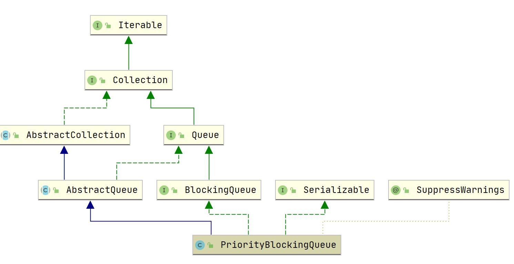

## PriorityBlockingQueue

### 1. 概述

#### 1.1 介绍

`PriorityBlockingQueue` 为堆实现的无界阻塞优先队列，采用锁实现出入队的原子性，另外使用一个 CAS 控制的独占锁保证只有一个线程进行扩容。

主要操作：

- offer：由于会自动扩容，总能入队成功，返回 true；
- put：同 offer；
- poll：队列为空则返回 null；
- take：队列为空则阻塞该线程，直到队列中有元素。

本文着重其原子性实现，堆的建立和维护见 <a href="../PriorityQueue.md">PriorityQueue</a>

#### 1.2 继承体系



### 2. 属性

``` java
    // 默认初始化容量
    private static final int DEFAULT_INITIAL_CAPACITY = 11;

    // 最大容量
    private static final int MAX_ARRAY_SIZE = Integer.MAX_VALUE - 8;

    // 数组，用于存储元素
    private transient Object[] queue;

    /**
     * The number of elements in the priority queue.
     */
    private transient int size;

    // 比较元素大小的接口，优先级队列底层为堆实现
    private transient Comparator<? super E> comparator;

    /**
     * Lock used for all public operations
     */
    private final ReentrantLock lock;

    // 阻塞take操作
    private final Condition notEmpty;

    // 扩容锁，使用CAS实现
    private transient volatile int allocationSpinLock;
```

### 3. 构造函数

``` java
    // 默认大小11
    public PriorityBlockingQueue() {
        this(DEFAULT_INITIAL_CAPACITY, null);
    }

    public PriorityBlockingQueue(int initialCapacity) {
        this(initialCapacity, null);
    }

    public PriorityBlockingQueue(int initialCapacity,
                                 Comparator<? super E> comparator) {
        if (initialCapacity < 1)
            throw new IllegalArgumentException();
        this.lock = new ReentrantLock();
        this.notEmpty = lock.newCondition();
        this.comparator = comparator;
        this.queue = new Object[initialCapacity];
    }

        public PriorityBlockingQueue(Collection<? extends E> c) {
        this.lock = new ReentrantLock();
        this.notEmpty = lock.newCondition();
        boolean heapify = true; // true if not known to be in heap order
        boolean screen = true;  // true if must screen for nulls
        if (c instanceof SortedSet<?>) {
            SortedSet<? extends E> ss = (SortedSet<? extends E>) c;
            this.comparator = (Comparator<? super E>) ss.comparator();
            heapify = false;
        }
        else if (c instanceof PriorityBlockingQueue<?>) {
            PriorityBlockingQueue<? extends E> pq =
                (PriorityBlockingQueue<? extends E>) c;
            this.comparator = (Comparator<? super E>) pq.comparator();
            screen = false;
            if (pq.getClass() == PriorityBlockingQueue.class) // exact match
                heapify = false;
        }
        Object[] a = c.toArray();
        int n = a.length;
        // If c.toArray incorrectly doesn't return Object[], copy it.
        if (a.getClass() != Object[].class)
            a = Arrays.copyOf(a, n, Object[].class);
        if (screen && (n == 1 || this.comparator != null)) {
            for (int i = 0; i < n; ++i)
                if (a[i] == null)
                    throw new NullPointerException();
        }
        this.queue = a;
        this.size = n;
        if (heapify)
            heapify();
    }
```

### 4. 主要操作

####  4.1 offer操作

``` java
    public boolean offer(E e) {
        if (e == null)
            throw new NullPointerException();
        final ReentrantLock lock = this.lock;
        lock.lock();
        int n, cap;
        Object[] array;
        // 队列已满，进行扩容
        while ((n = size) >= (cap = (array = queue).length))
            tryGrow(array, cap);
        try {
            Comparator<? super E> cmp = comparator;
            // 根据比较强选择上浮操作
            if (cmp == null)
                siftUpComparable(n, e, array);
            else
                siftUpUsingComparator(n, e, array, cmp);
            size = n + 1;
            notEmpty.signal();// 唤醒阻塞take操作的一个线程
        } finally {
            lock.unlock();
        }
        return true;
    }
```

扩容操作

``` java
    private void tryGrow(Object[] array, int oldCap) {
        // 释放锁，在扩容的分配内存阶段可以进行出队、入队操作
        lock.unlock(); // must release and then re-acquire main lock
        Object[] newArray = null;
        // 使用CAS操作将allocationSpinLock置为1，即为扩容独占锁
        if (allocationSpinLock == 0 &&
            UNSAFE.compareAndSwapInt(this, allocationSpinLockOffset,
                                     0, 1)) {
            try {
                // 旧容量<64使用2倍+2扩容， >=64使用1.5倍扩容
                int newCap = oldCap + ((oldCap < 64) ?
                                       (oldCap + 2) : // grow faster if small
                                       (oldCap >> 1));
                if (newCap - MAX_ARRAY_SIZE > 0) {    // possible overflow
                    int minCap = oldCap + 1;
                    if (minCap < 0 || minCap > MAX_ARRAY_SIZE)
                        throw new OutOfMemoryError();
                    newCap = MAX_ARRAY_SIZE;
                }
                if (newCap > oldCap && queue == array)
                    newArray = new Object[newCap];
            } finally {
                allocationSpinLock = 0;
            }
        }
        // 竞争扩容锁失败，则将该线程后移
        if (newArray == null) // back off if another thread is allocating
            Thread.yield();
        // 元素复制前获取锁，不再允许出入队操作
        lock.lock();
        if (newArray != null && queue == array) {
            queue = newArray;
            System.arraycopy(array, 0, newArray, 0, oldCap);
        }
    }
```

#### 4.2 put 操作

``` java
    public void put(E e) {
        offer(e); // never need to block
    }
```

#### 4.3 poll 操作

``` java
    public E poll() {
        final ReentrantLock lock = this.lock;
        lock.lock();
        try {
            return dequeue();
        } finally {
            lock.unlock();
        }
    }
```

``` java
    private E dequeue() {
        int n = size - 1;
        if (n < 0)
            return null;
        else {
            Object[] array = queue;
            E result = (E) array[0];
            E x = (E) array[n];
            array[n] = null;
            Comparator<? super E> cmp = comparator;
            if (cmp == null)
                siftDownComparable(0, x, array, n);
            else
                siftDownUsingComparator(0, x, array, n, cmp);
            size = n;
            return result;
        }
    }
```

#### 4.4 take 操作

``` java
    public E take() throws InterruptedException {
        final ReentrantLock lock = this.lock;
        lock.lockInterruptibly(); // 可中断锁
        E result;
        try {
            while ( (result = dequeue()) == null)
                notEmpty.await(); // 阻塞take操作线程
        } finally {
            lock.unlock();
        }
        return result;
    }
```


