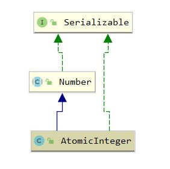

## AtomicInteger

### 1. 介绍

#### 1.1 介绍

AtomicInteger 是 一个原子类，可以在不需要 synchronized 加锁的情况保证线程安全，其底层使用了 <a href="../../CAS.md"> CAS </a> 机制来保证，效率相比加锁更高，常用于自增计数器

#### 1.2 继承体系



### 2. 属性

``` java
    // setup to use Unsafe.compareAndSwapInt for updates
    private static final Unsafe unsafe = Unsafe.getUnsafe(); 
    // value相对当前对象的内存偏移
    private static final long valueOffset;

    // 获得内存偏移
    static {
        try {
            valueOffset = unsafe.objectFieldOffset
                (AtomicInteger.class.getDeclaredField("value"));
        } catch (Exception ex) { throw new Error(ex); }
    }

    // 采用volatile修饰保证可见性
    private volatile int value;
```

### 3. 设置数值函数

``` java
    // 使用CAS实现设置数值
    public final int getAndSet(int newValue) {
        return unsafe.getAndSetInt(this, valueOffset, newValue);
    }

    // 使用CAS去设置，返回是否成功，用于循环体中
    public final boolean compareAndSet(int expect, int update) {
        return unsafe.compareAndSwapInt(this, valueOffset, expect, update);
    }

    public final int getAndIncrement() {
        return unsafe.getAndAddInt(this, valueOffset, 1);
    }

    public final int getAndDecrement() {
        return unsafe.getAndAddInt(this, valueOffset, -1);
    }

    /** 
     * 调用了Unsafe.putOrderedInt, 在一小段时间内其他线程获得的仍是旧值
     * JVM 层面去除volatile写域的StoreLoad屏障，只留下StoreStore
     * X86 CPU层面调用了xchg指令
     */
    public final void lazySet(int newValue) {
        unsafe.putOrderedInt(this, valueOffset, newValue);
    }
```

``` java
    // Unsafe.getAndSetInt
    public final int getAndSetInt(Object var1, long var2, int var4) {
        int var5;
        do {
            var5 = this.getIntVolatile(var1, var2); // 从内存读取值
        } while(!this.compareAndSwapInt(var1, var2, var5, var4));

        return var5;
    }
```

