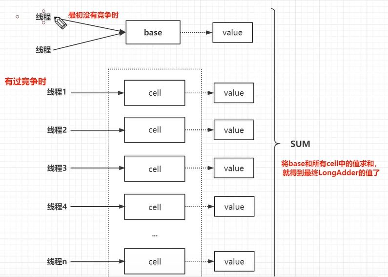
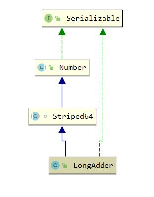

[toc]

## LongAdder

### 1. 介绍

#### 1.1 介绍

LongAdder 在 jdk 1.8 引入，为了解决高并发情况 AtomicLong 耗时过长的问题

AtomicLong 使用 CAS 机制，一次只能保证一个线程修改成功；LongAdder 的设计思想是利用空间换时间，在高并发情况下，为每个线程分配空间记录运算，统计这些运算，即可得到最终 LongAdder 的值

LongAdder 仅具有 **最终一致性**，不是 **时刻精确** 的，如果需要保证时刻精确使用 <a href="AtomicLong.md">AtomicLong</a>



开启 40 个线程进行自增操作两者的耗时如下

``` java
threadCount: 80, times: 10000000
LongAdder: 2506ms
Atomic: 17983ms
```

#### 1.2 继承体系



### 2. 构造函数与属性

``` java
    // 默认初始化为 0 
	public LongAdder() {
    }

    /**
     * cell与value都是来自Striped64
     * Striped64.cell长度为 2^n 
     */
    transient volatile Cell[] cells;

    /**
     * Base value, used mainly when there is no contention, but also as
     * a fallback during table initialization races. Updated via CAS.
     */
    transient volatile long base;
```

### 3. add 

add 的核心是调用 Striped64 的 <a href="Striped64.md">longAccumulate</a> 方法

``` java
    public void add(long x) {
        /**
         * as: cell 引用
         * b: 获取的base值
         * v: 期望值
         * m: cell数组的长度
         * a: 当前线程命中的cell单元
         */ 
        Cell[] as; long b, v; int m; Cell a;
        /**
         * cells != null -> true: cell数组已经初始化，将数据写到相应的cell
         *               -> false: 所有线程将数据写入base
         * casBase(b = base, b + x) -> true: 当前线程CAS替换数据成功
         *                           -> false: 发生竞争，需要重试或者扩容
         */
        if ((as = cells) != null || !casBase(b = base, b + x)) {
            // cell已经初始化或者发生竞争进入此处
            // uncontended: true->未竞争 false->发生竞争
            boolean uncontended = true;
            /**
             * 条件1: as == null || (m - 1) < 0 -> true: cell数组未初始化
             * 条件2: as[getProbe() & m]) == null -> true: 当前线程对应的cell不为空，
             * 需要将x添加到对应的cell 中
             * 条件3: !a.cas(v = a.value, v + x) -> true: cas失败，当前的cell存在竞争
             */
            if (as == null || (m = as.length - 1) < 0 ||
                (a = as[getProbe() & m]) == null || // getProbe()类似线程的哈希值
                !(uncontended = a.cas(v = a.value, v + x)))
                longAccumulate(x, null, uncontended);
        }
    }
```

### 4. longValue

``` java
    public long longValue() {
        return sum();
    }

	// 只能保证最终一次性
	public long sum() {
        Cell[] as = cells; Cell a;
        long sum = base;
        if (as != null) {
            for (int i = 0; i < as.length; ++i) {
                if ((a = as[i]) != null)
                    sum += a.value;
            }
        }
        return sum;
    }
```

