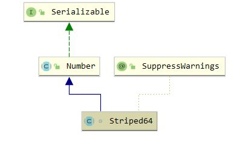

## Striped64

### 1. 介绍

#### 1.1 介绍

Striped64 是 jdk 1.8 引入来支持累加器的并发组件，设计思路是分散竞争，采用类似分段锁的算法实现并发计数


#### 1.2 继承体系



### 2. 属性

``` java
    // 静态内部类 Cell
	@sun.misc.Contended static final class Cell {
        volatile long value;
        Cell(long x) { value = x; }
        final boolean cas(long cmp, long val) {
            return UNSAFE.compareAndSwapLong(this, valueOffset, cmp, val);
        }

        // Unsafe mechanics
        private static final sun.misc.Unsafe UNSAFE;
        private static final long valueOffset; // value属性的内存偏移，用于CAS
        static {
            try {
                UNSAFE = sun.misc.Unsafe.getUnsafe();
                Class<?> ak = Cell.class;
                // 获取偏内存移
                valueOffset = UNSAFE.objectFieldOffset
                    (ak.getDeclaredField("value"));
            } catch (Exception e) {
                throw new Error(e);
            }
        }
    }

	// 当前计算机CPU数量，cell数组的长度上限
	static final int NCPU = Runtime.getRuntime().availableProcessors();
	
    transient volatile Cell[] cells;
	// 未发生竞争时或者cell数组扩容时数据存储在base
    transient volatile long base;
	// cell数组初始化和扩容需要获得锁， 1: 无锁， 0: 其他线程已经获得该锁
    transient volatile int cellsBusy;
```

### 3. 基本方法

``` java
 	// 使用CAS修改base
	final boolean casBase(long cmp, long val) {
        return UNSAFE.compareAndSwapLong(this, BASE, cmp, val);
    }

	// 尝试获得锁
    final boolean casCellsBusy() {
        return UNSAFE.compareAndSwapInt(this, CELLSBUSY, 0, 1);
    }

	// 获得一个与线程相关的类似hashCode的数值
    static final int getProbe() {
        return UNSAFE.getInt(Thread.currentThread(), PROBE);
    }

	// 重置当前线程的probe
    static final int advanceProbe(int probe) {
        probe ^= probe << 13;   // xorshift
        probe ^= probe >>> 17;
        probe ^= probe << 5;
        UNSAFE.putInt(Thread.currentThread(), PROBE, probe);
        return probe;
    }
```

### <font color=red>4. longAccumulate</font>

``` java
    /**
     * x: 需要累加的值
     * fn: long的函数式接口
     * uncontended: true->未竞争 false->发生竞争
     * 三种情况调用该方法:
     * 1. cell数组未初始化，多线程与base发生了竞争
     * 2. 当前线程命中的cell为null，需要对相应Cell进行初始化
     * 3. cas失败，命中的cell发生了竞争
     */
	final void longAccumulate(long x, LongBinaryOperator fn,
                              boolean wasUncontended) {
        // h为当前线程的probe值
        int h;
        if ((h = getProbe()) == 0) {
            ThreadLocalRandom.current(); // force initialization
            h = getProbe();
            wasUncontended = true; 
        }
        // collide -> false:一定不会扩容，true: 可能扩容
        boolean collide = false;                // True if last slot nonempty
        // 自旋
        for (;;) {
            /**
             * as: cell数组引用
             * a : 当前线程命中的cell
             * n : 数组长度
             * v : 期望值
             */
            Cell[] as; Cell a; int n; long v;
            // case 1: 已经初始化，不只是使用base存储
            if ((as = cells) != null && (n = as.length) > 0) {
                // case 1.1: 线程命中的cell为空
                if ((a = as[(n - 1) & h]) == null) {
                    if (cellsBusy == 0) {       // Try to attach new Cell
                        Cell r = new Cell(x);   // Optimistically create
                        if (cellsBusy == 0 && casCellsBusy()) {
                            boolean created = false;
                            try {               // Recheck under lock
                                Cell[] rs; int m, j;
                                // 当前命中的cell未被其他线程使用
                                if ((rs = cells) != null &&
                                    (m = rs.length) > 0 &&
                                    rs[j = (m - 1) & h] == null) {
                                    rs[j] = r;
                                    created = true;
                                }
                            } finally {
                                cellsBusy = 0;
                            }
                            if (created)
                                break;
                            continue;           // Slot is now non-empty
                        }
                    }
                    collide = false;
                }
                // case 1.2: cell初始化后当前线程竞争失败
                else if (!wasUncontended)       // CAS already known to fail
                    wasUncontended = true;      // Continue after rehash
                /** 
                 * case 1.3: 线程重置probe后，命中的cell不为空
                 *  写入cell，成功结束自旋，失败继续自旋
                 */
                else if (a.cas(v = a.value, ((fn == null) ? v + x :
                                             fn.applyAsLong(v, x))))
                    break;
                /** 
                 * case 1.4: 已经达到CPU上限或者其他线程已经扩容
                 * 重置probe后继续尝试
                 */
                else if (n >= NCPU || cells != as)
                    collide = false;            // At max size or stale
                // case 1.5: 允许扩容
                else if (!collide)
                    collide = true;
                // case 1.6: 扩容
                else if (cellsBusy == 0 && casCellsBusy()) {
                    try {
                        if (cells == as) {      // Expand table unless stale
                            Cell[] rs = new Cell[n << 1]; // 2倍扩容
                            for (int i = 0; i < n; ++i)
                                rs[i] = as[i];
                            cells = rs;
                        }
                    } finally {
                        cellsBusy = 0;
                    }
                    collide = false;
                    continue;                   // Retry with expanded table
                }
                // 重置哈希值，重新自旋
                h = advanceProbe(h);
            }
            /**
             * case 2: cell数组未被任何线程初始化，并且获得锁
             * cellBusy -> true: 当前未加锁
             * cells == as 判断多线程环境下，cells是否被其他线程改变
             * casCellBusy() -> true: 获得锁成功
             */
            else if (cellsBusy == 0 && cells == as && casCellsBusy()) {
                boolean init = false;
                try {                          
                    if (cells == as) { // 再次判断确保其他线程没有进行初始化
                        // 初始化cell数组，初始容量为2
                        Cell[] rs = new Cell[2];
                        rs[h & 1] = new Cell(x);
                        cells = rs;
                        init = true;
                    }
                } finally {
                    cellsBusy = 0;
                }
                if (init)
                    break;
            }
            /**
             * case 3: 未获得锁，其他线程正在进行初始化cell数组;
             * 或cell数组已经被初始化，需要将数据累加到base
             */
            else if (casBase(v = base, ((fn == null) ? v + x :
                                        fn.applyAsLong(v, x))))
                break;                          // Fall back on using base
        }
    }
```

