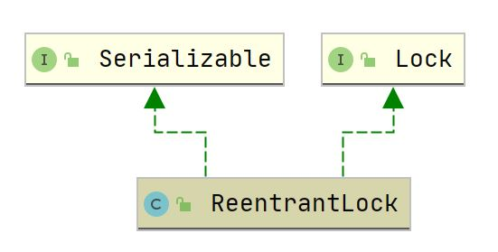
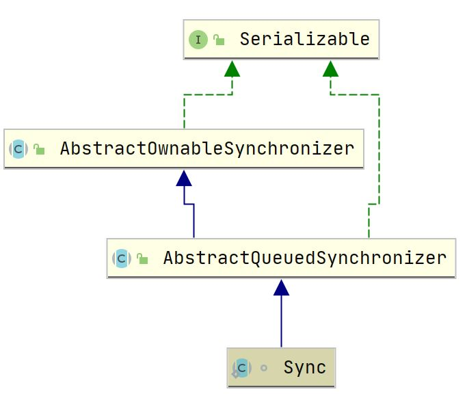

## ReentrantLock

### 1. 概述

#### 1.1 介绍

`ReentrantLock` 是独占锁，可以指定为公平锁或非公平锁，基于 <a href="../../../../java se/多线程/AQS.md">AQS</a> 实现

公平：先申请获取锁的线程将比后申请的线程先获取锁。

#### 1.2 继承体系





### 2. 属性

``` java
    // 同步器，可指定为公平锁或者非公平锁
    private final Sync sync;
```

### 3. 构造函数

``` java
    // 默认为非公平锁
    public ReentrantLock() {
        sync = new NonfairSync();
    }


    public ReentrantLock(boolean fair) {
        sync = fair ? new FairSync() : new NonfairSync();
    }
```

### 4. Sync

内部类 `Sync` 为锁的抽象类实现

``` java
    abstract static class Sync extends AbstractQueuedSynchronizer {

        // 获取锁，由子类实现
        abstract void lock();

        /**
         * Performs non-fair tryLock.  tryAcquire is implemented in
         * subclasses, but both need nonfair try for trylock method.
         */
        final boolean nonfairTryAcquire(int acquires) {
            final Thread current = Thread.currentThread();
            int c = getState();
            // 当前锁未被获取
            if (c == 0) {
                // 使用CAS获取锁，即将state置为1
                if (compareAndSetState(0, acquires)) {
                    setExclusiveOwnerThread(current);
                    return true;
                }
            }
            // 当前线程已占据着锁
            else if (current == getExclusiveOwnerThread()) {
                // 增加重入次数
                int nextc = c + acquires;
                if (nextc < 0) // overflow
                    throw new Error("Maximum lock count exceeded");
                setState(nextc);
                return true;
            }
            // 获取失败
            return false;
        }

        protected final boolean tryRelease(int releases) {
            int c = getState() - releases;
            // 当前线程未获取锁，则抛出异常
            if (Thread.currentThread() != getExclusiveOwnerThread())
                throw new IllegalMonitorStateException();
            boolean free = false;
            // 已释放重入锁，例如递归完全结束
            if (c == 0) {
                free = true;
                setExclusiveOwnerThread(null);
            }
            setState(c);
            return free;
        }

        // 当前线程是否占着锁
        protected final boolean isHeldExclusively() {
            return getExclusiveOwnerThread() == Thread.currentThread();
        }

        // 获取条件变量
        final ConditionObject newCondition() {
            return new ConditionObject();
        }

        // Methods relayed from outer class
        ...
    }
```

### 5. 公平锁

``` java
    static final class FairSync extends Sync {
        private static final long serialVersionUID = -3000897897090466540L;

        final void lock() {
            acquire(1);
        }

        /**
         * Fair version of tryAcquire.  Don't grant access unless
         * recursive call or no waiters or is first.
         */
        protected final boolean tryAcquire(int acquires) {
            final Thread current = Thread.currentThread();
            int c = getState();
            if (c == 0) {
                if (!hasQueuedPredecessors() &&
                    compareAndSetState(0, acquires)) {
                    setExclusiveOwnerThread(current);
                    return true;
                }
            }
            else if (current == getExclusiveOwnerThread()) {
                int nextc = c + acquires;
                if (nextc < 0)
                    throw new Error("Maximum lock count exceeded");
                setState(nextc);
                return true;
            }
            return false;
        }
    }
```

### 6. 非公平锁

``` java
    static final class NonfairSync extends Sync {
        private static final long serialVersionUID = 7316153563782823691L;

        /**
         * Performs lock.  Try immediate barge, backing up to normal
         * acquire on failure.
         */
        final void lock() {
            if (compareAndSetState(0, 1))
                setExclusiveOwnerThread(Thread.currentThread());
            else
                acquire(1);
        }

        protected final boolean tryAcquire(int acquires) {
            return nonfairTryAcquire(acquires);
        }
    }
```

### 7.主要操作

#### 7.1 lock

``` java
    public void lock() {
        sync.lock();
    }
```

#### 7.2 unlock

``` java
    public void unlock() {
        sync.release(1);
    }
```


#### 


