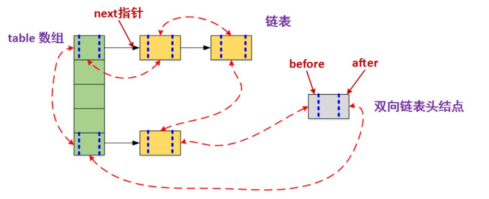
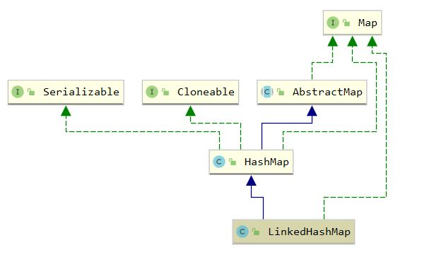
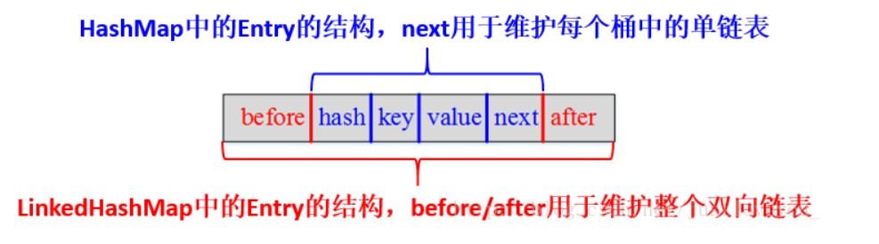

[toc]

## LinkedHashMap

### 1. 介绍

`java.util.LinkedHashMap` 在 <a href="HashMap.md"> HashMap </a>的基础上添加了双向链表，可以按照插入顺序进行遍历，是实现 LRU 算法的最佳选择，`LinkedHashMap` 也是线程不安全的

`LinkedHashMap` 的存储结构如下：



`LinkedHashMap` 的主要方法与 `HashMap` 实现相似，但是重写了 `HashMap` 中的 afterNodeAccess() 等方法实现维护链表

``` java
    // java.util.HashMap
    // Callbacks to allow LinkedHashMap post-actions
    void afterNodeAccess(Node<K,V> p) { }
    void afterNodeInsertion(boolean evict) { }
    void afterNodeRemoval(Node<K,V> p) { }
```

继承体系如下



### 2. 属性

`LinkedHashMap` 除了具有 `HashMap` 的负载因子，树化阈值等之外，还具有以下属性

``` java
    // 双向链表的头节点，不为哨兵
    transient LinkedHashMap.Entry<K,V> head;

    // 双向链表的尾节点，不为哨兵
    transient LinkedHashMap.Entry<K,V> tail;

    // 遍历顺序，true按照访问顺序遍历，false按照插入顺序遍历
    final boolean accessOrder;
```

### 3. Entry

`LinkedHashMap.Entry` 在 `HashMap.Node`  的基础上增加了链表的双向指针

``` java
    static class Entry<K,V> extends HashMap.Node<K,V> {
        Entry<K,V> before, after; // 链表指针
        Entry(int hash, K key, V value, Node<K,V> next) {
            super(hash, key, value, next);
        }
    }
```



### 4. 构造方法

``` java
    // 初始化与HashMap基本相同
    public LinkedHashMap(int initialCapacity, float loadFactor) {
        super(initialCapacity, loadFactor);
        accessOrder = false; // 默认采用插入顺序进行遍历
    }

    public LinkedHashMap(int initialCapacity) {
        super(initialCapacity);
        accessOrder = false;
    }

    public LinkedHashMap() {
        super();
        accessOrder = false;
    }

    public LinkedHashMap(int initialCapacity,
                         float loadFactor,
                         boolean accessOrder) {
        super(initialCapacity, loadFactor);
        this.accessOrder = accessOrder;
    }

    public LinkedHashMap(Map<? extends K, ? extends V> m) {
        super();
        accessOrder = false;
        // putMapEntries调用了putVal,内部实现了链化
        putMapEntries(m, false);
    }

```

### 5. put

`LinkedHashMap` 的 put 方法与 `HashMap` 相同，但重写了 newNode 方法实现链化，并且重写了 afterNodeInsertion 方法支持删除最老节点

``` java
    // HashMap.putVal
    final V putVal(int hash, K key, V value, boolean onlyIfAbsent,
                   boolean evict) {
        ...
        ++modCount;
        if (++size > threshold)
            resize();
        afterNodeInsertion(evict);
        return null;
    }
```

``` java
    // LinkedHashMap.newNode
    Node<K,V> newNode(int hash, K key, V value, Node<K,V> e) {
        LinkedHashMap.Entry<K,V> p =
            new LinkedHashMap.Entry<K,V>(hash, key, value, e);
        linkNodeLast(p);
        return p;
    }

    private void linkNodeLast(LinkedHashMap.Entry<K,V> p) {
        LinkedHashMap.Entry<K,V> last = tail;
        tail = p;
        if (last == null)
            head = p;
        else {
            p.before = last;
            last.after = p;
        }
    }
```

``` java
    // LinkedHashMap.afterNodeInsertion
    void afterNodeInsertion(boolean evict) { // possibly remove eldest
        LinkedHashMap.Entry<K,V> first;
        // removeEldestEntry默认为false，实现LRU需要重写该方法
        if (evict && (first = head) != null && removeEldestEntry(first)) {
            K key = first.key; // 头节点即为最老节点
            removeNode(hash(key), key, null, false, true);
        }
    }
```

### 6. get

`LinkedHashMap` 的 get 方法使用 HashMap 的查找方式，并支持 LRU 操作，将刚访问的节点移动至末尾(最近使用节点)

``` java
    public V get(Object key) {
        Node<K,V> e;
        if ((e = getNode(hash(key), key)) == null)
            return null;
        if (accessOrder)
            afterNodeAccess(e);
        return e.value;
    }
```

``` java
    void afterNodeAccess(Node<K,V> e) { // move node to last
        LinkedHashMap.Entry<K,V> last;
        if (accessOrder && (last = tail) != e) { // 如果刚访问节点不是尾节点
            /**
             * p: 刚访问节点
             * b: p的前一个节点
             * a: p的后一个节点
             */
            LinkedHashMap.Entry<K,V> p =
                (LinkedHashMap.Entry<K,V>)e, b = p.before, a = p.after;
            p.after = null;
            // 刚访问节点为头节点
            if (b == null)
                head = a;
            else
                b.after = a;
            if (a != null)
                a.before = b;
            else
                last = b;
            // 为第一个节点
            if (last == null)
                head = p;
            else {
                p.before = last;
                last.after = p;
            }
            tail = p;
            ++modCount;
        }
    }
```

### 7. remove

`LinkedHashMap` 的 remove 方法在 `HashMap` 的基础上重写了 afterNodeRemoval 方法，删除链表节点

``` java
    void afterNodeRemoval(Node<K,V> e) { // unlink
        LinkedHashMap.Entry<K,V> p =
            (LinkedHashMap.Entry<K,V>)e, b = p.before, a = p.after;
        p.before = p.after = null;
        if (b == null)
            head = a;
        else
            b.after = a;
        if (a == null)
            tail = b;
        else
            a.before = b;
    }
```

### 8. 实现 LRU

``` java
public class SimpleCache<K, V> extends LinkedHashMap<K, V> {

    private static final int MAX_NODE_NUM = 100;

    private int limit;

    public SimpleCache() {
        this(MAX_NODE_NUM);
    }

    public SimpleCache(int limit) {
        super(limit, 0.75f, true);
        this.limit = limit;
    }

    public V save(K key, V val) {
        return put(key, val);
    }

    public V getOne(K key) {
        return get(key);
    }

    public boolean exists(K key) {
        return containsKey(key);
    }
    
    /**
     * 判断节点数是否超限
     * @param eldest
     * @return 超限返回 true，否则返回 false
     */
    @Override
    protected boolean removeEldestEntry(Map.Entry<K, V> eldest) {
        return size() > limit;
    }
}
```

