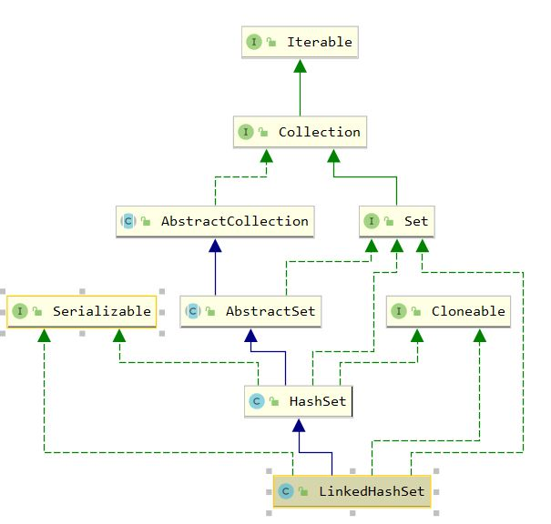

## LinkedHashSet

### 1. 介绍

`java.util.LinkedHashSet` 会维护插入顺序，内部采用 `LinkedHashMap` 存储和处理元素 

``` java
public LinkedHashSet(int initialCapacity, float loadFactor) {
    super(initialCapacity, loadFactor, true);
}

// 上述super调用的构造方法
HashSet(int initialCapacity, float loadFactor, boolean dummy) {
    map = new LinkedHashMap<>(initialCapacity, loadFactor);
}
```


继承体系如下



### 2.源码

`LinkedHashSet` 除了构造方法外全部使用 `HashSet` 的方法

``` java
    public LinkedHashSet(int initialCapacity, float loadFactor) {
        super(initialCapacity, loadFactor, true);
    }

    public LinkedHashSet(int initialCapacity) {
        super(initialCapacity, .75f, true);
    }

    public LinkedHashSet() {
        super(16, .75f, true);
    }

    public LinkedHashSet(Collection<? extends E> c) {
        super(Math.max(2*c.size(), 11), .75f, true);
        addAll(c);
    }
```

``` java
    // HashSet的某个构造函数，仅用于LinkedHashSet的初始化，无法被外部调用
    HashSet(int initialCapacity, float loadFactor, boolean dummy) {
        map = new LinkedHashMap<>(initialCapacity, loadFactor);
    }
```

