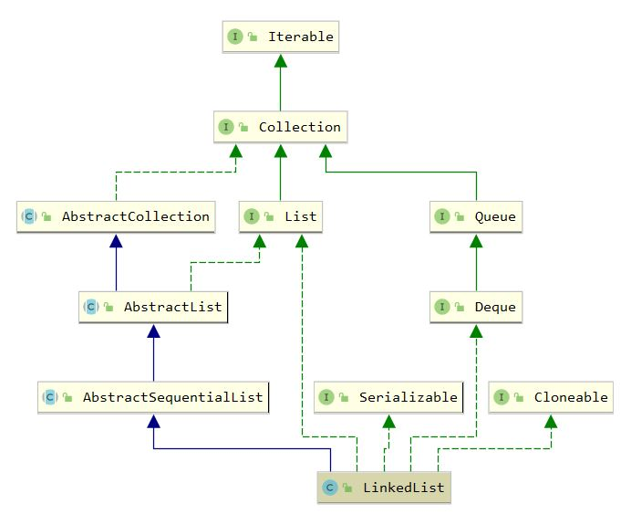

## LinkedList

### 1. 继承体系



### 2. 属性

``` java
    // Node 个数
	transient int size = 0;
	// 第一个 Node
    transient Node<E> first;
	// 最后一个 Node
    transient Node<E> last; 
```

``` java
    // 节点内部类
	private static class Node<E> {
        E item;
        Node<E> next;
        Node<E> prev;

        Node(Node<E> prev, E element, Node<E> next) {
            this.item = element;
            this.next = next;
            this.prev = prev;
        }
    }
```

### 3. 构造函数

``` java
    public LinkedList() {
    }

    public LinkedList(Collection<? extends E> c) {
        this();
        addAll(c);
    }
```

### 4. add 方法

```java
	public boolean add(E e) {
        // 尾部添加
        linkLast(e);
        return true;
    }
```

``` java
    void linkLast(E e) {
        final Node<E> l = last;
        final Node<E> newNode = new Node<>(l, e, null);
        last = newNode;
        if (l == null) // 当前添加第一个元素
            first = newNode;
        else
            l.next = newNode;
        size++;
        modCount++;
    }
```

### 5. remove 方法

``` java
    public boolean remove(Object o) {
        if (o == null) {
            for (Node<E> x = first; x != null; x = x.next) {
                if (x.item == null) {
                    unlink(x);
                    return true;
                }
            }
        } else {
            for (Node<E> x = first; x != null; x = x.next) {
                if (o.equals(x.item)) {
                    unlink(x);
                    return true;
                }
            }
        }
        return false;
    }
```

``` java
    E unlink(Node<E> x) {
        // assert x != null;
        final E element = x.item;
        final Node<E> next = x.next;
        final Node<E> prev = x.prev;

        if (prev == null) { // 删除的是头节点
            first = next;
        } else {
            prev.next = next;
            x.prev = null;
        }

        if (next == null) { // 删除的是尾节点
            last = prev;
        } else {
            next.prev = prev;
            x.next = null;
        }

        x.item = null; // 将x的prev、next、item设置为null, 通过GC回收
        size--;
        modCount++;
        return element;
    }
```

### 6. get 和 set

``` java
    public E get(int index) {
        checkElementIndex(index);
        return node(index).item;
    }
```

``` java
    public E set(int index, E element) {
        checkElementIndex(index);
        Node<E> x = node(index);
        E oldVal = x.item;
        x.item = element;
        return oldVal;
    }
```

``` java
   // 得到相应下标所对的节点
	Node<E> node(int index) {
        if (index < (size >> 1)) { // 该节点更靠近头节点，则正向遍历
            Node<E> x = first;
            for (int i = 0; i < index; i++)
                x = x.next;
            return x;
        } else { // 反向遍历
            Node<E> x = last;
            for (int i = size - 1; i > index; i--)
                x = x.prev;
            return x;
        }
    }
```

