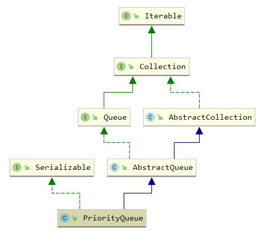

## PriorityQueue

### 1. 介绍

`java.util.PriorityQueue` 即优先级队列，底层采用堆实现。线程不安全，线程安全采用

`java.util.concurrent.PriorityBlockingQueue`

继承体系



### 2. 属性

``` java
    // 数组默认初始化容量为11
    private static final int DEFAULT_INITIAL_CAPACITY = 11;

    // 堆采用数组实现
    transient Object[] queue; // non-private to simplify nested class access

    private int size = 0;

    // 比较器，如果为null则采用自然顺序
    private final Comparator<? super E> comparator;

    // 修改次数，用于fast-fail机制
    transient int modCount = 0; // non-private to simplify nested class access
    
    // 最大容量 
    private static final int MAX_ARRAY_SIZE = Integer.MAX_VALUE - 8;
```

### 3. 构造方法

``` java
    public PriorityQueue() {
        this(DEFAULT_INITIAL_CAPACITY, null);
    }

    public PriorityQueue(int initialCapacity) {
        this(initialCapacity, null);
    }

    public PriorityQueue(Comparator<? super E> comparator) {
        this(DEFAULT_INITIAL_CAPACITY, comparator);
    }

    public PriorityQueue(int initialCapacity,
                         Comparator<? super E> comparator) {
        // Note: This restriction of at least one is not actually needed,
        // but continues for 1.5 compatibility
        if (initialCapacity < 1)
            throw new IllegalArgumentException();
        this.queue = new Object[initialCapacity];
        this.comparator = comparator;
    }

    // 通过Collection进行构造
    public PriorityQueue(Collection<? extends E> c) {
        if (c instanceof SortedSet<?>) {
            SortedSet<? extends E> ss = (SortedSet<? extends E>) c;
            this.comparator = (Comparator<? super E>) ss.comparator();
            initElementsFromCollection(ss);
        }
        else if (c instanceof PriorityQueue<?>) {
            PriorityQueue<? extends E> pq = (PriorityQueue<? extends E>) c;
            this.comparator = (Comparator<? super E>) pq.comparator();
            initFromPriorityQueue(pq);
        }
        else {
            this.comparator = null;
            initFromCollection(c);
        }
    }

    /* 省略一系列通过PriorityQueue和SortedSet构造队列的构造方法 */
```

``` java
/**
 * 初始化非PriorityQueue和SortedSet容器的过程
 */
    private void initFromCollection(Collection<? extends E> c) {
        initElementsFromCollection(c);
        heapify();
    }

    // 获取元素
    private void initElementsFromCollection(Collection<? extends E> c) {
        Object[] a = c.toArray();
        // If c.toArray incorrectly doesn't return Object[], copy it.
        if (a.getClass() != Object[].class)
            a = Arrays.copyOf(a, a.length, Object[].class);
        int len = a.length;
        if (len == 1 || this.comparator != null)
            for (int i = 0; i < len; i++)
                if (a[i] == null)
                    throw new NullPointerException();
        this.queue = a;
        this.size = a.length;
    }

    // 调整
    private void heapify() {
        for (int i = (size >>> 1) - 1; i >= 0; i--)
            siftDown(i, (E) queue[i]);
    }
```

### 4. offer方法

``` java
    // offer方法即进行入队
    public boolean offer(E e) {
        // 要求入队元素非空
        if (e == null)
            throw new NullPointerException();
        modCount++;
        int i = size;
        // 到达容量上限，自动扩容
        if (i >= queue.length)
            grow(i + 1);
        size = i + 1;
        if (i == 0)
            queue[0] = e;
        else
            siftUp(i, e); // 插入后进行上浮
        return true;
    }
```

``` java
    // 自动扩容方法
    private void grow(int minCapacity) {
        int oldCapacity = queue.length;
        // 容量较小时采用2倍+2扩容，大于64时采用1.5倍扩容
        int newCapacity = oldCapacity + ((oldCapacity < 64) ?
                                         (oldCapacity + 2) :
                                         (oldCapacity >> 1));
        if (newCapacity - MAX_ARRAY_SIZE > 0)
            newCapacity = hugeCapacity(minCapacity);
        queue = Arrays.copyOf(queue, newCapacity);
    }
```

``` java
    // 上浮操作，是优先级队列的核心方法之一
    private void siftUp(int k, E x) {
        // 使用提供的比较器进行大小比较
        if (comparator != null)
            siftUpUsingComparator(k, x);
        else
            siftUpComparable(k, x);
    }

    // 两个方法的实现基本类似，区别在于使用提供的comparator或Comparable接口
    private void siftUpComparable(int k, E x) {
        Comparable<? super E> key = (Comparable<? super E>) x;
        while (k > 0) {
            /** 因为采用下标0作为堆的根，取父节点时采用公式
             * parent = (k-1)/2
             * 例如，下标2的父节点为0
             */
            int parent = (k - 1) >>> 1;
            Object e = queue[parent];
            // 默认实现是小根堆
            if (key.compareTo((E) e) >= 0)
                break;
            queue[k] = e;
            k = parent;
        }
        queue[k] = key;
    }

    private void siftUpUsingComparator(int k, E x) {
        while (k > 0) {
            int parent = (k - 1) >>> 1;
            Object e = queue[parent];
            if (comparator.compare(x, (E) e) >= 0)
                break;
            queue[k] = e;
            k = parent;
        }
        queue[k] = x;
    }
```

### 5. poll方法

``` java
    public E poll() {
        if (size == 0)
            return null;
        int s = --size;
        modCount++;
        E result = (E) queue[0];
        E x = (E) queue[s]; // 最后一个元素
        queue[s] = null;
        // 将最后一个元素放于堆的根进行下沉
        if (s != 0)
            siftDown(0, x);
        return result;
    }
```

``` java
    // 下沉操作，是优先级队列的核心方法之一
    private void siftDown(int k, E x) {
        if (comparator != null)
            siftDownUsingComparator(k, x);
        else
            siftDownComparable(k, x);
    }

    private void siftDownUsingComparator(int k, E x) {
        int half = size >>> 1;
        // 根据堆的特性，除了根之外的最小值位于区间[1, half]之间
        while (k < half) {
            int child = (k << 1) + 1; // 计算左子节点的下标
            Object c = queue[child];
            int right = child + 1; // 计算右子节点的下标
            // 右子节点更小，则选择右子节点
            if (right < size &&
                comparator.compare((E) c, (E) queue[right]) > 0)
                c = queue[child = right];
            if (comparator.compare(x, (E) c) <= 0)
                break;
            queue[k] = c; // 进行交换
            k = child;
        }
        queue[k] = x; // 最后交换x
    }

    private void siftDownComparable(int k, E x) {
        Comparable<? super E> key = (Comparable<? super E>)x;
        int half = size >>> 1;        // loop while a non-leaf
        while (k < half) {
            int child = (k << 1) + 1; // assume left child is least
            Object c = queue[child];
            int right = child + 1;
            if (right < size &&
                ((Comparable<? super E>) c).compareTo((E) queue[right]) > 0)
                c = queue[child = right];
            if (key.compareTo((E) c) <= 0)
                break;
            queue[k] = c;
            k = child;
        }
        queue[k] = key;
    }
```

### 6. 其他方法

``` java
    public boolean add(E e) {
        return offer(e);
    }

    public E peek() {
        return (size == 0) ? null : (E) queue[0];
    }
```

