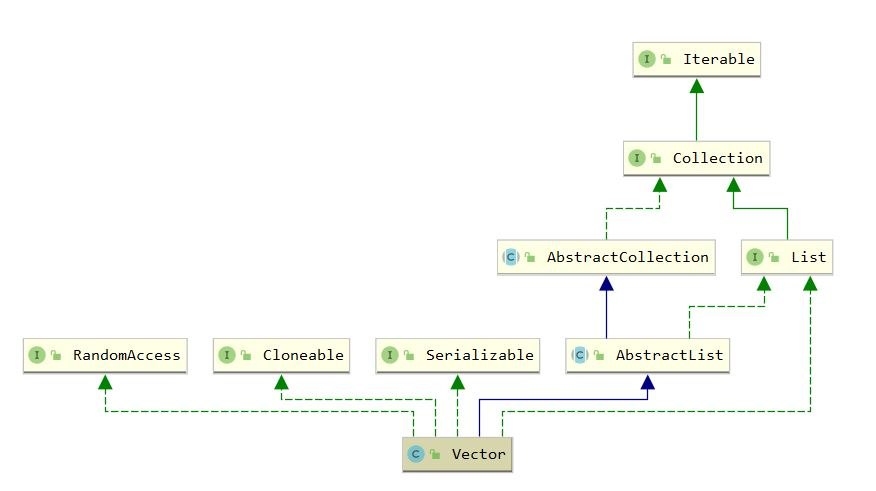

## Vector

### 1. 介绍

#### 1.1 介绍

Vector 是线程安全的自动扩容数组，其线程安全性通过 synchronized 对读写操作进行加锁，读多写少的场合推荐使用 CopyOnWriteArrayList

#### 1.2 继承体系



### 2. 属性

``` java
    // 元素数组，设为 protected 是因为有Stack等类继承了Vector
	protected Object[] elementData;
	// 数组中元素个数
    protected int elementCount;
	// 扩容增量，如果指定为0则两倍扩容
    protected int capacityIncrement; 
	// 数组最大长度，-8是因为某些虚拟机在数组中存放了header
    private static final int MAX_ARRAY_SIZE = Integer.MAX_VALUE - 8;
```

### 3. 构造函数

``` java
    // 设置初始容量和扩容增量
	public Vector(int initialCapacity, int capacityIncrement) {
        super();
        if (initialCapacity < 0)
            throw new IllegalArgumentException("Illegal Capacity: "+
                                               initialCapacity);
        this.elementData = new Object[initialCapacity];
        this.capacityIncrement = capacityIncrement;
    }

    public Vector(int initialCapacity) {
        this(initialCapacity, 0);
    }


	// 默认初始化容量为10， 两倍扩容
    public Vector() {
        this(10);
    }

    public Vector(Collection<? extends E> c) {
        elementData = c.toArray();
        elementCount = elementData.length;
        // c.toArray might (incorrectly) not return Object[] (see 6260652)
        if (elementData.getClass() != Object[].class)
            elementData = Arrays.copyOf(elementData, elementCount, Object[].class);
    }
```

### 4. add

``` java
  	public synchronized boolean add(E e) {
        modCount++;
        ensureCapacityHelper(elementCount + 1); // 必要时进行扩容
        elementData[elementCount++] = e;
        return true;
    }
```

``` java
    private void ensureCapacityHelper(int minCapacity) {
        // overflow-conscious code
        if (minCapacity - elementData.length > 0)
            grow(minCapacity);
    }

    private void grow(int minCapacity) {
        int oldCapacity = elementData.length;
        // 设置了capacityIncrement则按固定长度扩容，否则2倍扩容
        int newCapacity = oldCapacity + ((capacityIncrement > 0) ?
                                         capacityIncrement : oldCapacity);
        if (newCapacity - minCapacity < 0)
            newCapacity = minCapacity;
        if (newCapacity - MAX_ARRAY_SIZE > 0)
            newCapacity = hugeCapacity(minCapacity);
        elementData = Arrays.copyOf(elementData, newCapacity);
    }
```

### 5. remove

``` java
    public synchronized E remove(int index) {
        modCount++;
        if (index >= elementCount)
            throw new ArrayIndexOutOfBoundsException(index);
        E oldValue = elementData(index);

        int numMoved = elementCount - index - 1;
        if (numMoved > 0)
            System.arraycopy(elementData, index+1, elementData, index,
                             numMoved);
        // 防止内存泄漏
        elementData[--elementCount] = null; // Let gc do its work

        return oldValue;
    }
```

