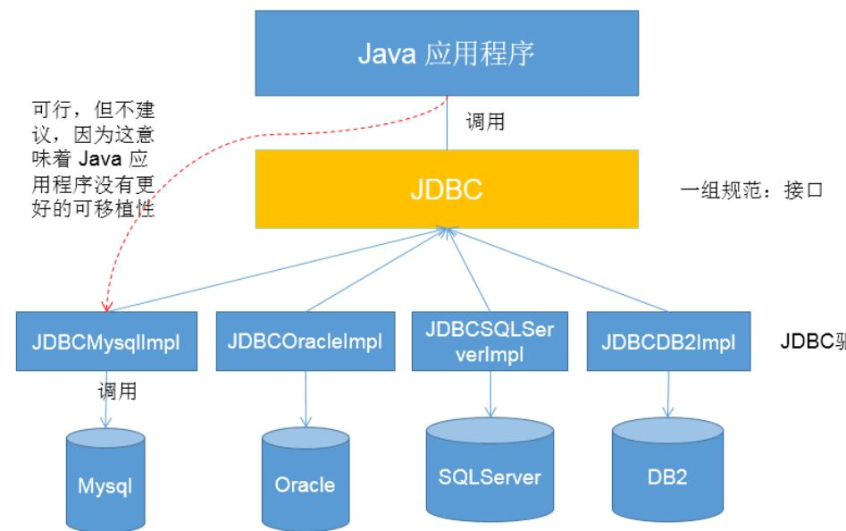
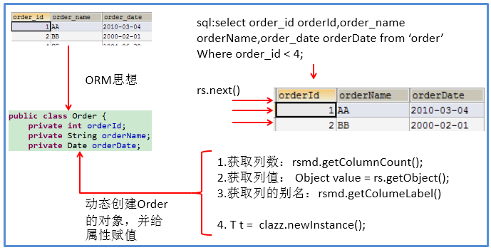

[toc]

## JDBC

### 1. 概述

- JDBC (Java Database Connectivity)是 **独立于特定数据库管理系统、通用的SQL数据库存取和操作的公共接口**，定义了用来访问数据库的标准Java类库(**java.sql, javax.sql**)，使用这些类库可以以一种**标准**的方法、方便地访问数据库资源。
- 第三方 O/R 工具 Mybatis 等是对 JDBC 的封装



### 2. 获取数据库连接

使用配置文件存储信息，获取数据库连接，减少耦合

``` java
        // 1.加载配置文件
        InputStream is = ConnectionTest.class.getClassLoader().getResourceAsStream("jdbc.properties");
        Properties pros = new Properties();
        pros.load(is);

        // 2.读取配置信息
        String url = pros.getProperty("url");
        String driverClass = pros.getProperty("driverClass");

        // 3.加载驱动, 进行设置
        Class.forName(driverClass);
        Properties config = new Properties();
        config.setProperty("user", pros.getProperty("user"));
        config.setProperty("password", pros.getProperty("password"));
        if (pros.getProperty("serverTimezone") != null) {
            config.setProperty("serverTimezone", pros.getProperty("serverTimezone"));
        }
        
        // 4.获取连接
        Connection conn = DriverManager.getConnection(url, config);
        System.out.println(conn);
        conn.close();
```


### 3. CRUD

java.sql 中有 3 个接口定义了对数据库调用

- Statement：用于执行静态 SQL 语句并返回结果
- PreparedStatement：SQL 语句被预编译并存储于此对象中，可以多次高效执行
- CallableStatement：执行 SQL 存储过程

#### 3.1 Statement

- 通过调用 Connection 对象的 createStatement() 方法创建该对象。该对象用于执行静态的 SQL 语句，并且返回执行结果。

  ``` java
  st = conn.createStatement();
  rs = st.executeQuery(sql);
  ```

- Statement 接口中定义了下列方法用于执行 SQL 语句：

  ```java
  int excuteUpdate(String sql); // 执行更新操作
  ResultSet executeQuery(String sql); // 执行查询操作
  ```

- 但是使用Statement操作数据表存在弊端：

  - 存在拼串操作，繁琐
  - 存在 **SQL注入** 问题

#### 3.2 PreparedStament

##### 3.2.1 介绍

- PreparedStatement 接口是 Statement 的子接口，表示一条预编译过的 SQL 语句，通过  preparedStatement(String sql) 方法获取 PreparedStatement 对象
- PreparedStatement 对象所代表的 SQL 语句中的参数用 ? 来表示，调用  setXxx() 方法来设置这些参数；setXxx() 方法有两个参数，第一个参数是参数的索引(从 1 开始)，第二个是参数的值
- 因为进行了预编译 SQL ，故可以解决 SQL 注入问题

##### 3.2.2 通用修改

``` java
    // 通用修改操作
    public void update(String sql,Object ... args){
		Connection conn = null;
		PreparedStatement ps = null;
		try {
			// 1.获取数据库的连接
			conn = JDBCUtils.getConnection();
			
			// 2.获取PreparedStatement的实例 (或：预编译sql语句)
			ps = conn.prepareStatement(sql);
			// 3.填充占位符
			for(int i = 0;i < args.length;i++){
				ps.setObject(i + 1, args[i]);
			}
			
			// 4.执行sql语句
			ps.execute();
		} catch (Exception e) {
			
			e.printStackTrace();
		}finally{
			// 5.关闭资源
			JDBCUtils.closeResource(conn, ps);
		}
	}
```

##### 3.2.3 通用查询

Mybatis 的基础实现

``` java
	// 返回单个查询对象，如果返回多个采用 List<T>并进行相应修改
    public <T> T getInstance(Class<T> clazz, String sql, Object... args) {
		Connection conn = null;
		PreparedStatement ps = null;
		ResultSet rs = null;
		try {
			// 1.获取数据库连接
			conn = JDBCUtils.getConnection();

			// 2.预编译sql语句，得到PreparedStatement对象
			ps = conn.prepareStatement(sql);

			// 3.填充占位符
			for (int i = 0; i < args.length; i++) {
				ps.setObject(i + 1, args[i]);
			}

			// 4.执行executeQuery(),得到结果集：ResultSet
			rs = ps.executeQuery();

			// 5.得到结果集的元数据：ResultSetMetaData
			ResultSetMetaData rsmd = rs.getMetaData();

			/*
             * 6.1 通过ResultSetMetaData得到columnCount,columnLabel
             * 通过ResultSet得到列值
             */
			int columnCount = rsmd.getColumnCount();
			if (rs.next()) {
				T t = clazz.newInstance();
				for (int i = 0; i < columnCount; i++) {
					// 获取列值
					Object columnVal = rs.getObject(i + 1);
                    /* 
                     * 当数据库字段名与对象的属性名不同时，可以通过别名进行代替
					 * 获取列的别名:列的别名，使用类的属性名充当
					 */
					String columnLabel = rsmd.getColumnLabel(i + 1);
					// 6.2 使用反射，给对象的相应属性赋值
					Field field = clazz.getDeclaredField(columnLabel);
					field.setAccessible(true);
					field.set(t, columnVal);

				}
				return t;
			}
		} catch (Exception e) {

			e.printStackTrace();
		} finally {
			// 7.关闭资源
			JDBCUtils.closeResource(conn, ps, rs);
		}
        
		return null;
        
	}
```

#### 3.3 PreparedStatement vs Statement

- 代码的可读性和可维护性。
- **PreparedStatement 能最大可能提高性能：**
  - DBServer 对**预编译**语句提供性能优化。预编译语句有可能被重复调用，所以<u>DBServer 缓存编译后的执行代码，下次调用相同的预编译语句只要将参数直接传入即可。</u>
  - Statement 即使是相同操作但数据内容不一样，也无法进行缓存。这样<u>每执行一次都要对传入的语句编译一次。</u>
- PreparedStatement 可以防止 SQL 注入 
- PreparedStatement 可以处理 Blob 类型数据
- PreparedStatement 可以进行快速批量插入

#### 3.4 ResultSet与ResultSetMetaData

##### 3.4.1 ResultSet

- 查询需要调用PreparedStatement 的 executeQuery() 方法，查询结果是一个ResultSet 对象

- ResultSet 对象以逻辑表格的形式封装了执行数据库操作的结果集，返回的实际上就是一张数据表。有一个游标指向数据表的第一条记录之前，可以通过 next() 方法，若有效，该方法返回 true，且指针下移。

- 当指针指向一行时, 可以通过调用 getXxx(int index) 或 getXxx(int columnName) 获取每一列的值。

  - 例如: getInt(1), getString("name")
  - **JDBC 与数据库交互涉及到的索引都从1开始。**

  


##### 3.4.2 ResultSetMetaData

- 可用于获取关于 ResultSet 对象中列的类型和属性信息的对象

- ResultSetMetaData meta = rs.getMetaData();
  - **getColumnName**(int column)：获取指定列的名称
  - **getColumnLabel**(int column)：获取指定列的别名
  - **getColumnCount**()：返回当前 ResultSet 对象中的列数。 

  - getColumnTypeName(int column)：检索指定列的数据库特定的类型名称。 
  - getColumnDisplaySize(int column)：指示指定列的最大标准宽度，以字符为单位。 
  - **isNullable**(int column)：指示指定列中的值是否可以为 null。 

  - isAutoIncrement(int column)：指示是否自动为指定列进行编号，这样这些列仍然是只读的。 




### 4. 批量插入

#### 4.1 批量执行SQL语句

当需要成批插入或者更新记录时，可以采用Java的批量**更新**机制，允许多条语句一次性提交给数据库批量处理。

JDBC的批量处理语句包括下面三个方法：

- **addBatch(String)：添加需要批量处理的SQL语句或是参数；**
- **executeBatch()：执行批量处理语句；**
- **clearBatch()：清空缓存的数据**

通常我们会遇到批量执行 SQL 语句的情况：

- 多条 SQL 语句的批量处理
- 一个 SQL 语句的批量传参


#### 4.2 高效的批量插入

举例：向数据表中插入20000条数据

```sql
CREATE TABLE goods(
id INT PRIMARY KEY AUTO_INCREMENT,
NAME VARCHAR(20)
);
```

##### 4.2.1 实现层次一：使用Statement

```java
Connection conn = JDBCUtils.getConnection();
Statement st = conn.createStatement();
for(int i = 1;i <= 20000;i++){
	String sql = "insert into goods(name) values('name_' + "+ i +")";
	st.executeUpdate(sql);
}
```

##### 4.2.2 实现层次二：使用PreparedStatement

```java
Connection conn = JDBCUtils.getConnection();
		
String sql = "insert into goods(name)values(?)";
PreparedStatement ps = conn.prepareStatement(sql);
for(int i = 1;i <= 20000;i++){
	ps.setString(1, "name_" + i);
	ps.executeUpdate();
}
				
JDBCUtils.closeResource(conn, ps);
```

##### 4.2.3 实现层次三

```java
/*
 * 修改1： 使用 addBatch() / executeBatch() / clearBatch()
 * 修改2：mysql服务器默认是关闭批处理的，我们需要通过一个参数，让mysql开启批处理的支持。
 * 		 在url中设置rewriteBatchedStatements=true
 */
@Test
public void testInsert1() throws Exception{
		
	Connection conn = JDBCUtils.getConnection();
		
	String sql = "insert into goods(name)values(?)";
	PreparedStatement ps = conn.prepareStatement(sql);
		
	for(int i = 1;i <= 1000000;i++){
		ps.setString(1, "name_" + i);
			
		//1. 500条执行一次
		ps.addBatch();
		if(i % 500 == 0){
			//2.执行
			ps.executeBatch();
			//3.清空
			ps.clearBatch();
		}
	}

	JDBCUtils.closeResource(conn, ps);
}
```

##### 4.2.4 实现层次四

```java
/*
* 层次四：在层次三的基础上操作
* 使用Connection 的 setAutoCommit(false)  /  commit()
*/
@Test
public void testInsert2() throws Exception{

	Connection conn = JDBCUtils.getConnection();
		
	// 1.设置为不自动提交数据
	conn.setAutoCommit(false);
		
	String sql = "insert into goods(name)values(?)";
	PreparedStatement ps = conn.prepareStatement(sql);
		
	for(int i = 1;i <= 1000000;i++){
		ps.setString(1, "name_" + i);
			
		ps.addBatch();
		if(i % 500 == 0){
			ps.executeBatch();
			ps.clearBatch();
		}
	}
		
	// 2.提交数据
	conn.commit();
		
	JDBCUtils.closeResource(conn, ps);
}
```

