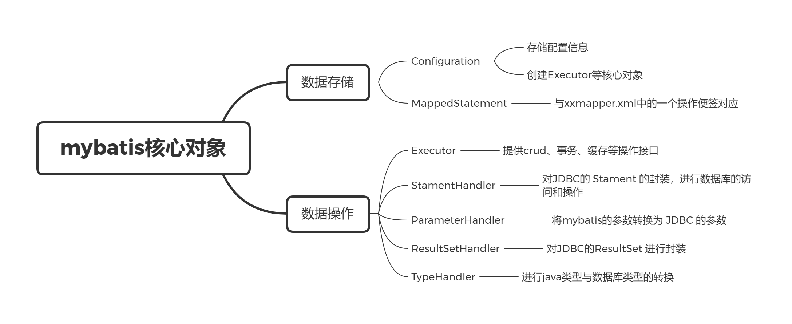
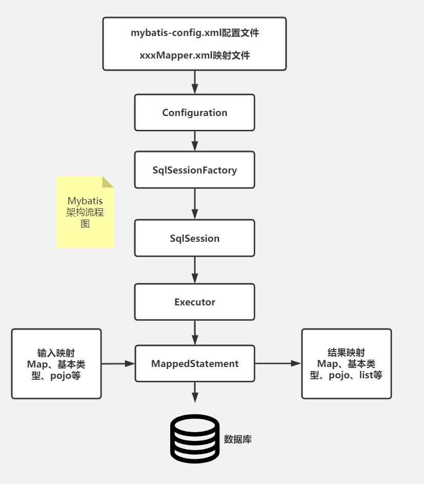
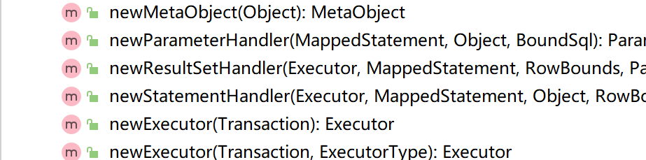

## MyBatis

### 1. Mybatis核心对象



mybatis 是对 JDBC 的封装，其核心对象包括：

- 数据存储类对象：存储 mybatis 相关的配置信息，包含以下类：
  - `Configuration`
  - `MappedStatement`
- 操作类对象
  - `Executor`
  - `StamentHandler`
  - `ParameterHandler`
  - `ResultSetHandler`
  - `TypeHandler`



#### 1.1 Configuration

`org.apache.ibatis.session.Configuration` 存储了全局配置信息，并且提供相关对象的创建操作。

``` java
public class Configuration {

  protected Environment environment;

  // 对应mybatis-config.xml里 <settings>标签
  protected boolean safeRowBoundsEnabled;
  protected boolean safeResultHandlerEnabled = true;
  protected boolean mapUnderscoreToCamelCase;
  protected boolean aggressiveLazyLoading;
  protected boolean multipleResultSetsEnabled = true;
  protected boolean useGeneratedKeys;
  protected boolean useColumnLabel = true;
  protected boolean cacheEnabled = true;
  protected boolean callSettersOnNulls;
  protected boolean useActualParamName = true;
  protected boolean returnInstanceForEmptyRow;
  
  // 其他信息... 
    
  // 全局MappedStatement，包含各个xxxMapper.全局MappedStatement
  protected final Map<String, MappedStatement> mappedStatements = new StrictMap<MappedStatement>("Mapped Statements collection");
  // 缓存
  protected final Map<String, Cache> caches = new StrictMap<Cache>("Caches collection");
  // 全局的ResultMap,包含各个xxxMapper.xml里面的自定义ResultMap
  protected final Map<String, ResultMap> resultMaps = new StrictMap<ResultMap>("Result Maps collection");
  protected final Map<String, ParameterMap> parameterMaps = new StrictMap<ParameterMap>("Parameter Maps collection");
  protected final Map<String, KeyGenerator> keyGenerators = new StrictMap<KeyGenerator>("Key Generators collection");
    
  // 对应mybatis-config.xml里 <mappers>标签
  protected final Set<String> loadedResources = new HashSet<String>();
  // 其他信息... 
}
```




### 1.2 MappedStament

`org.apache.ibatis.mapping.MappedStatment`对应 `XXXMapper.xml` 一个配置标签，例如 `<insert>..</insert>`

``` java
public final class MappedStatement {

  private String resource;
  private Configuration configuration;
  
  // 对应标签的各个属性
  private String id;
  private Integer fetchSize;
  private Integer timeout;
  /** 
   * Stament的类型, 与JDBC的stament类型对应
   * STATEMENT
   * PREPARED: 对应JDBC的PreparedStatament,默认使用
   * CALLABLE: 使用存储过程，使用较少
   */
  private StatementType statementType;
  private ResultSetType resultSetType;
  // 封装了BoundSql, BoundSql内部封装了动态sql语句
  private SqlSource sqlSource;
  private Cache cache;
  private ParameterMap parameterMap;
  private List<ResultMap> resultMaps;
  private boolean flushCacheRequired;
  private boolean useCache;
  private boolean resultOrdered;
  private SqlCommandType sqlCommandType;
  private KeyGenerator keyGenerator;
  private String[] keyProperties;
  private String[] keyColumns;
  private boolean hasNestedResultMaps;
  private String databaseId;
  private Log statementLog;
  private LanguageDriver lang;
  private String[] resultSets;
}
```

#### 1.3 Executor

`org.apache.ibatis.executor.Executor` 是操作的接口，进行 crud、事务、缓存等操作。

``` java
public interface Executor {
  // 增删改操作
  int update(MappedStatement ms, Object parameter) throws SQLException;
   
  // 查询操作
  <E> List<E> query(MappedStatement ms, Object parameter, RowBounds rowBounds, ResultHandler resultHandler, CacheKey cacheKey, BoundSql boundSql) throws SQLException;
  <E> List<E> query(MappedStatement ms, Object parameter, RowBounds rowBounds, ResultHandler resultHandler) throws SQLException;
  <E> Cursor<E> queryCursor(MappedStatement ms, Object parameter, RowBounds rowBounds) throws SQLException;

  // 事务操作 
  void commit(boolean required) throws SQLException;
  void rollback(boolean required) throws SQLException;
    
  // 其他操作...
}
```

该接口主要实现类：

- `SimpleExecutor`：默认使用

- `BatchExecutor`：进行批处理
- `ReuseExecutor`：复用 JDBC 的 `Statement`，减少连接，但是要求 sql 语句必须相同，限制大

####  1.4 StatementHandler

`StamentHandler` 是对 JDBC 的 `Stament` 的封装，真正进行数据库的访问和操作。

``` java
public interface StatementHandler {

  Statement prepare(Connection connection, Integer transactionTimeout)
      throws SQLException;

  void parameterize(Statement statement)
      throws SQLException;

  // 批处理
  void batch(Statement statement)
      throws SQLException;

  // crud
  int update(Statement statement) throws SQLException;
  <E> List<E> query(Statement statement, ResultHandler resultHandler) throws SQLException;
  <E> Cursor<E> queryCursor(Statement statement) throws SQLException;

  BoundSql getBoundSql();
  // 参数处理
  ParameterHandler getParameterHandler();
    
}
```

``` java
/**
 * SimpleStatementHandler.query，对JDBC Statement的封装
 */
public <E> List<E> query(Statement statement, ResultHandler resultHandler) throws SQLException {
    String sql = boundSql.getSql();
    // JDBC的操作
    statement.execute(sql);
    // 经过ResultSetHandler处理后返回
    return resultSetHandler.<E>handleResultSets(statement);
  }
```

该接口主要实现类对应 JDBC 的 `Statement`：

- `SimpleStatementHandler`
- `PrepareStatementHandler`
- `CallableStatementHandler`

#### 1.5 ParameterHandler

`ParameterHandler` 将 mybatis 的参数转换为 JDBC 的参数

``` markdown
@Param(用户传递参数) --> #{}(动态sql语句) --> ?(jdbc) 
```

#### 1.6 ResultSetHandler

对 JDBC 的 `ResultSet` 进行封装

``` java
public interface ResultSetHandler {
    <E> List<E> handleResultSets(Statement var1) throws SQLException;

    <E> Cursor<E> handleCursorResultSets(Statement var1) throws SQLException;

    void handleOutputParameters(CallableStatement var1) throws SQLException;
}
```

#### 1.7 TypeHandler

进行 java 类型与数据库类型的转换

```java
public interface TypeHandler<T> {

  void setParameter(PreparedStatement ps, int i, T parameter, JdbcType jdbcType) throws SQLException;

  T getResult(ResultSet rs, String columnName) throws SQLException;

  T getResult(ResultSet rs, int columnIndex) throws SQLException;

  T getResult(CallableStatement cs, int columnIndex) throws SQLException;

}
```

