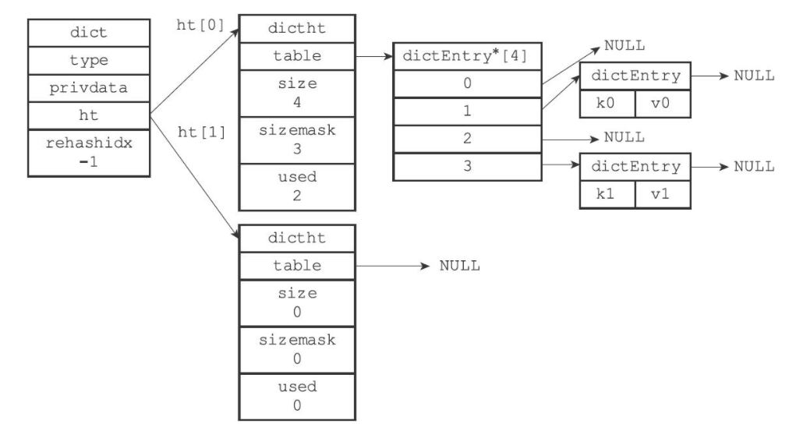

[toc]


## Redis 底层实现

### 1. 字符串

```c
struct sdshdr {
    // buf数组已使用的字节数
    int len;
    // buf数组未使用的字节数
    int free;
    char buf[];
}
```

sdshdr 相比 C 字符串的优势：

- 计数方式不同，C 字符串获取长度时间复杂度 O(n)，sdshdr 为 O(1)
- 杜绝了缓冲区溢出，进行自动扩容
- **空间预分配**和**惰性空间释放**
  - 空间预分配：对 sdshdr 拓展时，会分配多余的 free空间 + 1 byte，其余 1 byte 用于存空字符
  - 惰性空间释放：sdshdr 缩减后，不会立即回收多余空间
- 二进制安全，对于二进制文件中存在 '\0' , C 字符串会截断，sdshdr 则不存在这个问题。
- sdshdr 兼容 string.h 的某些操作，并且可以保存二进制数据


### 2. 链表

``` c
typedef struct listNode {
    struct listNode * pre;
    struct listNode * next;
    // 采用void* 可以保存任意类型
    void * value;
}
```

``` c
typedef struct list {
    listNode * head;
    listNode * tail;
    // 节点数量
    unsigned long len;
    // 节点值复制函数
    void *(*dup)(void *ptr);
    // 节点值释放函数
    void *(*free)(void *ptr);
    // 节点值对比函数
    void *(*match)(void *ptr, void *key);
}
```


### 3. 字典

#### 3.1 字典实现

redis 的字典采用哈希表实现，哈希表中包含多个哈希表节点，一个哈希表节点即为一个 key-value 对

##### 3.1.1 哈希表

``` c
typedef struct dictht {
    // 哈希表数组
    dictEntry ** tabble;
    // 哈希表大小
    unsigned long size;
    // 哈希表掩码，总等于 size-1
    unsigned long sizemask;
    // 已有节点数量
    unsigned long used;
} dictht;
```

##### 3.1.2 哈希表节点

``` c
typedef struct dictEntry {
    void * key;
    // value可以为指针、无符号64位整数、有符号64位整数
    union {
        void * val;
        uint64_t u64;
        int64_t s64;
    } v;
    // 采用拉链法解决冲突
    struct dictEntry *next;
}
```

##### 3.1.3 字典

``` c
typedef struct dict {
    // 类型特定函数，保存了操作该类型的函数
    dictType *type;
    // 保存了传给该类型的可选参数
    void *pridata;
    // ht[0]存储数据，ht[1]用于rehash复制
    dictht ht[2];
    // 是否在rehash, 如果不在rehash，则值为-1
    int rehashidx;
}
```

``` c
typedef struct dictType {
    // 哈希函数
    unsigned int (*hashFunction)(const void *key);
    // 复制key的函数
    void *(*keyDup)(void *privdata, const void *key);
    // 复制value的函数
    void *(*valDup)(void *privdata, const void *obj);
    // 对比key的函数
    int (*keyCompare)(void *privdata, const void *key1, const void* key2);
    // 销毁key的函数
    void (*keyDestructor)(void *privdata, void *key);
    // 销毁value的函数
    void (*valDestructor)(void *privdata, void *obj);
} dictType;
```

下图即为字典结构示意图



#### 3.2 rehash

redis rehash 的步骤（类似 java.util.HashMap）：

- 为 ht[1] 分配空间，ht[1] 的长度为 2 的幂

- 渐进 rehash：当用户执行增删改查时，定位其索引 rehashidx，将 ht[0] 对应的节点复制到 ht[1]，故 resash 操作被平摊到各个操作上。故在 rehash 过程中，用户的操作需要在 ht[0] 和 ht[1] 两个表进行（增加操作只在 ht[1] 进行，保证 ht[0] 只减不增），rehash 结束，rehashidx变为 -1
- 释放 ht[1]，将 ht[1] 设置为 ht[0]，ht[1] 创建一个空表，为下次 rehash 做准备


rehash 条件：

- 拓展
  - 目前没有执行 BGSAVE 或 BGREWRITEAOF，且负载因子大于等于 1
  - 目前正在执行 BGSAVE 或 BGREWRITEAOF，且负载因子大于等于 5（对于执行 BGSAVE/BGREWRITEAOF 时，redis 创建了子进程，操作系统大多采用 copy-on-write 来优化子进程的使用效率，redis 提高了负载因子的上限，避免子进程存在期间哈希表进行拓展，减少不必要的内存写入）
- 收缩：负载因子小于 0.1


