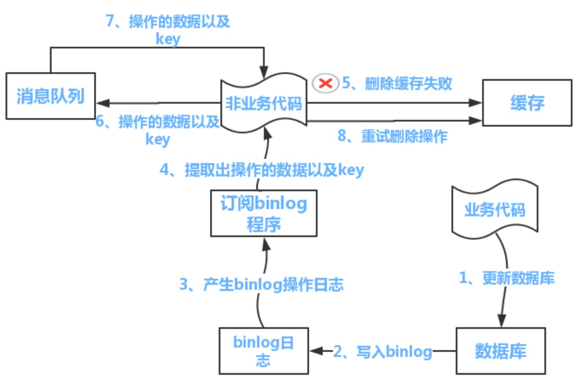

## redis 进阶

### 1. 缓存穿透、击穿、雪崩

- 缓存穿透：redis 的缓存没有命中，向持久层数据库查询也没有，查询失败，缓存也无法更新；当大量用户产生上述情况就发生了缓存穿透

  解决方案：

  - 布隆过滤器，先对能够查询的数据进行 hash，先在控制层进行校验
  - 即使是空对象也进行缓存，但是会产生空值的键，会浪费内存，即使设置了过期时间，但也会使缓存和数据库的数据有一段时间不一致

  

- 缓存击穿：当热点 key 失效瞬间，并发访问直接查询数据库，导致访问速度降低

  解决方案：

  - 热点数据永不过期
  - 加互斥锁保证只要少量请求访问数据库并重新构建缓存，其余线程在锁释放之后访问新缓存 


- 缓存雪崩：某一个时间段，缓存集中过期，redis 宕机

  解决方案：

  - redis 高可用，增设从机

  - 过期时间增加随机值

  - 限流降级，缓存失效后，通过加锁或者队列来限制缓存的线程数量


### 2. 分布式锁

分布式锁主要解决分布式逻辑处理时的并发问题（逻辑处理往往不是原子的）

redis 实现分布式锁：setnx 获取锁，del 释放锁；expire 设置过期时间防止执行过程出现异常，锁不会释放导致死锁。但可能存在以下问题：

- setnx 和 expire 之间 redis 挂了导致死锁，使用组合原子指令

  ``` bash
  # 获取锁并设置过期时间为5分钟
  set lock 777 ex 5 nx 
  ```

- 如果在主节点申请的锁还未同步到从节点，主节点挂了，而从节点取代之后没有这把锁，将会导致存在两个客户端获得同一把锁。一般而言可以容忍，追求高可用性可以使用 Redlock 算法（加锁时向过半节点发生 set 指令才能加锁成功，释放锁向所有节点发送 del 指令）


### 3. 过期策略和内存换出

redis 会将设置过期时间的 key 存放在一个独立的字典中，采用定期删除 + 懒惰删除策略

- 定期删除：默认每秒扫描 10 次，每次从字典中选出 20 个 key，删除过期元素，如果过期比例超过四分之一，则重复选取。
- 懒惰删除：客户端进行某个 key 的操作时进行检测，过期即删除

场景问题：

- 如果有大量 key 同时过期，将会导致多次扫描引起卡顿，故需要将过期时间设置一个随机范围，分散过期处理的压力。


当 redis 的内存超过物理内存时，将会与磁盘产生交换，redis 提供了以下淘汰策略：

- noeviction：默认淘汰策略，可删读，不可增改
- volatile-lru：使用 lru 淘汰设置了过期时间的 key
- volatile-ttl：淘汰最先要过期的 key
- volatile-random：随机淘汰会过期的 key
- allkeys-lru：使用 lru 淘汰 key
- allkets-random：随机淘汰key


### 4. Sentinel

Sentinel 哨兵本质上是一个运行在特殊模式下的 Redis 服务器，重在实现主服务器宕机后自动切换主服务器的操作

主要操作：

- 获取主服务器信息：使用 INFO 命令获取主服务器和其从机的信息
- 检测下线状态：向与它连接的实例发送 PING 命令判断是否在线
- 选举领头哨兵：当一个主服务器被判断下线时，监视这个主服务器的各个 Sentinel 进行协商选举出一个领头 Sentinel，由其执行故障转移操作
- 故障转移：在已下线主服务器的从服务器里面，挑选出一个将其转换为主服务器，将其他从服务器和已下线的服务器改为以此为主服务器


### 5. 双写一致性

以下为常见的策略

#### 5.1 设置过期时间

给缓存设置过期时间，所有的写操作以数据库为准，对缓存操作只是尽最大努力即可；数据库写成功，缓存更新失败，可以保证最终一致性。

#### 5.2 先更新数据库，再更新缓存

该方案一般不可行，有如下原因：

- 线程不安全：A，B请求先后进行数据更新，但由于网络问题，A 在 B 之后更新了缓存，导致了脏数据
- 代价高：当业务场景是以写为主时，缓存频繁更新

#### 5.3 先删缓存，再更新数据库

该方案将导致数据不一致，例如遇到如下情况，将导致缓存中的是脏数据 。

（1）请求 A 进行写操作，删除缓存
（2）请求 B 查询发现缓存不存在
（3）B 去数据库查询得到旧值
（4）B 将旧值写入缓存
（5）A 将新值写入数据库

解决方案：

1.使用延时双删缓解，实现简单，但第二次删除可能失败，仍就导致脏数据

- 先淘汰缓存，再写数据库
- 延时一段时间之后，再次删除缓存

2.使用重试机制，但实现复杂



#### 5.4 先更新数据库，再删除缓存

即 Cache Aside Pattern

（1）缓存刚好失效
（2）请求 A 查询数据库，得一个旧值
（3）请求 B 将新值写入数据库
（4）B 删除缓存
（5）A 将查到的旧值写入缓存

上述条件仍会产生脏数据，但前提是 (3) 比 (2) 耗时短（数据库一般读快于写，所以该条件触发几率小），可以使用之前的解决方案进一步缓解

#### 5.5 串行化

将读写请求串行化放到内存队列中，保证数据库和缓存的一致性，但是降低了系统的吞吐量，只推荐在强一致性的场景使用。