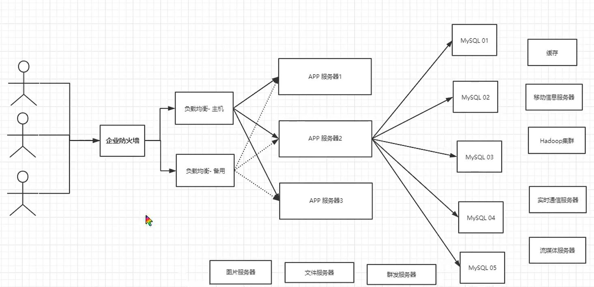
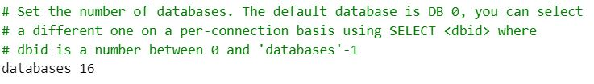

[toc]

## Redis

### 1. NoSQL 概述

#### 1.1 为什么使用 NoSQL

数据库演进：

- 90 年代，因为访问量低，使用的是单机数据库
- Memcached ( 缓存 )  + MySQL + 垂直拆分，进行读写分离
- 分库分表 + 水平拆分 + MySQL 集群
- 如今数据类型多且数据量大，MySQL 等关系型数据库表很大，效率较低；需要使用 NoSQL 进行改进



#### 1.2 什么是 NoSQL

NoSQL = Not only SQL，泛指非关系型数据库

NoSQL 特点：

- 方便拓展，因为数据之间没有关系
- 高性能
- 数据类型多样，不需要提前设计数据库

大数据的特点：

```markdown
1. 大数据的三V: 描述问题
   - 海量 Volume
   - 多样 Variety
   - 实时 Velocity
2. 大数据的三高: 对程序的要求
   - 高并发
   - 高可拓
   - 高性能
```

#### 1.3 NoSQL 分类

- KV 键值对：Redis，常用于缓存，处理高访问负载
- 文档型数据库：MongoDB，常用数据格式 bson，应用于 Web 应用
- 列存储数据库：HBase，常用于分布式文件系统
- 图形关系数据库：Neo4j，用于设计网络、推荐系统


### 2. Redis 入门

#### 2.1 概述

Redis ( Remote Dictionary Server )，远程字典服务

主要作用：

- 内存存储，断电即失，但 Redis 支持持久化
- 用于高速缓存
- 消息中间件，发布订阅系统
- 地图信息分析
- 计数器，例如微信文章浏览量

#### 2.2 基础知识

- redis 默认有 16 ( 0 - 15 ) 个数据库，默认使用第 0 个

  

- 基本命令

  ``` markdown
  1. select index ---> 选择数据库
  2. dbsize ---> 当前数据库大小
  3. set key value ---> 设置k-v对
  4. get key ---> 获取key对应的数据
  5. keys * ---> 查看所有key
  6. EXISTS key ---> key是否存在
  7. move key 1 ---> 删除key
  8. flushall/flushdb ---> 清除所有数据/清除当前数据库
  9. EXPIRE key num ---> 设置key的过期时间，单位为s
  10. TTL key ---> 查看key的剩余时间, -1为不过期
  11. type key ---> 查看key的类型
  ```

- Redis 是**单线程**的，因为数据全部存储在内存，故选择单线程是最快的操作，多线程需要上下文切换，并不适合于 CPU 密集场景

  

### 3. 五大数据类型

#### 3.1 String

##### 3.1.1 基础命令

``` markdown
1. APPEND key str ---> 追加字符串，如果key不存在，则新建
2. STRLEN key ---> 获取字符串长度
3. incr/decr key ---> key对应的值自增/自减
4. INCRBY/DECRBY key step ---> key对应的值增加/减少step
5. GETRANGE key start end ---> 类似substr，截取字符串
6. SETRANGE key start end ---> 替换部分字符串
7. setex key timeout value ---> 设置k/v以及过期时间
8. setnx key value ---> 设置k/v，如果key存在则失败
9. mset/msetnx k1 v1 k2 v2 ---> 设置多个k/v，msetnx是原子操作，只能一起成功或者一起失败
```

##### 3.1.2 底层实现

```c
struct sdshdr {
    // buf数组已使用的字节数
    int len;
    // buf数组未使用的字节数
    int free;
    char buf[];
}
```

sdshdr 相比 C 字符串的优势：

- 计数方式不同，C 字符串获取长度时间复杂度 O(n)，

  sdshdr 为 O(1)，返回 len + free

- 杜绝了缓冲区溢出

- 加入了**空间预分配**和**惰性空间释放**

  - 空间预分配：对 sdshdr 拓展时，会分配多余的 free空间 + 1 byte，其余 1 byte 用于存空字符
  - 惰性空间释放：sdshdr 缩减后，不会立即回收多余空间

- 二进制安全，对于二进制文件中存在 '\0' , C 字符串会截断，sdshdr 则不存在这个问题

#### 3.2 List

List 常用于消息队列

**基本命令**

``` markdown
1. LPUSH/RPUSH key value ---> 往列表key头/尾插入数值
2. LPOP/RPOP key ----> 移除列表的头/尾元素
3. LRANGE key start end ---> 获取列表key一部分数据
4. LINDEX key index ---> 获取第index个元素
5. LREM key count value ---> 移除指定个数的value
6. LLEN key ---> 获取列表的长度
7. LTRIM key start stop ---> 通过下标截取指定范围的数据
8. LSET list index value ---> 更新第index元素的value

```


#### 3.3 Set

可以实现关注用户、共同关注等功能

**基本命令**

``` markdown
1. sadd myset value ---> 添加元素
2. SMEMBERS myset  ---> 查看指定set的所有值
3. SISMEMBER myset value  ---> 查看value是否在myset中
4. scard myset ---> 查看元素个数
5. srem myset value ---> 删除set中的value元素
6. 集合操作
	- 差集: SDIFF set1 set2 
	- 交集: SINTER set1 set2
	- 并集: SUNION set1 set2
```


#### 3.4 Hash

Hash 类似 String，只不过 key-value 变为 key-map 

常用于存储对象

**基本命令**

``` markdown
1. hset myhash key1 value1   ---> 设置元素
2. hmset myhash k1 v1 k2 v2  ---> 批量设置
3. hgetall myhash ---> 获得key对应的map
4. hdel myhash --->删除key对象的map
5. hlen myhash ---> 获取字段数量

```


#### 3.5 Zset

**基本命令**

``` markdown
1. zadd myset score value  ---> 添加元素，优先级为score
2. ZRANGEBYSOCRE myset min max [WITHSOCRES] ---> 获取score范围在min - max 之间的元素，可选带优先级
3. zcount myset min max ---> 获取指定区间的成员数量
```


### 4. 三种特殊数据类型

#### 4.1 geospatial 地理位置

```markdown
常用命令
1. geoadd table 经度 纬度 placename ---> 添加地理位置
2. getpos table placename ---> 获取指定位置的经度和纬度
3. geodist table placename1 placename2 单位 ---> 获取两地的直线距离
4. georadius table 经度 纬度 半径 单位 ---> 以所给经度、纬度为圆心，获得在半径范围内的位置
5. georadiusbymember table place 半径 单位 ---> 以所给位置为圆心，获得在半径范围内的位置
```


#### 4.2 Hyperloglog

基数：一个数据集里不重复元素的个数

redis 2.8.9 加入了 hyperloglog，用来进行基数统计，其优点是占用内存固定，但计算存在一定误差

适用场景：允许误差的统计

``` markdown
常用命令
1. PFadd mykey v1 v2 v3 v4.... ---> 添加元素
2. PFCOUNT mykey ---> 计算mykey的基数
3. PFMERGE dist mykey1 mykey2... ---> 合并多个hyperloglog
```


#### 4.3 Bitmaps

针对于两个状态数据的存储

``` markdown
常用命令
1. setbit mapname index value ---> 将第index位设置为value，value为0/1
2. getbit mapname index ---> 取得第index位
3. bitcount mapname ---> 计算位图中1的个数
```


### 5. 事务

redis 执行单条命令保证原子性，<font color=blue>事务不保证原子性</font>

redis 的事务：

- 开启事务，multi

- 命令入队

- 执行事务，exec，到这里才开始真正执行，执行每一个命令

  取消事务，discard

redis 的事务回滚

- 编译期错误( 命令有错 )，则所有命令都会回滚
- 运行期错误( 例如 incr 一个非数字)，错误命令回滚，其他命令正常执行


**redis 实现乐观锁**

悲观锁：任何适合都加锁

乐观锁：不会上锁，更新数据的时候判断是否发生了变动；获取 version，更新数据时判断 version 是否一致

redis 使用 watch 命令可以实现乐观锁


### 6. Jedis

jedis 的操作与命令相同

``` java
Jedis jedis = new Jedis("127.0.0.1", 6379);
jedis.flushDB();
jedis.set("k1", "bzzb");
```


### 7. Springboot 整合redis

springboot 2.x 之后，使用了 lettuce 替换了 jedis

- jedis：采用直连，多线程操作不安全，需要使用连接池，类似 BIO 模式
- lettuce：采用 netty，实例可以在多个线程共享，线程安全，类似 NIO 模式

``` java
@Autowired
private RedisTemplate redisTemplate;

/* 
opsForValue 操作字符串类型
opsForList  操作List
opsForSet   操作Set
... 
*/
redisTemplate.opsForValue().set("k1", "v1");
```


### 8. Redis 配置文件详解

- 网络

  ``` bash
  bind 127.0.0.1  ---> 绑定ip
  protected-mode yes ---> 保护模式，只接收127.0.0.1和::1的地址
  port 6379 ---> 端口
  ```

- 通用

  ``` bash
  daemonize yes ---> 守护进程，默认是no; windows不存在该配置
  pidfile /var/run/redis_6379.pid ---> 以后台运行，需要指定pid
  database 16 ---> 数据库数量
  ```

- snapshoting 快照：用于持久化

  ``` bash
  如果一定时间内进行了操作，则会进行持久化
  save 900 1  ---> 900s 至少修改了一次
  save 300 10 ---> 300s 至少修改10次
  save 60 10000 ---> 1min 内至少修改10000次
  
  stop-writes-on-bgsave-error yes ---> 出错是否继续工作
  rdbcompression yes ---> 是否压缩
  rdbchecksum yes ---> 是否校验
  dir ./     ---> 存放位置
  ```

- LIMITS

  ``` bash
  maxclients 10000 ---> 最多连接客户端
  maxmemory <bytes> ---> 最大内存
  maxmemory-policy noeviction ---> 内存到达上限策略
  	1. volatile-lru: 只对会过期的key进行LRU
  	2. allkeys-lru: LRU
  	3. volatile-random: 随机删除即将过期的key
  	4. allkeys-random: 随机删除
  	5. volatile-ttl: 删除即将过期的
  	6. noeviction: 永不删除，直接返回错误
  ```

- APPEND ONLY MODE： AOF 的配置

  ``` bash
  appendonly no ---> 默认不开启aof模式，默认使用rdb
  appendfilename "appendonly.aof" ---> aof默认文件名
  appendfsync everysec ---> 每秒执行一次同步，可能丢失这一秒的数据
  			always ---> 每次改变都同步
  
  ```


### 9. Redis 持久化

如果仅做缓存使用，则不需要进行持久化

#### 9.1 RDB

触发时机

- 配置的 save 规则满足
- 执行 flushall 命令
- 退出 redis 

恢复 rdb 文件：将 rdb 存放在 redis 启动目录即可

优点：

- 适合大规模的数据恢复
- 对数据的完整性要求不高

缺点：

- 需要一定时间进程才能操作，redis 挂了的话，最后一次修改数据的操作丢失
- fork 进程的时候占用较大内存

#### 9.2 AOF

以日志的形式记录每个写操作，只许追加不允许修改

优点：

- 每一次修改都会同步，数据完整
- 默认每秒同步一次，可能丢失一秒的数据

缺点：

- 文件大小远大于 rdb，修复时间慢
- 运行效率慢，默认使用 rdb