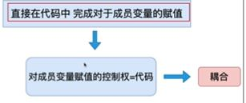

[toc]

## Spring 5

### 1. 引言

#### 1.1 EJB 的问题

Spring 是用于**改善 EJB 的问题**

EJB 的问题

- **运行环境苛刻**，EJB 必须依靠 EJB 容器实现，需要运行在 Weblogic 等 Application 服务器上，这些服务器都是收费的，且未开源
- **代码移植性差**，EJB 应用必须实现 Weblogic 等服务器的相关接口，更改服务器后代码必须重写

#### 1.2 Spring介绍

Spring 是一个轻量级的 Java EE 解决方案，并整合众多优秀的设计模式

- 轻量级：运行环境没有额外要求，可运行在支持 Servelt 引擎的服务器；代码移植性高，不需要额外实现接口
- Java EE 解决方案：Spring 可实现 Controller、Service、DAO 各层

#### 1.3 工厂设计模式

<font color=blue>Spring 的本质即使用工厂，ApplicationContext(applicationContext.xml)</font>

#####  1.3.1 简单反射工厂

通过反射来实现工厂的建造返回

``` java
Class clazz = Class.forName("xxx.xx.xx.UserServiceImpl");
UserService userService = (UserService)clazz.newInstance(); // newInstance调用了无参构造函数
return userService;
```

上述实现仍需要 UserServiceImpl 的全限定名，转为文件来设置全限定名，通过读取配置文件设置

``` properties
# xxx.properties
userService = xxx.xx.xx.UserServiceImpl
```

``` java
// Properties集合来存储 properties 文件的内容
// Properties是一个<String, String>的特殊Map
public class BeanFactory {
    private static Prorerties env = new Prorerties();
    // 使用静态代码块来读入配置文件
    static {
        InputStream inputStream = BeanFactory.class.
            getResourceAsStream("xxx.properties");
        env.load(inputStream); // 读取输入流
    }
    
    public static UserService getUserService() {
        Class clazz = Class.forName(env.getProperty("userService"));
		return (UserService)clazz.newInstanwence();
    }
}
```

只需要改动配置文件即可，不需要重新编译

##### 1.3.2 通用工厂设计

仅使用简单工厂将导致工厂数量大大增加，并且工厂实现代码存在大量冗余，设计通用工厂来实现

``` java
public class BeanFactory {
    private static Prorerties env = new Prorerties();
    // 使用静态代码块来读入配置文件
    static {
        InputStream inputStream = BeanFactory.class.
            getResourceAsStream("xxx.properties");
        env.load(inputStream); // 读取输入流
    }
    
    public static Object getBean(String key) {
        Object ret = null;
        try {
            Class clazz = Class.forName(env.getProperty(key));
        } catch(Exception e) {
            ...
        }
		return ret;
    }
}
```

### 2. 第一个 Spring 程序

#### 2.1 环境搭建

Spring 的配置文件

``` markdown
1. 配置文件的存放位置: 任意, 但需要进行配置文件路径的配置
2. 配置文件的命名: 任意，推荐 applicationContext.xml
```

#### 2.2 Spring 核心 API

- ApplicationContext：创建对象的工厂

  ``` markdown
  1. 接口类型
  非web环境接口实现: ClassPathXmlApplicationContext
  web环境接口实现: XmlWebApplicationContext
  2. 重量级资源
  一个应用程序只会创建一个工厂对象，线程安全
  ```

#### 2.3 程序开发

- 程序开发流程

  ``` markdown
  1. 配置文件
  <!-- id:唯一标识； class:类的全限定名 -->
  <bean id="person" class="com.stroke.demo.entity.Person"></bean>
  2. 通过工厂类获得对象
  ```

- 代码实现

  ```java
  // 1. 获得Spring的工厂
  ApplicationContext ctx = 
      new ClassPathXmlApplicationContext("/applicationContext.xml");
  // 2. 创建对象,下述为几种实现
  // getBean通过反射创建对象，调用该类的无参构造函数，如果不存在无参构造将报错
  Person person = (Person) ctx.getBean("person");
  Person person = ctx.getBean("person", Person.class);
  Person person = ctx.getBean(Person.class); // 该实现要求配置文件中只有一个bean的class为Person，否则抛出NoUniqueBeanDefinitionException异常
  ```

- 配置文件的细节

  ``` markdown
  1. 只配置 class 的情况下
  a) Spring 会自动生成 id 值，默认为 类的全限定名#数字
  b) 当 bean 只使用一次的时候，才能省略 id
  2. name 属性
  作用: 为 bean 对象定义别名，使用类似 id
  与 id 的区别:
  	a) name 可以有多个，id 唯一
  	b) containsBeanDefinition 方法只能判断 id 不能判断 name，containsBean 方法二者皆可        判断
  ```

  #### 2.4 Spring 工厂的底层实现(简易版)

  Spring 工厂可以通过调用**私有**的构造函数创建对象，反射面前无私有

  

### 3. 注入

#### 3.1 简介

注入即通过工厂与配置文件，为创建对象的**成员变量赋值**，去除编码方式赋值存在的耦合

#### 3.2 如何注入

- 成员变量提供 setter

- 配置文件

  ``` properties
      <bean id="person" class="com.stroke.demo.entity.Person">
          <property name="id">
              <value>1</value>
          </property>
          <property name="name">
              <value>bzzb</value>
          </property>
      </bean>
  ```

#### 3.3 Set 注入

##### 3.3.1 JDK内置类型

**1. String + 基本类型**

``` properties
<value>要注入的值</value>
```

简化写法

``` properties
<property name="id" value="1" />
<property name="name" value="bzzb" />
```

**2. List、Set等容器**

``` properties
<list>
	<value>注入的值1</value>
	<value>注入的值2</value>
	<value>注入的值3</value>
</list>
```

**3. Map**

``` properties
<map>
	<entry>
		<key><value> uzi </value></key>
		<value> yyds </value>
	</entry>
</map>
```

##### 3.3.2 自定义类型

**1. 第一种方式**

配置文件

``` properties
<bean id="userService" class="xxx.UserServiceImpl">
	<property name="userDao">
		<bean class="xxx.UserDaoImpl" />
	</property>
</bean>
```

**2. 第二种方式**

第一种方式存在的问题：

- 当 Dao 被多个 Service 调用时，存在多个 bean 的相同配置，代码冗余
- 创建了多个 Dao 实例，实际上可以使用同一个

使用引用改善

``` properties
<bean id="userService" class="xxx.UserServiceImpl">
	<property name="userDao">
		<ref bean="userDAO" />
	</property>
</bean>

<!-- 简化写法 -->
<bean id="userService" class="xxx.UserServiceImpl">
	<property name="userDao" ref="userDAO" />
</bean>
```


#### 3.4 构造注入

通过调用**有参构造**注入属性

配置文件

``` properties
<bean id="customer" class="com.stroke.demo.entity.Customer">
     <constructor-arg value="bzzb"></constructor-arg>
     <constructor-arg value="22"></constructor-arg>
</bean>
```

如何**区分重载**的构造函数？

**1. 参数个数不同**

``` properties
控制 constructor-arg 的个数
```

**2. ** **参数个数相同**

``` properties
通过 type 指定类型
<bean id="customer" class="com.stroke.demo.entity.Customer">
     <constructor-arg type="int" value="22"></constructor-arg>
</bean>
```


### 4. <font color = red>反转控制与依赖注入</font>

#### 4.1 反转控制 IOC(Inverse of Control)

原先的成员赋值由代码实现



Spring 将成员赋值的控制权交给 **配置文件 + Spring 工厂**，只需更改配置文件，无需改动代码，**无需重新编译**

#### 4.2 依赖注入 DI(Dependency Injection)

例如 Service 依赖 DAO，将 DAO 作为 Service 的成员变量，通过 Spring 进行注入


### 5. Spring 工厂创建复杂对象

复杂对象：不能直接通过 new 构造方法创建的对象，例如 Connection，SqlSessionFactory等

Spring 创建复杂对象的三种方法：

- **FactoryBean 接口**
- **实例工厂**
- **静态工厂**


#### 5.1 FactoryBean 接口

##### 5.1.1接口定义

``` java
public interface FactoryBean<T> {
    
    // 创建复杂对象
    @Nullable
    T getObject() throws Exception;

    // 复杂对象的Class
    @Nullable
    Class<?> getObjectType();

    // 是否单例
    default boolean isSingleton() {
        return true;
    }
}
```

##### 5.1.2 开发步骤

- 实现 FactoryBean 接口

  ``` jade
  public class ConnectionFactoryBean implements FactoryBean<Connection> {
  
      public Connection getObject() throws Exception {
          Class.forName("com.mysql.jdbc.Driver");
          Connection conn = DriverManager.getConnection
          ("jdbc:mysql://localhost:3306/new_3d_web?serverTimezone=Asia/Shanghai", 		    "root","root");
          return conn;
      }
  
      public Class<?> getObjectType() {
          return Connection.class;
      }
  
      public boolean isSingleton() {
          return false;
      }
  }
  ```

- 配置文件

  ``` properties
  <bean id="conn" class="com.stroke.demo.factorybean.ConnectionFactoryBean" />
  ```

  ``` java
  Connection connection = (Connection) ctx.getBean("conn");
  ```

  **<font color=blue>注意此处获得的是 Connetion 对象， 而不是 ConnectionFactoryBean 对象</font>**

##### 5.1.3 细节

- 如果想实现 ConnectionFactoryBean 对象，通过加 & 实现

  ```java
  ConnectionFactoryBean cfb = (ConnectionFactoryBean)ctx.getBean("&conn");
  ```

- isSingleton() 根据业务需要确定，例如工厂对象可以设置为单例

- 不足：上述代码仍存在耦合，例如 url, username, password 与代码耦合，使用 DI 解耦

  ``` properties
      <bean id="conn" class="com.stroke.demo.factorybean.ConnectionFactoryBean">
          <property name="driveClassName" value="com.mysql.jdbc.Driver" />
          <property name="url" value="jdbc:mysql://localhost:3306/new_3d_web?	  serverTimezone=Asia/Shanghai&amp;useSSL=false" />
          <property name="username" value="root" />
          <property name="password" value="root" />
      </bean>
  ```

##### 5.1.4 FactoryBean 的实现原理(简易版)

Spring 的工作：本质上就是**接口回调**

- 根据配置文件获得实现类，并判断是否为 FactoryBean 的子类
- 调用 getObject()


#### 5.2 实例工厂

##### 5.2.1 使用实例工厂的原因

``` markdown
1. 避免实现 FactoryBean 产生的 Spring 框架的侵入，即用户需要必须实现框架的类或者接口
2. 整合遗留系统，例如只提供 .class 文件的系统
```

##### 5.2.2 开发步骤

遗留系统，原有的工厂代码

``` java
public class ConnectionFactory {

    public Connection getConnection() throws Exception {
        Class.forName("com.mysql.jdbc.Driver");
        Connection conn = DriverManager.getConnection("jdbc:mysql://localhost:3306/new_3d_web?serverTimezone=Asia/Shanghai&useSSL=false",
                "root","root");
        return conn;
    }

}
```

- 配置文件

  ``` properties
  <bean id="connFactory" class="com.stroke.demo.factorybean.ConnectionFactory"/>
  <bean id="conn" factory-bean="connFactory" factory-method="getConnection"/>
  ```

  通过 getBean("conn") 即可获得 Connection 对象


#### 5.3 静态工厂

与实例工厂的区别在于是否**需要工厂的实例**，静态工厂直接调用 static 方法即可

配置文件的差异即是否需要创建工厂的 bean

``` properties
<bean id="conn3" class="com.stroke.demo.factorybean.StaticConnectionFactory" factory-method="getConnection" />
```


### 6. Spring 工厂创建对象的次数

#### 6.1 控制简单对象的创建次数

配置文件中设定 bean 中的 scope 属性的值为

- singleton：单例模式，只会创建一次，是**<font color=blue>默认值</font>**
- prototype：原型模式，每一次都会创建新的对象

#### 6.2 控制复杂对象的创建次数

``` markdown
设置 FactoryBean 接口中的 isSingleton 方法的返回值为 true 即可实现单例
```

常设置为单例的对象：

- 工厂类
- DAO
- Service


### 7. 对象生命周期

<font color=blue>对象的生命周期：一个对象创建、存活、消亡的一个完整过程</font>

#### 7.1 创建阶段

**何时创建**

- 单例：scope="singleton"，Spring 工厂创建的时候(ApplicationContext 创建的时候)创建对象，饿汉式

  注：也可改为懒汉式，设置 lazy-init="true"

- 原型：scope="prototype"，Spring 工厂在获取对象( getBean )时，创建对象

#### 7.2 初始化阶段

Spring 工厂创建对象后调用对象的初始化方法

``` markdown
1. 提供方: 程序员
2. 调用方: Spring 工厂
```

**实现方式**

- 实现 InitializingBean 接口

  ``` java
  public interface InitializingBean {
      void afterPropertiesSet() throws Exception;
  }
  ```

- 对象中提供一个普通的方法，通过配置文件指出

  ``` java
  public void init() {
      ...
  }
  
  <bean id="product" class="com.stroke.demo.life.Product" init-method="init" />
  ```

**初始化细节**

- 同时实现两种方式，先调用 afterPropertiesSet() 方法， 再调用用户自定义方法
- **先注入再进行初始化**，所以方法名称为 afterPropertiesSet

#### 7.3 销毁阶段

``` markdown
1. Spring 什么时候销毁创建的对象
  ctx.close();
2. 销毁方法: 程序员根据自己需求定义，Spring 工厂完成调用
```

**实现方式**

- 实现 DisposableBean 接口

  ``` java
  public interface DisposableBean {
      void destroy() throws Exception;
  }
  ```

- 通过配置文件

  ``` properties
  <bean id="product" class="com.xxx.Product" destroy-method="destroy" />
  ```

**销毁细节**

- 类似初始化阶段，先调用接口， 再调用用户自定义方法
- 销毁方法**只适用于单例模式**，即 scope="singleton"

#### 7.4 总结

注入发生在 1 与 2 之间


### 8. 配置文件参数化

将配置文件中需要经常修改的部分，转移到更小的配置文件中

- 提供一个 .properties 的文件

  ``` properties
  jdbc.driverClassName = com.mysql.jdbc.Driver
  jdbc.url = jdbc:mysql://localhost:3306/new_3d_web?serverTimezone=Asia/Shanghai&useSSL=false
  jdbc.username = root
  jdbc.password = root
  ```

- 整合 Spring 的配置文件和 .properties 文件

  ``` xml
      <context:property-placeholder location="classpath:/db.properties" />
  
      <bean id="conn" class="com.stroke.demo.factorybean.ConnectionFactoryBean">
          <property name= "driveClassName" value="${jdbc.driverClassName}"/>
          <property name="url" value="${jdbc.url}" />
          <property name="username" value="${jdbc.username}" />
          <property name="password" value="${jdbc.password}" />
      </bean>
  ```

### 9. 自定义类型转换器

Spring 内部没有提供特定类型转换时，需要自己实现

**实现**

- 实现 Converter 接口

  ``` java
  @FunctionalInterface
  public interface Converter<S, T> {
      @Nullable
      T convert(S var1);
  }
  ```

  ``` java
  public class MyDateConverter implements Converter<String, Date> {
      
      private String pattern;
  
      @Override
      public Date convert(String s) {
          Date date = null;
          try {
              SimpleDateFormat sdf = new SimpleDateFormat(pattern);
              date = sdf.parse(s);
          } catch (Exception e) {
              e.printStackTrace();
          }
          return date;
      }
  }
  ```

- Spring 配置文件进行注册

  ``` xml
      <!-- 此处对pattern进行DI -->
      <bean id="myDateConverter" class="com.stroke.demo.basic.MyDateConverter" >
          <property name="pattern" value="yyyy-MM-dd"/>
      </bean>
      <!-- 注册转化器 -->
      <bean id="conversionService" class="org.springframework.context.support.ConversionServiceFactoryBean">
          <property name="converters">
              <!-- 此处需要是set标签 -->
              <set>
                  <ref bean="myDateConverter" />
              </set>
          </property>
      </bean>
  ```

**注意**

- ConversionServiceFactoryBean 的 id 是**固定**的，不能采用其他字符串

  ``` xml
  <bean id="conversionService" class="org.springframework.context.support.ConversionServiceFactoryBean">
  ```

  