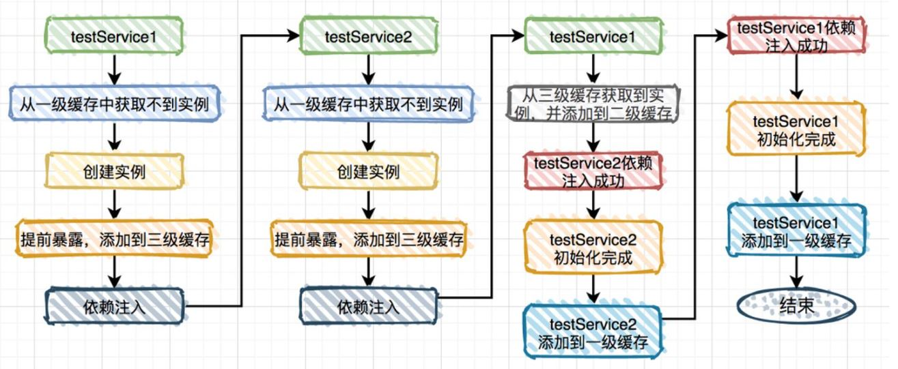
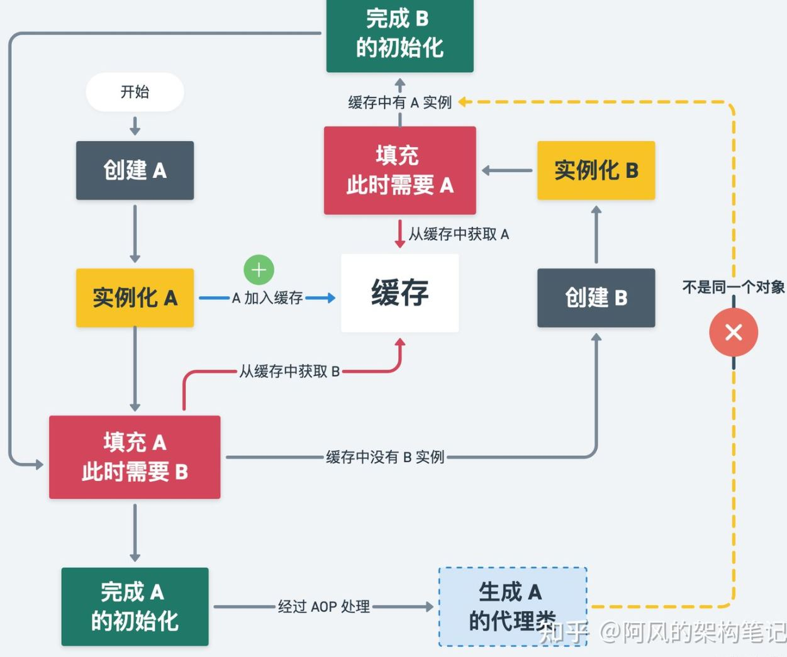

## Spring面试题

#### 1. Spring Bean的作用域

- singleton：默认值，单例模式
- prototype：原型模式，每次创建一个新实例
- request：每次 HTTP 请求创建一个实例，仅用于 WebApplicationContext
- session：同一个 HTTP Session 共享一个实例，仅用于 WebApplicationContext
- gloabalSession：用于 Portlet 应用，不常使用，仅用于 WebApplicationContext


#### 2. BeanFactory和FactoryBean

- BeanFactory：是个接口，定义 IOC 容器或对象工厂基本形式，实现该接口的有 ApplicationContext、XmlBeanFactory 等；
- FactoryBean：是一个工厂 bean，可以自定义 bean 的创建过程，为 bean 提供了灵活处理的方式


#### 3. Bean的线程安全性

- 对于 prototype，线程不存在共享，是线程安全的
- 对于 singleton，线程存在共享。如果是无状态 bean（例如 Service，DAO），则是线程安全的；如果是有状态的，则是不安全的，可以使用 ThreadLocal 为每个线程存储独立的副本，实现线程安全


#### 4. Spring 如何解决循环依赖问题

循环依赖问题是指 A 类中引入 B 类属性，B 类中引入 A 类属性（或者更多类形成循环），由于 Spring 利用反射机制进行注入，循环依赖将导致实例无法生成。

##### 4.1 循环依赖场景

- 单例 setter 注入，能解决
- 多例 setter 注入，无法解决
- 构造器注入，无法解决
- 单例代理对象 setter 注入，有可能解决
- DependsOn 循环依赖，无法解决

##### 4.2 解决循环依赖

Spring 的三级缓存

- 一级缓存 Map<String, Object> singletonObjects：存储已经创建（实例化、注入、初始化）完毕的单例 Bean 实例
- 二级缓存 Map<String, Object> earlySingletonObjects：存储已经实例化的的 Bean 实例
- 三级缓存 Map<String, ObjectFactory<?>> singletonFactories：存储该 Bean 提前暴露的引用，

解决循环依赖的过程如下图



分析：

- 仅使用一级缓存：完全无法解决循环依赖问题

- 仅使用二级缓存：可以解决部分循环依赖问题，如果该 Bean 实现 AOP 则会产生问题

  

  如上图所示，实现了 AOP 的 Bean 在初始化之后经过 AOP 生成代理类，但该代理类和 B 类持有的 A 类不是一个对象。

- 三级缓存：三级缓存中存放 bean 对应的工厂 ObjectFactory，是个 Lambda 表达式

  ``` java
  addSingletonFactory(beanName, () -> getEarlyBeanReference(beanName, mbd, bean));
  ```

  earlyBeanReference 取得该 bean 的代理对象，后续再将代理对象放入二级缓存。


#### 5. Spring 容器启动流程

Spring IOC 容器启动流程主要是

- 定位：获取配置文件路径
- 加载：把配置文件解析成 BeanDefinition
- 注册：将 BeanDefinition 存储到 IOC 容器中
- 实例化：根据 BeanDefinition 创建实例

`AbstractApplicationContext.refresh()` 实现了主要逻辑：

- `prepareReresh()` 准备工作，记录容器启动事件、处理配置文件占位符等；
- `obtainFreshBeanFactory()`将配置文件解析成 BeanDefinition 并注册，**重点**；
- `prepareBeanFactory`：设置  BeanFactory 的类加载器等初始化操作；
- `postProcessBeanFactory`： 添加 BeanFactoryPostProcessor 的实现类；
- `invokeBeanFactoryPostProcessors`：调用上述实现类的方法；
- `finishBeanFactoryInitialization()`：初始化所有单例 bean，**重点**


#### 6. Springboot 自动配置

在 springboot 项目中，注解 `@SpringBootApplication` 是一个组合注解，其中的 `@EnableAutoConfiguration` 开启了自动配置

原理：在 autoconfig 的 jar 包中存放了默认配置文件 `META-INF/spring.factories`，内容为配置类的全限定名，将这些自动配置类加载到 Spring 容器中

``` properties
org.springframework.boot.autoconfigure.EnableAutoConfiguration=\
org.springframework.boot.autoconfigure.admin.SpringApplicationAdminJmxAutoConfiguration,\
org.springframework.boot.autoconfigure.aop.AopAutoConfiguration,\
```


#### 7. IOC 的理解

IOC 即控制反转，将对象的创建和管理由程序员交由 IOC 容器控制，资源由容器统一管理；依赖注入 DI 是 IOC 的实现手段，在容器运行期间，动态将依赖关系注入到对象之中（即把需要的类赋值给相应的属性）。

IOC 是依赖倒置原则的一种设计思路，高层不依赖底层实现。详见<a href="https://www.zhihu.com/question/23277575">Spring IOC的好处</a>

优点：

- 解耦，对象与对象之间是松耦合，替换服务方便（可以通过配置文件）

缺点：

- 增加系统的复杂度，大量配置文件
- 通过反射生成对象，效率有所损耗


#### 8. AOP 的理解

AOP 解决了系统需求实现（日志、权限验证）在各处散落的问题，把和主业务无关的事情，放到代码外做，在运行时动态地将代码切入到类的指定方法、指定位置上。

OOP 的粒度在类上，用继承和组合的方式（多态、继承、模板方法等等），绵绵编织成一套类和对象体系；AOP 的粒度在方法上（执行前，执行后等等），凡某包某类某开头的方法，一并处理。AOP 是对 OOP 的有益补充。

Spring AOP 使用动态代理，提供调用者增强过后的对象。