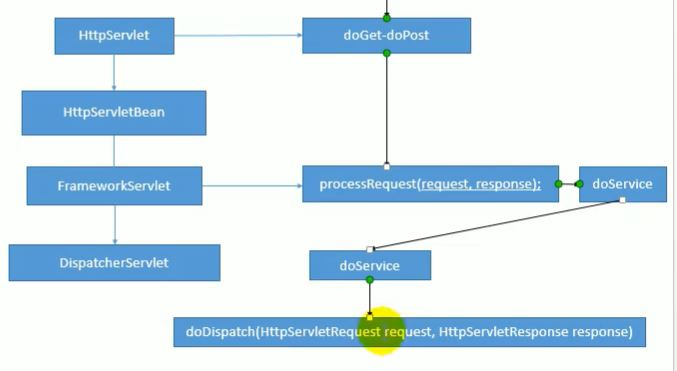

[toc]

## Spring MVC 源码

### 1. DispatcherServlet

所有请求通过 DispatcherServlet 拦截，并调用 doDispatch 方法



``` java
	protected void doDispatch(HttpServletRequest request, HttpServletResponse response) throws Exception {
		HttpServletRequest processedRequest = request;
		HandlerExecutionChain mappedHandler = null;
		boolean multipartRequestParsed = false;

        // 异步管理器
		WebAsyncManager asyncManager = WebAsyncUtils.getAsyncManager(request);

		try {
			ModelAndView mv = null;
			Exception dispatchException = null;

			try {
                // 1. 检查当前请求是否上传文件
				processedRequest = checkMultipart(request);
				multipartRequestParsed = (processedRequest != request);

				// Determine handler for the current request.
                // 2. 找到能处理该请求的Controller类
                // 通过循环遍历handerMappings寻找，映射在IOC容器创建Controller类的时候进					   行设置
				mappedHandler = getHandler(processedRequest);
                // 3. 没有找到抛出 404
				if (mappedHandler == null) {
					noHandlerFound(processedRequest, response);
					return;
				}

				// Determine handler adapter for the current request.
                // 4. 获取适配器，该适配器封装了该Controller类能够执行的方法，反射工具
				HandlerAdapter ha = getHandlerAdapter(mappedHandler.getHandler());

				// Process last-modified header, if supported by the handler.
				String method = request.getMethod();
				boolean isGet = "GET".equals(method);
				if (isGet || "HEAD".equals(method)) {
					long lastModified = ha.getLastModified(request, mappedHandler.getHandler());
					if (new ServletWebRequest(request, response).checkNotModified(lastModified) && isGet) {
						return;
					}
				}

				if (!mappedHandler.applyPreHandle(processedRequest, response)) {
					return;
				}

                // 5. 适配器执行了Controller对应的方法，返回值为 ModelAndView
				mv = ha.handle(processedRequest, response, mappedHandler.getHandler());

				if (asyncManager.isConcurrentHandlingStarted()) {
					return;
				}

                // 如果方法返回值为void，则设置默认名
				applyDefaultViewName(processedRequest, mv);
				mappedHandler.applyPostHandle(processedRequest, response, mv);
			}
			catch (Exception ex) {
				dispatchException = ex;
			}
			catch (Throwable err) {
				dispatchException = new NestedServletException("Handler dispatch failed", err);
			}
            // 6. 将ModelAndView转发到目标页面
			processDispatchResult(processedRequest, response, mappedHandler, mv, dispatchException);
		}
		catch (Exception ex) {
			triggerAfterCompletion(processedRequest, response, mappedHandler, ex);
		}
		catch (Throwable err) {
			triggerAfterCompletion(processedRequest, response, mappedHandler,
					new NestedServletException("Handler processing failed", err));
		}
		finally {
			if (asyncManager.isConcurrentHandlingStarted()) {
				// Instead of postHandle and afterCompletion
				if (mappedHandler != null) {
					mappedHandler.applyAfterConcurrentHandlingStarted(processedRequest, response);
				}
			}
			else {
				// Clean up any resources used by a multipart request.
				if (multipartRequestParsed) {
					cleanupMultipart(processedRequest);
				}
			}
		}
	}
```


### 2.  九大组件

Spring MVC 在关键位置都是由组件完成的

共同点：9 大组件全为接口

``` java
	/** MultipartResolver used by this servlet. */
	// 文件上传相关
	private MultipartResolver multipartResolver;

	/** LocaleResolver used by this servlet. */
	// 区域信息解析器，与国际化相关
	private LocaleResolver localeResolver;

	/** ThemeResolver used by this servlet. */
	// 主题解析器，支持主题更换，基本不使用
	private ThemeResolver themeResolver;

	/** List of HandlerMappings used by this servlet. */
	// 处理handler映射
	private List<HandlerMapping> handlerMappings;

	/** List of HandlerAdapters used by this servlet. */
	private List<HandlerAdapter> handlerAdapters;

	/** List of HandlerExceptionResolvers used by this servlet. */
	// 异常解析
	private List<HandlerExceptionResolver> handlerExceptionResolvers;

	/** RequestToViewNameTranslator used by this servlet. */
	// 基本不使用
	private RequestToViewNameTranslator viewNameTranslator;

	/** FlashMapManager used by this servlet. */
	// 支持重定向携带数据
	private FlashMapManager flashMapManager;

	/** List of ViewResolvers used by this servlet. */
	// 视图解析器
	private List<ViewResolver> viewResolvers;
```


组件的初始化通过调用 initStrategies(ApplicationContext context) 方法

组件初始化流程：去 IOC 容器中寻找组件，没有找到则使用默认配置

``` java
	protected void initStrategies(ApplicationContext context) {
		initMultipartResolver(context);
		initLocaleResolver(context);
		initThemeResolver(context);
		initHandlerMappings(context);
		initHandlerAdapters(context);
		initHandlerExceptionResolvers(context);
		initRequestToViewNameTranslator(context);
		initViewResolvers(context);
		initFlashMapManager(context);
	}
```


