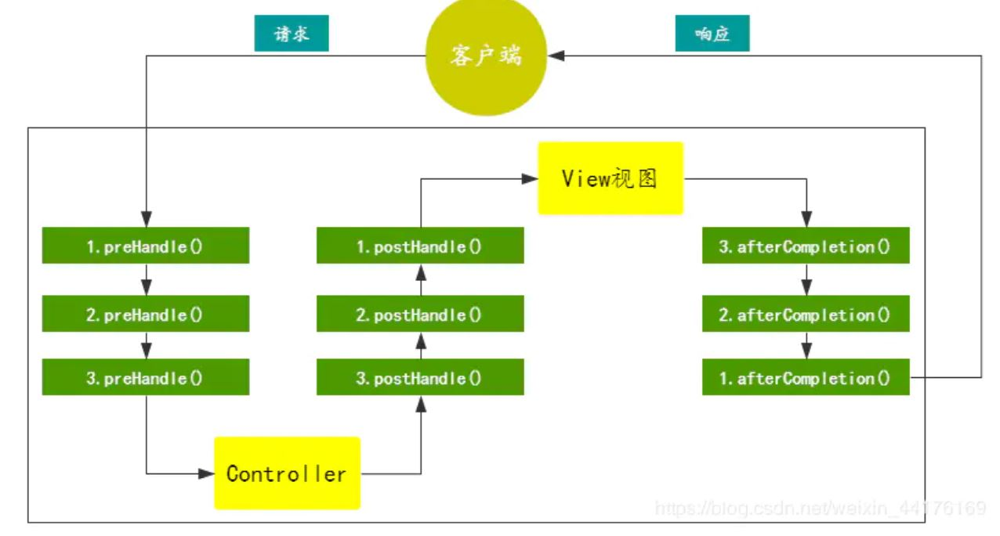
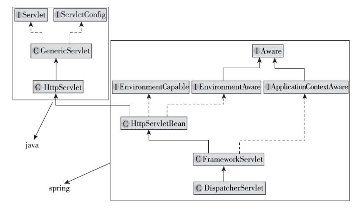

[toc]

## Spring MVC 入门

### 1. 概述

- 通过注解开发
- 至少 Restful 风格的 url 请求
- 采用了松散耦合可插拔的组件结构

本质上就是 servlet，核心思想是使用 DispatcherServlet 拦截所有请求，再进行处理

运行流程

- 客户端发送请求到 web 服务器
- spring mvc 前端控制器拦截所有请求
- 前端控制器寻找目标方法，利用反射执行
- 对返回值进行处理 (解析页面或者封装为 JSON )


### 2. @RequestMapping

作用：告诉 spring mvc，控制器可以处理哪些请求

- 标注在类上，提供初步的请求映射信息，类似根目录
- 标注在方法上，提高细分映射信息，如果类未标注，则该方法的 url 是相对于根目录的

#### 2.1 属性：

- **value**：即请求的 url

- **method**：限定请求方式，GET、POST等，默认全接收

  ``` java
  @RequestMapping(value = "/hello", method = RequestMethod.GET)
  ```

- **params**：规定请求参数

  ``` java
  @RequestMapping(value = "/hello", params = ["username", "pwd"])
  ```

- **headers**：规定请求头

- consumes：规定请求头中的 Content-Type

- produces：给响应头加上 Content-Type

#### 2.2 url 模糊匹配

- **?** : 能替代任意一个字符
- ***** : 能替代任意多个字符或者一层路径
- ** : 替代任意层次路径

#### 2.3 @PathVariable

主要用于 RESTful 风格

**REST**思想：资源对应一个 url，GET、POST、PUT、DELETE 分别对应对资源的获取、新建、更新、删除操作

``` java
    @RequestMapping("user/{id}")
    public int restTest(@PathVariable("id") int id) {
        return id;
    }
```


### 3. 请求处理

- @RequestParam：获取请求参数，如果不指定 required 为 false, 请求必须携带该参数，否则会报 404 错误

- @RequestHeader：获取请求头中某个 key 的值

  ``` java
  @RequestHeader("User-Agent")
  ```

- @CookieValue：获取 Cookie 某个 key 对应的值

- 传入 POJO: Spring MVC 能自动为 POJO 进行赋值

  ``` java
  @RequestMapping("/book")
  public void addBook(Book book) {
      ...
  }
  ```

  

### 4. 数据输出

spring mvc 传给前端数据的方式

- 参数中传入 Map、Model、ModelMap，然后进行赋值

  ``` java
      @RequestMapping("/test")
      public String test(Model model) {
          model.addAttribute("msg", "hello");
          return "success";
      }
  ```

  三者关系：ModelMap 实现了 Map 接口，Model 是 Spring的接口，最后实现都是 BindingAwareModelMap，该类继承了 ModelMap，实现了 Model、Map 接口， 该对象保存的数据将会存放在请求域

- 返回值为 ModelAndView

  ``` java
      public ModelAndView test() {
          // viewName是要跳转的页面
          ModelAndView mv = new ModelAndView("success");
          mv.addObject("msg", "...");
          return  mv;
      }
  ```

- @ModelAttributes


### 5. 数据转换

Spring MVC 如何将页面提交的字符串转化为对应的类型

WebDataBinder 负责处理以上工作


### 6. 拦截器

在 DispatcherServlet 后执行，使用场景：登录认证、字符过滤等

#### 6.1 自定义拦截器

主要有两种实现方式

- 实现 HandlerInterceptor 接口

  ``` java
  public interface HandlerInterceptor {
      // 返回true即放行
  	default boolean preHandle(HttpServletRequest request, HttpServletResponse response, Object handler)
  			throws Exception {
  
  		return true;
  	}
  
  	default void postHandle(HttpServletRequest request, HttpServletResponse response, Object handler,
  			@Nullable ModelAndView modelAndView) throws Exception {
  	}
  
  	default void afterCompletion(HttpServletRequest request, HttpServletResponse response, Object handler,
  			@Nullable Exception ex) throws Exception {
  	}
  
  }
  ```

- 继承实现了 HandlerInterceptor 接口的类

#### 6.2 拦截器流程




### 7. 全局异常处理

Spring MVC 异常的默认处理是响应一个500状态码和错误信息， Spring MVC提供了一个 HandlerExceptionResolver 接口，可用于统一异常处理。  

``` java
public interface HandlerExceptionResolver {
	@Nullable
	ModelAndView resolveException(
			HttpServletRequest request, HttpServletResponse response, @Nullable Object handler, Exception ex);

}
```

``` java
@Component
public class MyExceptionResolver implements HandlerExceptionResolver {
	@Override
	public ModelAndView resolveException(HttpServletRequest httpServletRequest,
		HttpServletResponse httpServletResponse, Object o, Exception e) {
		ModelAndView mv = new ModelAndView();
		mv.setViewName("error");
		return mv;
	}
}
```


### x. 整体结构介绍

