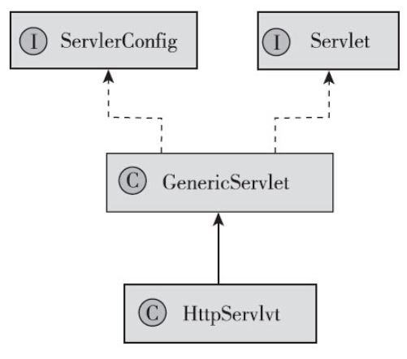
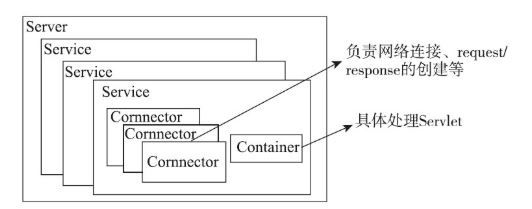

[toc]

## 网站基础知识

### 1. 软件三大类型

- 单机型
- C/S
- B/S


### 2. 海量数据解决方案

- 缓存和页面静态化
- 数据库优化：表结构优化、SQL 语句优化、分库分表、索引优化等
- 分离活跃数据
- 批量读取和延迟修改：主要是减少 IO
- 读写分离，建立数据库集群，但需解决**数据一致性**问题


### 3. 高并发解决方案

- 应用和静态资源分离
- 页面缓存
- 集群和分布式，但需解决 Session 同步等额外难题
- 反向代理
- CDN


### 4. Servlet

Servlet 结构图



``` java
public interface Servlet {
    // 容器启动时被容器调用，只会调用一次
    public void init(ServletConfig config) throws ServletException;
    public ServletConfig getServletConfig();
    // 用于处理一个请求
    public void service(ServletRequest req, ServletResponse res) throws Servlet Exception, IOException;
    // 获取作者、版权等信息，默认返回空字符串
    public String getServletInfo();
    // Servlet 销毁时调用，只会调用一次
    public void destroy();
}
```

- ServletConfig 是 Servlet 级的，而 ServletContext 是应用级的，在各个Servlet 中共享

- HttpServlet 主要重写了 service() 方法，将其中的 ServletRequest 和 ServletResponse 转换为

  HttpServletRequest 和 HttpServletResponse，并根据请求的方法将其路由到各个处理函数中( 例如 doGet、doPost) 


### 5. Tomcat

#### 5.1 tomcat 结构

最顶层是 server，代表整个应用，一个 server 至少包含一个 service；service 中包含 connector 和 container，connector 用于处理连接，提供 socket 与 request、response 的转换，container 封装和管理 servlet，并处理 request 请求。

一个 tomcat 只有一个 server，一个 service 只有一个 container


