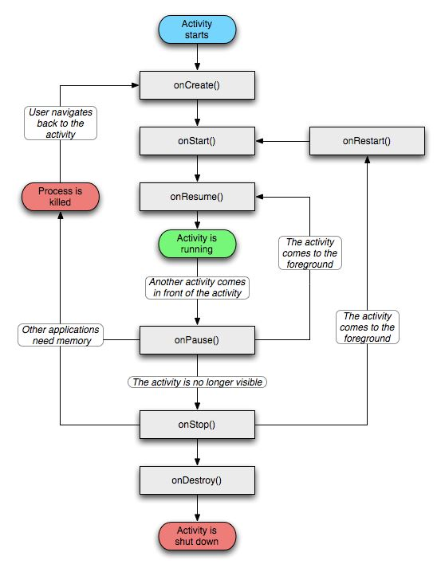
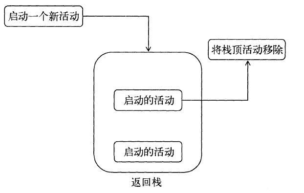
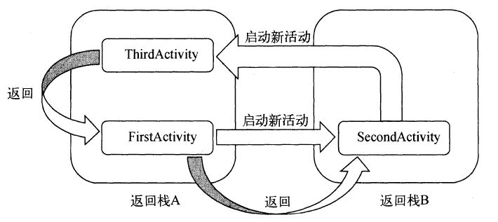

## Activity

### 1. 简介

用户与应用的互动经常以不确定的方式开始（ 视频软件申请QQ登录 ），Activity 的目的便是促进这种范式的实现。

通常，一个 Activity 实现应用中的一个屏幕。

### 2. 生命周期

#### 2.1 回调方法

- 完整生存期：
  - `onCreate()` ：Activity 第一次被创建时调用，必须实现，在 Activity 的整个生命周期中只应发生一次。完成加载布局、绑定事件等；
  - `onDestroy()`：销毁时调用，释放内存。
- 可见生存期：
  - `onStart()`：Activity 不可见变为可见时调用，加载资源；
  - `onStop()`：Activity 完全不可见时调用，释放资源。启动的新 Activity 是对话框式的活动，`onStop()` 不会执行，`onPause()`执行。
- 前台生存期：
  - `onResume()`：Activity 位于栈顶且处于运行状态；
  - `onPause()`：当 Activity 失去焦点并进入“已暂停”状态时( 分屏也算暂停 )，常用于释放资源；

- `onRestart()`：停止状态变为运行状态之前调用，即活动被重新启动前，后面总跟着 `onStart()`。

#### 2.2 Activity 的活动状态

##### 2.2.1 活动状态

安卓使用 **返回栈** 保存 Activity，新建一个 Activity 则压入栈，按返回键或者调用 finish() 则将栈顶元素弹出。

Activity 的活动状态：

- 运行：位于栈顶时即为运行状态。系统最不会回收该状态的 Activity。
- 暂停：不位于栈顶，但仍然可见，举例：不占满屏幕的对话框。只有在内存极低情况下系统才进行回收。
- 停止：不位于栈顶，并且完全不可见。系统会为该状态的 Activity 保存相应的状态和成员变量，但不可靠，可能被回收。
- 销毁：已经从栈中移除，系统最倾向于回收该状态的 Activity。

系统永远不会直接终止 Activity 以释放内存，而是会 **终止 Activity 所在的进程** 。

##### 2.2.2 状态变更

- 配置发生了更改：Activity 会被销毁并重新创建。原始实例将触发 `onPause`、`onStop()`、`onDestroy()`  回调，创建新实例并触发 `onCreate()`、`onStart()`、`onResume()` 回调。例如竖屏变为横屏；
- 前台覆盖：如果有新的 Activity 局部覆盖了正在进行的 Activity，则被覆盖的 Activity 会触发 `onPause()`。当被覆盖的 Activity 返回到前台并重新获得焦点时，会调用 `onResume()`。
- 用户点击返回：Activity 将依次经历 `onPause()`、`onStop()` 和 `onDestroy()` 回调，从栈中移除

#### 2.3 启动另一个 Activity 的生命周期

- Activity A 的 `onPause()` 方法执行。

- Activity B 的 `onCreate()`、`onStart()` 和 `onResume()` 方法依次执行（Activity B 现在具有用户焦点）。

- 然后，如果 Activity A 在屏幕上不再显示，其 `onStop()` 方法执行。

### 3. 启动模式

- standard：默认启动模式，启动一个新 Activity 后入栈并返回栈顶，每次启动都会重新创建一个该Activity 的实例；

- singleTop：栈顶复用模式，如果栈顶已经是该 Activity，通过 `onNewIntent()` 传递给实例，而不会创建新 Activity；

- singleTask：栈内复用模式，栈中只会保存一个该 Activity 实例。如果后台任务中已存在该 Activity 的实例，则将其放到前台运行；

- singleInstance：全局单例模式，启用一个新的栈来管理这个 Activity，用于共享 Activity。

  

### 4. 进程分类

- 前台进程：用户目前执行操作所需的进程，内存极低时才会终止。
- 可见进程：进行用户当前知晓的进程，除非为了保持前台进程运行才会终止可见进程；
- 服务流程：包含一个已使用 `startService()` 方法启动的 `Service`（ 例如下载 ）。除非内存不够保留前台进程和可见进程才会终止；
- 缓存进程：目前不需要的进程，系统可以根据需要自由终止该进程来释放内存。

### 5. Parcelable 和 Serializable

- Serializable：java 的序列化技术。优点是简单，不需要手动处理序列化和反序列化，用于网络传输和 Activity 之间的传值；缺点是使用反射，速度慢，并且创建许多临时对象，容易触发 GC。
- Parcelable：android 的序列化技术。优点是速度快，原理是将一个对象分解为 Intent 支持的数据类型；缺点是使用复杂，需要实现序列化和反序列化，且由于底层依赖于 android 版本，不适用用于存储数据在磁盘。

