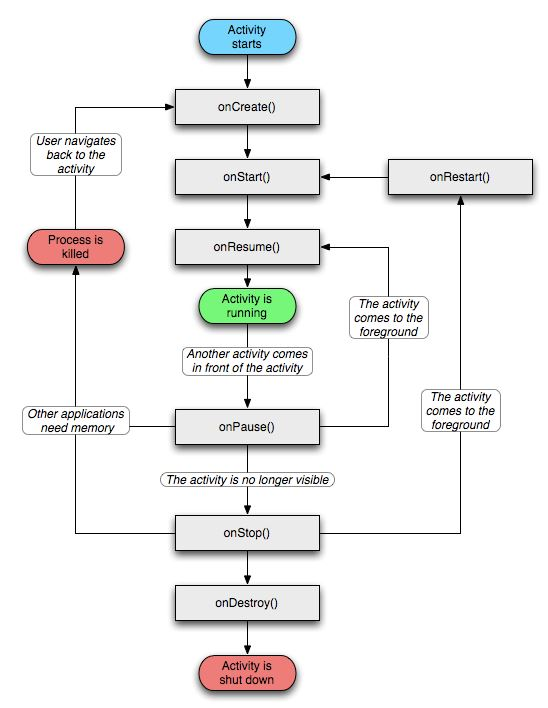
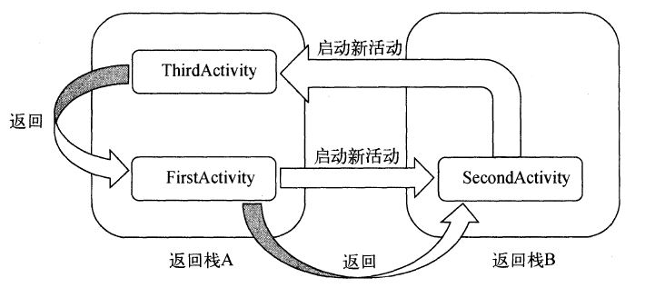

[toc]

## 安卓基础

### 1. Activity

#### 1.1 生命周期

安卓使用 **返回栈** 保存 Activity，新建一个 Activity 则压入栈，按返回键或者调用 finish() 则将栈顶元素弹出。


Activity 的活动状态：

- 运行：位于栈顶时即为运行状态。系统最不会回收该状态的 Activity。
- 暂停：不位于栈顶，但仍然可见，举例：不占满屏幕的对话框。只有在内存极低情况下系统才进行回收。
- 停止：不位于栈顶，并且完全不可见。系统会为该状态的 Activity 保存相应的状态和成员变量，但不可靠，可能被回收。
- 销毁：已经从栈中移除，系统最倾向于回收该状态的 Activity。

Activity 的回调方法：

- 完整生存期：
  - onCreate() ：第一次被创建时调用，应使用该方法完成加载布局、绑定事件等；
  - onDestroy()：销毁时调用，释放内存。
- 可见生存期：
  - onStart()：不可见变为可见时调用，加载资源；
  - onStop()：Activity 完全不可见时调用，释放资源。启动的新 Activity 是对话框式的活动，onStop() 不会执行，onPause() 执行。
- 前台生存期：
  - onResume()：准备好和用户进行交互时调用，位于栈顶且处于运行状态；
  - onPause()：启动或恢复另一个 Activity 时调用，常用于释放资源、保存关键数据；

- onRestart()：停止状态变为运行状态之前调用，即活动被重新启动前。



#### 1.2 启动模式

Activity 的四种启动模式

- standard：默认启动模式，启动一个新 Activity 后入栈并返回栈顶，每次启动都会重新创建一个该Activity 的实例；

- singleTop：栈顶复用模式，如果栈顶已经是该 Activity，直接使用而不会创建新 Activity；

- singleTask：栈内复用模式，栈中只会保存一个该 Activity 实例；

- singleInstance：全局单例模式，启用一个新的栈来管理这个 Activity，用于共享 Activity。

  

### 2. Fragment

#### 2.1 Fragment 概述

Fragment 依赖于 Activity(多对多)，但有自己的生命周期

 

### 3. 广播机制

广播类型：

- 标准广播：异步执行，发出后所有接收器几乎会在同一时刻收到，没有先后顺序。但无法被截断；
- 有序广播：同步执行，发出后同一时刻只有一个广播接收器能够收到，逻辑执行结束后传递广播。

``` java
import androidx.appcompat.app.AppCompatActivity;

import android.content.BroadcastReceiver;
import android.content.Context;
import android.content.Intent;
import android.content.IntentFilter;
import android.os.Bundle;
import android.widget.Toast;

// 通过广播机制监测网络变化
public class MainActivity extends AppCompatActivity {

    private IntentFilter intentFilter;

    private NetworkChangeRecevier networkChangeRecevier;

    @Override
    protected void onCreate(Bundle savedInstanceState) {
        super.onCreate(savedInstanceState);
        setContentView(R.layout.activity_main);

        intentFilter = new IntentFilter();
        intentFilter.addAction("android.net.conn.CONNECTIVITY_CHANGE");
        networkChangeRecevier = new NetworkChangeRecevier();
        registerReceiver(networkChangeRecevier, intentFilter);
    }

    @Override
    protected void onDestroy() {
        super.onDestroy();
        unregisterReceiver(networkChangeRecevier);
    }

    class NetworkChangeRecevier extends BroadcastReceiver {
        @Override
        public void onReceive(Context context, Intent intent) {
            Toast.makeText(context, "network change", Toast.LENGTH_SHORT).show();
        }
    }
}
```

广播分为全局广播和本地广播，一般使用本地广播，本地广播的特点：

- 发送的广播不会离开程序；
- 其他程序无法发送广播到本程序；
- 速度更快；
- 无法静态注册。


### 4. 内容提供器

内容提供器用于读取和操作其他程序的数据，或提供数据操作接口给外部程序。

``` java
// ContentResovler使用举例
// 增
Uri uri = Uri.parse("content://com.example.boardcast_test/tabel1");
ContentValues values = new ContentValues();       
values.put("column1", "text");    
values.put("column2", 1);
getContentResolver().insert(uri, values);
```


### 5. Service

#### 5.1 异步消息处理机制

异步消息处理机制：

- Message
- Handler
- MessageQueue
- Looper

#### 5.2 Service 介绍

Service 是安卓实现程序后台运行的方案，非常适合执行不需要用户交互且长期运行的任务。

```java
public class MyService extends Service {
    public MyService() {
        
    }
    
    @Override
    // 必须重写该方法
    public IBinder onBind(Intent intent) {
        
    }
}
```


### 6. 数据存储

#### 6.1 存储概述

安卓存储：

- 内部存储：随应用卸载被删除，包括 shared_prefs、databases、files、cache
- 外部存储
  - 公有目录：比如 Pictures 等
  - 私有目录：随应用卸载被删除，例如存储在外部存储上的 cache、files

#### 6.2 SharedPreferences

SharedPreferences 是安卓中的轻量存储，以 K-V 形式存储在 xml 文件中，存放在 /data/data/applicationid/shared_prefs 中


