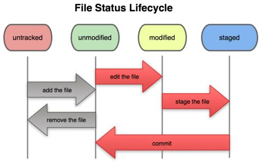
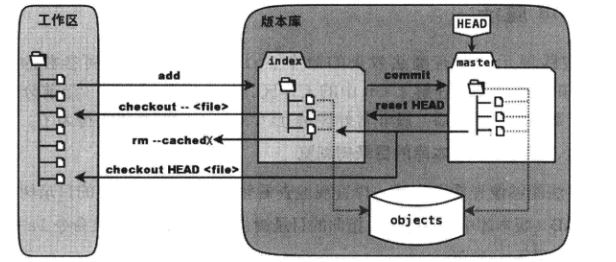

## Git

### 1. git 基础

git 的文件生命周期



基本指令

``` bash
git status: 查看当前文件状态
git diff： 查看修改
git rm:
```


git结构：

- 工作区
- 暂存区：图中 index部分
- 目录树：图中 master 所代表部分
- objects：git 的对象库



操作所对应的更改：

- 文件更改：修改工作区的文件
- git add：更新暂存区的目录树
- git commit：暂存区的目录树写到对象库中，master 分支相应更新，master 指向提交前暂存区的目录树
- git reset HEAD：暂存区的目录树被 master 指向的目录树替换，工作区不影响
- git rm --cached：从暂存区删除文件，工作区不影响
- git checkout：使用暂存区的相应文件替换工作区的文件